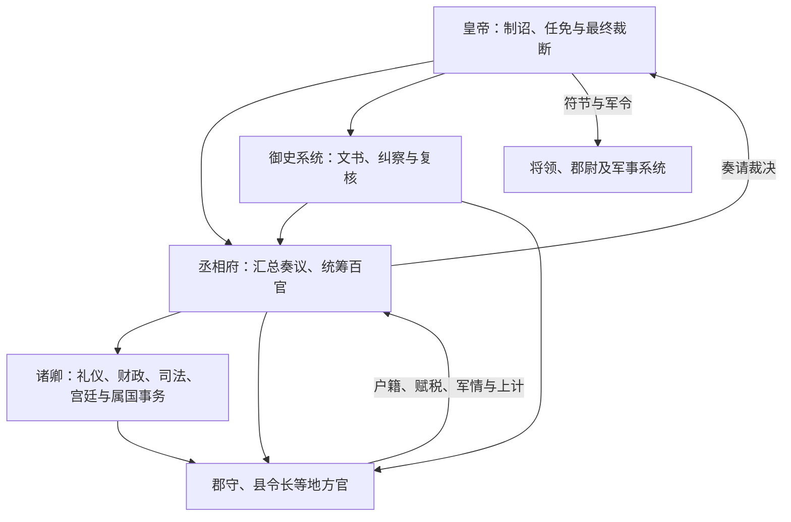

# 秦代中枢机构

秦在战国官僚化基础上，于前 221 年统一六国后把皇帝、中央官署、郡县和法令文书体系扩展到帝国尺度。皇帝拥有最高任免、立法、军事和司法裁断权；丞相、御史大夫及诸卿分掌行政与宫廷事务。常称“三公九卿”，但“三公”作为整齐定制的说法更多由后世概括，秦是否常置太尉及具体官署编制仍有讨论。

## 最高权力与三公

| 官职 | 主要职掌 | 实际边界 |
| --- | --- | --- |
| 皇帝 | 最终决策、任免、调兵、制诏与重大司法裁断。 | 需依靠官僚、奏事、文书和地方上计取得信息；个人裁断能力仍受信息与执行条件限制。 |
| 丞相 | 总领百官、协助处理全国政务，可能分左右丞相。 | 权力很大但来自皇帝授权；左右尊卑和分工并非所有时期完全一致。 |
| 御史大夫 | 掌副丞相职能、文书与监察。 | 既参与行政又纠察官吏，不能简单等同后世独立监察院。 |
| 太尉 | 名义上与军事相关。 | 秦代是否实际常置、具体任职情况均不明确，不宜据后世官制补齐。 |

## 九卿及宫廷—国家交叠

| 官职 | 主要职掌 |
| --- | --- |
| 奉常 | 宗庙祭祀与礼仪。 |
| 郎中令 | 皇帝侍从与宫殿门户相关宿卫。 |
| 卫尉 | 宫门、宫城警卫。 |
| 太仆 | 皇帝车马及相关事务。 |
| 廷尉 | 最高司法与刑狱。 |
| 典客 | 诸侯、属国及外来宾客事务。 |
| 宗正 | 皇族谱牒与宗室事务。 |
| 治粟内史 | 国家粮赋、仓储和财政。 |
| 少府 | 皇室财产、山海池泽收入及宫廷制造。 |

九卿中相当一部分从服务王室的“家务”发展为国家机关，显示早期帝国尚未完全区分皇室财政、宫廷服务与公共行政。治粟内史和少府并列，正体现国家财政与皇室财政的双轨。

## 政令与监督链

官员由中央任免并领取俸禄，政令通过制、诏、符、传等文书传递；地方以户籍、赋税和上计向中央反馈。统一文字书写规范、度量衡和道路交通，有助于跨地区行政，但执行仍依赖地方吏员与既有社会网络。

## 建立、运行与危机

- **统一初期**：废除六国王号和主要世袭政治中心，普遍实行郡县；迁徙部分豪强、收缴兵器并统一规范，试图降低地方反抗能力。
- **大规模动员**：北逐匈奴、修筑交通与防御工程，南征岭南及营建宫陵，都要求中央财政、军役与运输系统高强度运作。
- **继承危机**：前 210 年秦始皇死后，遗诏传递、近臣控制信息及赵高、李斯等人的政治操作改变继承结果，说明高度集中的制度仍可能被掌握宫廷文书的人利用。
- **崩溃过程**：前 209 年起反秦战争迅速扩散，前 207 年秦亡。沉重徭役兵役、严密刑法、统一后的政治整合不足、宫廷斗争与地方叛乱相互叠加，不能归结为单一制度因素。

## 制度评价

秦的官僚体系显著提高跨区域征发和统一治理能力，也把错误决策迅速放大到全国。皇帝居中裁断削弱世袭中间层，却形成信息过度集中、官员向上负责和缺少稳定继承协调机制等风险。汉代大体继承中央官署与郡县框架，同时调整法律、赋役和封国安排。

## 图示

