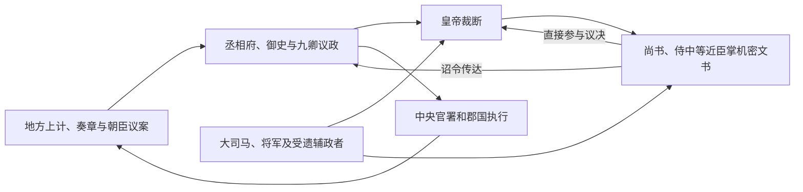

# 西汉中枢机构

西汉承袭秦的皇帝、三公九卿和郡县官僚框架，同时保留诸侯王国，并不断调整宫廷与外朝的关系。最重要的中枢变化，是尚书、侍中等原本品秩不高的近臣在汉武帝时期以后进入决策与文书核心，形成后世所谓“中朝 / 内朝”；丞相及诸卿组成的“外朝”仍承担大量行政，二者不是两套边界固定的政府。

## 机构组合

| 层级 / 机构 | 主要职能 | 变化 |
| --- | --- | --- |
| 皇帝 | 最终决策、任免、军令、司法裁断与礼制中心。 | 幼主、疾病或政治危机时，皇太后、外戚与受遗大臣可能代行或分享实际权力。 |
| 丞相、太尉 / 大司马、御史大夫 | 总理政务、军政与监察文书；官名和配置多次变化。 | 丞相长期是百官之长，武帝以后近臣和大司马权势上升，三公制度并非静止。 |
| 九卿 | 太常、光禄勋、卫尉、太仆、廷尉、大鸿胪、宗正、大司农、少府。 | 分掌礼仪宿卫、司法、属国、国家财政和皇室财政等，宫廷与国家职能仍交叠。 |
| 尚书与中朝近臣 | 承受奏章、传达诏令并参与机密决策。 | 侍中、尚书令、常侍等因接近皇帝而扩大影响；“中朝”是分析概念，不是一次设立的正式官署。 |
| 御史与刺史 | 监察中央和地方官吏。 | 前 106 年分部置刺史，形成中央获取地方信息的新渠道。 |

## 决策怎样从外朝转入中朝

汉武帝扩张战争、财政改革和复杂宫廷政治提高了对快速机密决策的需求。近臣掌握奏章进出与诏令起草后，可以绕开丞相的部分程序；但丞相、御史及九卿仍处理人事、司法、财政和常规行政，因此不能把变化理解为外朝立即失去作用。

## 专门职能与选官

- **财政**：大司农偏国家租税、仓储，少府偏山泽收入与皇室用度；盐铁、均输平准等措施又形成专门官署网络。
- **军事**：太尉并非常置，大司马、将军及临时统帅的权力取决于战争与皇帝授权；军政未固定归一个常设机关。
- **监察**：御史系统与刺史巡察相结合，刺史最初是低秩监察官，并非州级行政长官。
- **选官**：察举、征辟、任子、赀选等途径并存。察举由郡国长官举荐并经中央考察，不等于完全公开考试，也会受地方关系影响。

## 阶段变化与政治后果

| 阶段 | 中枢特征 |
| --- | --- |
| 高祖至文景 | 在秦制基础上恢复秩序，丞相地位较高；诸侯王国和功臣集团仍是重要政治力量。 |
| 武帝时期 | 中朝近臣、尚书和大司马等权力上升；战争与财政改革推动专门官僚扩张。 |
| 昭宣时期 | 霍光等受遗辅政者控制中枢，说明皇帝年幼时制度运行依赖摄政联盟。 |
| 元成以后 | 外戚王氏等逐步掌权，尚书和宫廷文书渠道成为争夺焦点，最终为王莽代汉提供条件。 |

西汉中枢一方面扩大了财政、军事和监察能力，另一方面也形成多条权力渠道。近臣制约丞相并不自动产生稳定平衡；当继承、摄政和宫廷信息被少数人控制时，内朝可能成为外戚或权臣掌权的工具。

## 图示

