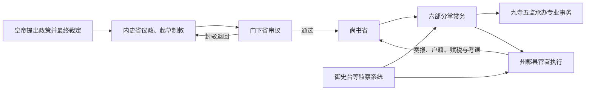

# 隋代中枢机构

隋结束长期分裂后，吸收北朝与南朝官制，建立以内史省、门下省、尚书省为核心的中央体系。内史省起草诏令，门下省审议封驳，尚书省统领六部执行政务；秘书省、内侍省及寺监分别处理图籍、宫廷和专门事务。隋制为唐代继承，但隋文帝与隋炀帝时期的名称、编制和实际权力仍有调整。

## 核心机构

| 机构 | 职掌 / 说明 |
| --- | --- |
| 内史省 | 参与决策、起草制敕，相当于后世所称中书省；设内史令、内史侍郎等。 |
| 门下省 | 侍从顾问、审议诏令并可封驳，防止不当文书直接执行。 |
| 尚书省 | 全国行政执行中枢，设令、左右仆射、左右丞，统领六部。 |
| 六部 | 吏、礼、兵、都官、度支、工等部门；名称经调整后形成吏、户、礼、兵、刑、工框架。 |
| 御史台等监察机关 | 纠察官吏；炀帝时监察组织和巡察办法多有改动。 |
| 九寺五监 | 分掌礼仪祭祀、宗室、司法、仓储、工程、教育等专门事务，与六部存在政令承办和业务协作关系。 |
| 三师三公 | 位高而不一定常置或亲理日常政务，主要承担尊礼、顾问和重大议政功能。 |

## 政令运行

三省分工使一项政令原则上经过议论、起草、审核和执行，但皇帝仍可通过特旨或近侍影响流程。三省长官的政治分量、门下封驳能否发挥作用，也取决于具体君臣关系。

## 重要改革

- **开皇官制**：隋文帝重整品秩与官署，削减北周六官制的复古色彩，把南北制度融合为较统一的行政体系。
- **六部定型**：尚书省分部处理人事、财政、礼仪、军政、司法和工程，为唐代六部组织奠基。
- **地方精简**：583 年废郡，以州统县；炀帝 607 年又改州为郡。中央官制改革与地方层级压缩共同减少冗官和重叠。
- **选官变化**：废止九品中正的地方中正品第，设进士等科取士；科举在隋仍属初创，门荫、荐举和贵族网络并未立即消失。
- **炀帝改制**：官署名称、监察和礼制多有变更，追求整齐化，也增加制度频繁调整的成本。

## 运行条件与崩溃

统一后的户籍清查、均田租调、仓储运输和大运河建设增强了中央资源调度能力。与此同时，营建东都、远征高句丽、边防和大工程叠加，造成高强度征发；地方执行在灾荒与战争中失灵，611 年以后反叛扩散。隋亡不能简单归因于三省六部或科举，而是财政兵役负荷、战略失败、统治联盟破裂与继承后的政策选择共同造成。

## 制度遗产与局限

隋制把分裂时代的多套官制整合为可供统一帝国运作的框架，唐初大体沿用并调整。其优势是职责明确和全国标准化，代价是文书层次增加，并高度依赖中央是否能准确掌握地方资源。科举与官僚制的扩大也并未立即消除关陇贵族及门第政治。

## 图示

