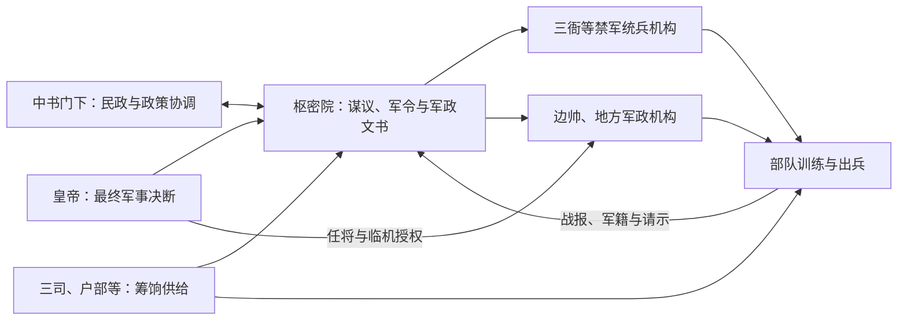

# 枢密院

“枢密”在不同时代指向不同制度。唐后期的内枢密使主要承受奏表、宣达帝命，五代以后逐渐转成处理军国机务的中枢；宋代枢密院与中书门下并称“二府”，是制度史上最典型的军政中枢。辽、金、元也设置相关机构，但组织与权力不能直接照搬宋制理解。

## 形成与演变

| 时期 | 机构地位 | 常见官名 | 关键变化 |
| --- | --- | --- | --- |
| 唐后期 | 内廷机要传宣渠道。 | 内枢密使，多由宦官担任。 | 承受表奏、宣达诏命并逐渐介入军机；当时更接近内廷使职，不能等同宋代完整官署。 |
| 五代 | 最高军政机关之一。 | 枢密使、枢密副使等。 | 军事政权需要集中军令、任将和机密文书，枢密使权势显著上升。 |
| 宋 | 与中书门下并列的军政中枢。 | 枢密使、知枢密院事、同知院事、枢密副使、签书院事等。 | 掌军政谋议、军令与武官相关事务；与掌政务的中书门下合称“二府”。 |
| 辽 | 北、南枢密院等制度并存。 | 北院枢密使、南院枢密使等。 | 结合辽朝北南面官体系，职权具有本朝族群与区域治理特点。 |
| 金 | 设枢密院掌军政，制度多次调整。 | 枢密使、枢密副使等。 | 受战争形势、尚书省体制和皇帝授权影响。 |
| 元 | 与中书省、御史台并列的重要中央机构。 | 知枢密院事、同知枢密院事等。 | 统理全国军政，并与行枢密院、诸王军府及地方军政体系互动。 |
| 明清 | 不再设置同名常设最高军政中枢。 | 明有五军都督府、兵部；清有军机处。 | 清代把军机大臣雅称为“枢臣”只是比附，不是枢密院制度延续。 |

## 宋代军令链

宋代常以“枢密院掌兵籍、虎符，三衙管诸军”概括发令与统兵分离。其目的之一是避免单一将领或机关同时控制军令和常备军，但边防行动仍需财政供给、宰执协调和前线判断，实际并非一条完全割裂的指挥链。

## 制度功能

- **机密与速度**：集中处理边报、任将、调兵和军令文书，减少普通行政流程对战时决策的拖延。
- **分割权力**：把军政从一般宰相机构或统兵将领手中分出，使皇帝居中裁决。
- **文武协调**：枢密院长贰未必由职业武将担任，宋代尤其常用文臣，以控制军事并使军政服从整体政策。
- **跨区域治理**：在辽、金、元，枢密机构还要面对多种军制、诸王权力和边疆统治结构。

## 局限与争议

分割军令、统兵和财政可以降低政变风险，却增加协调层次；战时若信息迟缓、责任边界不清，可能妨碍前线应变。反过来，把战争成败简单归因于“文官制武”也过于单一：战略、财政、兵源、后勤、将领体系和对手能力同样关键。比较唐、宋、辽、金、元的枢密制度时，应先确认它是内廷使职、正式官署还是本朝特有的复合机构。
