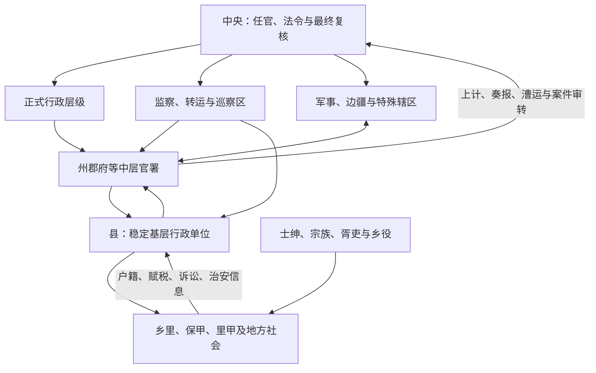

# 地方行政区划

本目录整理中国古代地方行政层级、监察区、军区、封国与边疆特殊辖区。区划名称只是入口：研究地方治理还要看官员由谁任命、税粮向哪里输送、军队听谁调度、案件如何复核，以及正式行政层级以下由哪些乡里组织和地方精英协助执行。

## 笔记

| 分类 | 内容 | 入口 |
| --- | --- | --- |
| 历代比较 | 从商周复合统治、秦汉郡县到元明清省制，比较各朝层级与运行机制。 | [历代地方区划总览](/%E4%BA%BA%E6%96%87%E7%A7%91%E5%AD%A6/%E5%8E%86%E5%8F%B2/%E4%B8%9C%E4%BA%9A/%E4%B8%AD%E5%9B%BD/_%E5%88%B6%E5%BA%A6/%E5%9C%B0%E6%96%B9%E8%A1%8C%E6%94%BF%E5%8C%BA%E5%88%92/%E5%8E%86%E4%BB%A3%E5%9C%B0%E6%96%B9%E5%8C%BA%E5%88%92/README.md) |
| 区域个案 | 追踪“荆州”由地理概念、监察区、行政区到魏吴分治及后世缩小的过程。 | [荆州](/%E4%BA%BA%E6%96%87%E7%A7%91%E5%AD%A6/%E5%8E%86%E5%8F%B2/%E4%B8%9C%E4%BA%9A/%E4%B8%AD%E5%9B%BD/_%E5%88%B6%E5%BA%A6/%E5%9C%B0%E6%96%B9%E8%A1%8C%E6%94%BF%E5%8C%BA%E5%88%92/%E8%8D%86%E5%B7%9E/README.md) |

## 四类空间不能混同

| 类型 | 功能 | 常见例子 |
| --- | --- | --- |
| 正式行政区 | 设常任长官，直接治理户籍、赋税、司法与治安。 | 郡、县，州、府，明清省府州县。 |
| 监察或使职区 | 中央派员巡察、转运、提刑或协调若干行政区。 | 汉刺史部、唐道、宋路；后来可能行政化，但起点不同。 |
| 军事与边疆区 | 因边防、驻军、交通或族群政治设置，权限常跨行政层级。 | 都护府、节度使辖区、都司、将军辖区、盟旗。 |
| 封国与特殊权益 | 王侯、宗室、寺院、土司等取得税收或治理权，程度各异。 | 汉王国、晋诸侯国、元投下、明清土司。 |

## 地方治理机制

县长期是国家常设官僚深入基层的关键节点，但县以下很少铺设完整的俸禄官僚。乡里组织、里正、耆老、保甲、里甲、胥吏、宗族和士绅在不同时期协助征税、治安与调解，也可能转嫁负担或隐匿信息。

## 演变的反复模式

1. **监察区行政化**：汉州、元行省等都经历从派出或监察性质向稳定地方层级发展的过程，但路径并不相同。
2. **地方权力分割**：宋路设多司，明省设三司，清省有督抚、布政与按察，目的都是防止一人兼掌军政财刑。
3. **战时重新集中**：节度使、总管、总督、巡抚等常因战争取得跨区权力，危机过后可能撤销，也可能常设化。
4. **边疆差异治理**：都护府、羁縻州、土司、盟旗和驻扎大臣等反映中央在不同环境下采用多层间接治理，不能硬套内地层级。

## 阅读提示

- “道、路、省”在各朝性质不同，不能仅因名称接近就视为同一级。
- 名义层级不等于真实治理强度；交通、财政、人口登记和地方合作决定中央命令能否落实。
- 区划增减既可能为提高治理，也可能源于人口迁移、军事防御、财政分割与政治牵制。
- 地图边界常随战争和史料口径变化，涉及侨置、遥领和争议疆域时应注明约数或性质。

## 直接上级

- [中国古代制度](/%E4%BA%BA%E6%96%87%E7%A7%91%E5%AD%A6/%E5%8E%86%E5%8F%B2/%E4%B8%9C%E4%BA%9A/%E4%B8%AD%E5%9B%BD/_%E5%88%B6%E5%BA%A6/README.md)
