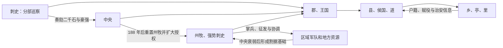

# 东汉地方区划

东汉大体延续郡国—县体系，州在前中期仍主要是刺史巡察范围。朝廷曾调整刺史与州牧名称和权限；灵帝中平五年（188 年）在危机中重置州牧，授重臣更广军政权，州才在东汉末明显转为能够统辖郡国的区域权力中心。这个过程是渐变且不均衡的，不能用一个年份解释所有地区。

## 常规层级与特殊单位

| 单位 | 性质 |
| --- | --- |
| 郡 | 太守治理，辖县、道、侯国等；向中央上计并承担财政、司法和治安。 |
| 王国 | 皇子封国，王主要享有租税；国相由中央任命，职权近太守。 |
| 县、侯国、道 | 县令长或相等治理的基层行政单位；道多用于民族成分复杂地区。 |
| 属国 | 由属国都尉等管理归附族群与边地事务，控制强度因地而异。 |
| 司隶校尉部 | 监察京师及近畿，性质与一般州部不同。 |
| 西域都护等 | 随国力和西域形势时置时废，属于边疆军政体系。 |

汤沐邑、列侯食邑等主要提供租税收入，不宜自动视作封君拥有独立治民权。

## 州从监察走向军政

刺史原来秩低、巡行而不治民，其作用是越过郡守向中央报告。黄巾起义及各地叛乱使中央需要能统筹数郡兵粮的长官，州牧、强势刺史遂拥有行政和军事资源。州行政化既增强应急能力，也让刘焉、刘表等州牧在中央失控时建立区域政权。

## 东汉末十三州

通常概括为司隶及豫、冀、兖、徐、青、荆、扬、益、凉、并、幽、交等州部；献帝时期又有雍州等分合。名单、治所与边界随军阀战争反复变化，“十三州”更多是制度框架，不是末年始终稳定的地图。

## 地方官与豪强

- 太守、县令长拥有征税、司法、选举和治安权，郡府与县廷依赖属吏处理日常文书。
- 察举孝廉、茂才等由郡国长官推荐，地方名望与仕途相连。
- 豪强大族凭土地、宗族、宾客和武装影响乡里，朝廷既通过法律和刺史压制，也依靠其赈济、征兵和地方合作。
- 边郡、蛮夷地区、属国和西域的治理常借当地首领，不等于内地县制完全覆盖。

## 危机与后果

外戚宦官斗争、党锢、财政压力和地方豪强并非直接由区划造成，但削弱了中央人事与军事控制。184 年黄巾起义后地方自行募兵，188 年州牧扩权，189 年董卓入京后中央更失去统一号令。州郡长官在镇压叛乱中掌握军队、税粮和人事，最终演变为军阀割据。曹魏、西晋保留州—郡—县框架，也不断以都督军事等方式处理州级权力问题。

## 图示

