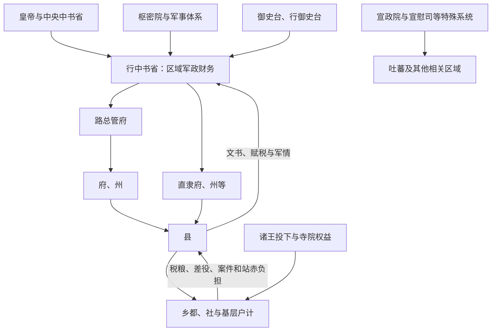

# 元代地方区划

元代以行中书省为多数地区的高层区域机构，通常简称行省。行省最初具有中书省派出机关性质，因征服、军需和跨区域治理逐渐常设化，掌握较广军政财权；它仍受中央中书省、枢密院、御史台和行御史台牵制。元代层级多、类型杂，不能把“行省—路—府—州—县”当作全国每处都完整一致的五级制。

## 常规与特殊区划

| 单位 | 性质 |
| --- | --- |
| 中书省直辖区 | 大都周边及河北、山东、山西等“腹里”多由中央中书省直接管理，不另设普通行省。 |
| 行中书省 | 高层区域军政财政机关，长官多人共署；辖境广且随战争、分合调整。 |
| 路 | 重要中层单位，设总管府，统辖府州县或直属州县。 |
| 府、州、县 | 层级关系灵活：府州有的隶路，有的直隶行省；州可领县，也可能不领县。县是稳定基层行政单位。 |
| 宣政院辖地 | 宣政院统理佛教及吐蕃事务，相关地区采用院辖、宣慰司等特殊系统。 |
| 宣慰司、都元帅府等 | 用于边疆、民族地区或军事要地，职权可跨一般行省层级。 |

## 行省运行

行省拥有处理紧急军情、调度钱粮和任免部分官员的空间，多名长官共署旨在内部牵制。重大命令、高级任命和财赋仍须服从中央；行省并非自治“地方王国”。危机时行省权力扩大，也可能成为地方将领和政治集团的依托。

## 驿站、财政与基层

- **站赤**把驿路、马匹、粮食和夫役连成帝国交通网，提高军令和人员移动速度，也给沿线民户造成沉重供应负担。
- 户籍常按民户、军户、匠户、站户等类别承担不同世役，职业与身份管理增强国家动员，也限制社会流动。
- 乡村设社等组织劝农、赈济或协助征发，县官仍依靠吏员、村社与地方有力者执行。
- 盐课、漕运、纸币与江南税粮是中央财政重点，行省和路府负责征收运输。

## 多重权利结构

蒙古诸王、功臣投下、寺院和斡脱等可在特定人口或地区享有税收、差役或司法权益，达鲁花赤等官又与汉地长官并置。重叠权利使中央、行省、封主和地方官之间不断协调，也可能造成重复征敛。族群法律地位和任官差异进一步使实际治理不完全统一。

## 形成、危机与遗产

忽必烈时期随南宋征服和全国整合，行省逐步稳定；之后省界、机构和名称仍多次调整。元末水患、治河征发、货币财政危机与红巾军起义扩散，中央依靠行省和地方武装镇压，反而使部分区域长官拥有更大自主资源。明代承接省级框架，却把行省权力拆给布政、按察、都司三司，正是对元末区域集权风险的回应。

## 图示

