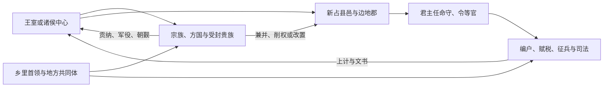

# 先秦地方结构

先秦地方统治经历商周复合政治网络、春秋诸侯国内的县邑扩张和战国郡县官僚化。它不是“分封制完全消失后才出现郡县制”的整齐替代：方国、封君食邑、贵族采邑、县、郡及边地军事辖区曾长期并存，各国制度也不同。

## 主要形态

| 时期 | 地方结构 | 中央—地方关系 |
| --- | --- | --- |
| 商 | 王畿与方国、族邑相互连接，后世常概括为内外服。 | 商王通过征伐、贡纳、祭祀、婚姻和册命维系外部首领；控制强度随距离与政治形势变化。 |
| 西周 | 周王室分封诸侯，诸侯再授卿大夫采邑，宗法礼制与政治等级结合。 | 受封者有世袭基础和内部治理权，同时负有朝觐、贡赋、军役等义务，并非中央派任的普通地方官。 |
| 春秋 | 诸侯兼并小国，国内卿族势力与国君争权，边地县邑增加。 | 新占土地有时由国君派官管理，也可能封给贵族；旧封建网络与新行政方式交错。 |
| 战国 | 郡、县及君主任命的守令发展，户籍、赋税、征兵和成文法深入地方。 | 官员有任期、考核和俸禄，地方资源更直接进入国君控制的财政军事体系。 |

## 转型机制

战国大规模战争要求稳定兵源、粮饷和道路后勤，促使国家丈量土地、登记人口并把地方官纳入考课。郡起初常有边地军事性质，县的出现和职能在各国并不同步，秦统一后的郡县制是长期演化的结果。

## 权力与社会

- **贵族和封君**：仍可享有食邑、家臣和一定司法军事权，变法往往通过军功爵、迁徙和官僚任命削弱世袭特权。
- **地方官**：县令、县长、守、尉等负责征税、司法、治安和军事，直接向国君及中央官署负责。
- **基层组织**：什伍、乡里和连坐等方式把家庭纳入征发与治安，具体成熟程度以秦及战国后期材料最清楚。
- **地方精英**：国家扩大官僚并不意味着地方宗族消失；文吏、豪族和旧贵族常转入新官僚体系。

## 制度成效与代价

郡县和编户使国家能够跨越世袭中间层，扩大征兵、征税和司法统一，也强化对个人与家庭的控制。高强度战争推动制度创新，同时带来兵役、徭役、迁徙和严刑负担。学术上对“内外服”、西周分封范围、郡县起源和早期国家性质均有争论，宜把这些概念视为解释模型，而非各时代自始完备的固定层级。

## 图示

