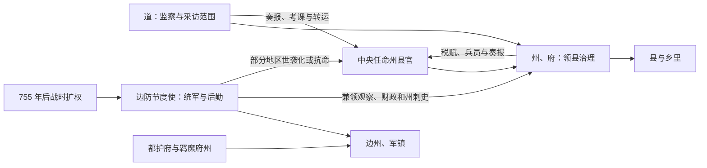

# 唐代地方区划

唐代常规地方行政以州 / 府—县为主，道起初是监察和地理分区，并非整齐的常设省级政府。玄宗以后采访、转运、节度等使职在道或跨州区域活动；安史之乱后部分节度使长期掌握军政财权，形成藩镇。因而唐代前后期的“道—州—县”不能按同一行政层级理解。

## 道、州府与县

| 单位 | 性质与职能 |
| --- | --- |
| 道 | 太宗贞观元年（627 年）分十道，玄宗开元二十一年（733 年）调整为十五道；主要用于监察、巡察和地理划分，后由采访使等逐渐形成区域官署。 |
| 州 | 刺史治理的主要领县单位，负责户籍、租庸调、司法、治安与征发；郡名在玄宗时期一度恢复，后又改州。 |
| 府 | 京师、陪都或重要州升格，如京兆、河南、太原、成都、凤翔、河中、江陵等；具体升置时间不同。 |
| 县 | 县令治理，是国家稳定基层行政单位，以下乡里组织承担户籍与赋役。 |
| 都督府、都护府 | 都督府协调若干州军政；安东、安南、安西、安北、单于、北庭等都护府面向边疆与交通，实际控制随战争变化。 |
| 节度使辖区 | 原为边防军镇与使职区域，兼辖军队、财政和若干州；不是全国统一覆盖、边界永远固定的行政层。 |

十道通常为关内、河南、河东、河北、山南、陇右、淮南、江南、剑南、岭南；十五道是在此基础上分合并增京畿、都畿、黔中等，名称和辖境随后仍有调整。

## 从巡察区到藩镇

道的行政化不是单线发展。采访使、观察使、转运使各掌不同事务；节度使可能兼观察使、支度营田使及州刺史，把军政财权集中。也有许多藩镇长期服从中央、由中央调任，不应把晚唐所有地区都视为独立割据。

## 财政与基层变化

前期租庸调、均田和府兵依赖户籍与土地登记；人口流动、土地兼并和长期战争削弱旧体系。780 年两税法以资产和居地纳税，地方财政使职、留州与上供关系重组。县以下仍通过乡里、村坊、里正等组织征收与治安，城市坊市和边地军镇又有不同管理。

## 关键转折

- **唐初统一**：继承隋州县体系，裁并区划并建立十道监察，中央控制较强。
- **开元调整**：十五道及采访使强化区域巡察，府、都护府和边镇体系扩展。
- **安史之乱**：为平叛和防边，大量授予节度使军政财权；河北等地出现长期由军人集团控制的藩镇。
- **德宗以后**：中央以两税、盐利、神策军及讨伐、承认相结合维持关系；藩镇格局随战争反复。
- **晚唐崩解**：黄巢起义重创财政交通和州县秩序，强藩与军阀控制朝廷，最终由朱温代唐。

## 制度评价

州县体系和道级巡察在大帝国中提供分层管理，边疆都护与羁縻制度具有适应性。使职能快速处理战争、转运和财政，代价是临时授权常设化、常官与使职重叠、军政责任不清。唐亡不是“节度使制度”单一结果，还包括财政基础变化、内廷军权、继承斗争、农民战争和外部边防压力。

## 图示

