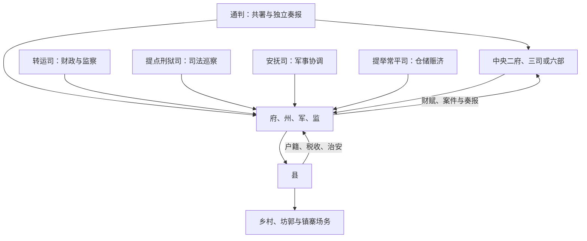

# 宋代地方区划

宋代地方的稳定领县单位是府、州、军、监，县为官僚行政末端。其上所称“路”不是一套单一省政府，而是转运、提点刑狱、安抚、提举常平等使司各按事务分区；不同司的辖界和权力可能不完全重合。通过多司交叉、文臣知州、通判监督与官员频繁调任，中央试图避免唐末藩镇式军政财权集中。

## 层级与机构

| 层级 / 机构 | 主要职能 |
| --- | --- |
| 路级转运司 | 转运财赋、监督地方财政并兼有行政监察；转运使常是最重要的路级长官之一。 |
| 提点刑狱司 | 巡察司法、复核案件和监督州县刑狱。 |
| 安抚司 | 处理区域军事、边防与灾乱，常由重要州府长官兼任。 |
| 提举常平司 | 管常平、赈济及相关财政社会政策，设置与职掌有时期变化。 |
| 府、州、军、监 | 主要地域行政单位。知府、知州等治理户籍、赋税、司法与治安；军、监有军事或专门生产来源，也可领县。 |
| 通判 | 与知州共同签署重要文书，向中央直接奏报，形成州级内部牵制。 |
| 县 | 知县或县令治理，是常规基层行政单位；县下还有镇、寨、场、务等财政、治安或生产节点。 |

## 多司分权机制

几套使司共同覆盖一个区域，使任何单一长官较难同时掌握军、财、刑、政。它也产生辖界交错、文书重复和责任分散。危机时朝廷又会让安抚使、制置使、宣抚使等获得跨路权力，以换取快速协调。

## 中央收权过程

- 太祖、太宗平定割据后，逐步收回藩镇财权和军权，地方高级军人不再世袭控制州镇。
- 以文臣知州、通判监州，地方赋税由转运体系上供；精兵集中中央，厢军和地方武力承担不同任务。
- 官员实行差遣、回避和迁转，使职位不易与本地家族固定结合。
- 南宋边防压力下，制置使、宣抚使及地方军队权力扩大，但仍受中央任命和财政制约。

## 基层治理

宋代县以下没有全国均一的完整俸禄官僚。乡、里、保、都等编制及耆长、户长、保正等役职承担税役、治安和文书；王安石变法又推行保甲、免役等。市镇、草市、场务和寨堡增多，使国家在县城之外设置税务、盐酒、矿冶或治安节点。地方士人、宗族、寺院和胥吏既协助治理，也可能隐产、包揽或转嫁役负。

## 财政、司法与信息

宋代商业税、盐茶专卖和转运体系发达，路级财政官将大量收入送往中央或边防。案件由县、州逐级审理，提刑巡察，重大刑案送中央复核。多渠道奏报提高中央掌控，但报表、考课和法律程序繁密，实际效果受官员、吏人和地方信息质量影响。

## 成效与结构成本

宋代地方分权机制降低了区域长官割据风险，并支撑庞大财政与文官政府。代价是中央行政成本、官员数量和文书协调增加，地方财政缺乏弹性；战时跨区统筹较慢，需临时集中权力。宋的军事成败不能直接由“地方分权”推出，边防地理、常备军组织、财政后勤和战略决策同样关键。

## 图示

