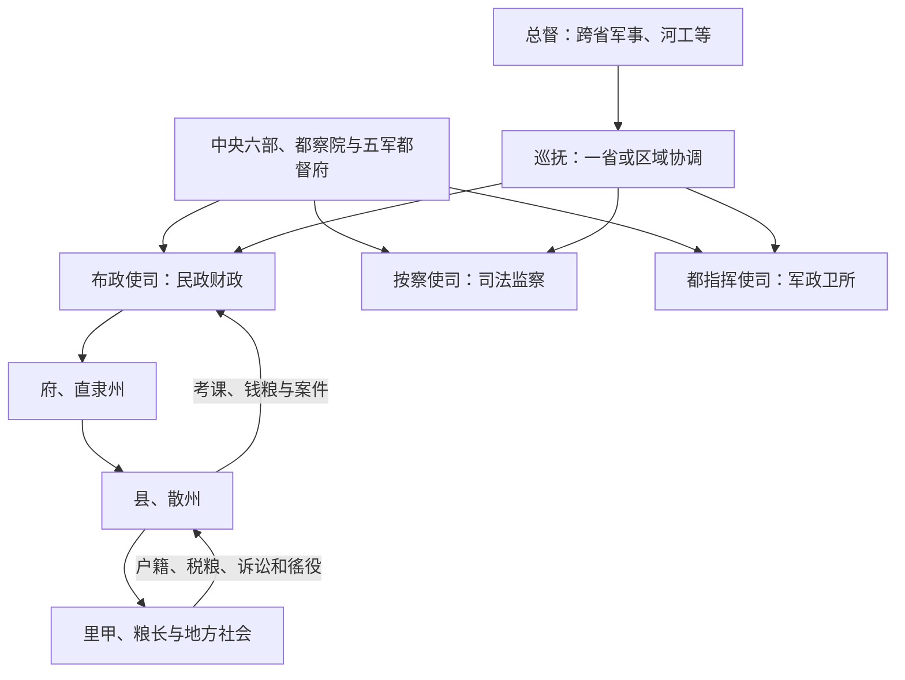

# 明代地方区划

明代承接元行省地域框架，却把省级行政、司法监察与军事分给承宣布政使司、提刑按察使司、都指挥使司，合称“三司”。北京、南京周边为直隶地区，不设普通布政使司。巡抚、总督原为中央派出的临时差遣，因边防、治河和跨区协调逐渐常设化，后来成为实际统合省级军政的关键。

## 正式层级

| 机构 / 区划 | 职掌 |
| --- | --- |
| 承宣布政使司 | 设左右布政使，掌民政、财政与户籍，辖府、直隶州等。日常所称“某省”常以其辖境为基础。 |
| 提刑按察使司 | 掌司法、监察和驿传等，分巡、分守道等派出系统后来增加。 |
| 都指挥使司 | 统辖卫所军事、军户和军籍，隶中央五军都督府等军事体系，与民政区并不完全重合。 |
| 府 | 知府治理，辖县和散州。 |
| 直隶州 / 散州 | 直隶州直接隶布政司并可领县；散州隶府，地位和领县情况不同。 |
| 县 | 知县治理户籍、税粮、司法、治安与教化，是常规基层行政单位。 |
| 卫、所 | 军事编制和屯田单位，常与府州县空间交叠，不是民政层级。 |

## 分权与再协调

三司互不统属可防止一位地方长官独占军政财刑，却使灾荒、叛乱和边防需要跨机关协调。巡抚多由都察院官衔出巡，总督可统合数省军务；明中后期其辖区、驻地和常设程度各异，不能直接等同清代定型督抚。

## 基层与赋役

- 里甲以户籍组织赋役，原则上由里长、甲首轮役；粮长在部分税粮重地负责催征与解运。
- 卫所军户承担世袭军役和屯田，民户与军户属不同管理体系；逃军、军屯侵占和军籍败坏削弱其功能。
- 黄册记录户籍和赋役，鱼鳞图册登记土地；实际更新、隐漏和地区覆盖并不完全一致。
- 一条鞭法在十六世纪后期逐步把多种赋役折银并归并征收，简化名目，也使百姓更受白银供求和地方加派影响。
- 县衙正式官员少，日常依赖胥吏、里甲、乡绅和宗族；地方精英既能赈济调解，也可能包揽税役、隐占土地。

## 特殊区域

两京直隶由中央直接联系；边地设九边军镇、都司卫所及羁縻卫所。西南土司以世袭首领治理并向朝廷承认名号、贡赋和军役，中央在条件成熟处实行改土归流。海疆、矿区、河工和漕运又常由专门巡抚、总督或差官管理，使空间权力超出普通省府县图。

## 成效与代价

三司分权与科道巡按提高中央监督，省府县和里甲支撑全国税粮；巡抚总督则补足区域协调。代价是军事与民政区划重叠、临时差遣常设化后权责复杂、基层正规官员不足。晚明辽饷、剿饷、练饷等加派，灾荒和战争破坏税源，卫所衰败、新募军依赖饷银，中央与督抚之间的资源协调失衡。明亡不能只由省制或督抚权力解释。

## 图示

