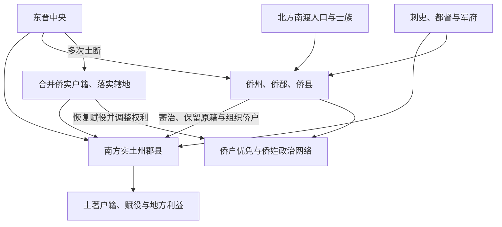

# 两晋地方区划

两晋以州—郡 / 国—县为常规框架，同时叠加宗室封国、都督军事辖区和东晋侨州郡县。西晋统一后州郡数量已较汉代增加，地方层级趋于碎片化；永嘉乱后人口南渡，侨置与原有州郡重叠，户籍、赋役和地方权利更加复杂。

## 常规层级与宗室封国

| 层级 / 单位 | 运行方式 |
| --- | --- |
| 州 | 刺史主持行政监察，重要区域又常由都督诸军事统辖军队；刺史、都督可以一人兼任，也可能分设。 |
| 郡、王国 | 太守或内史治理。西晋分封宗室王，以郡为国；诸王享有食封并配置国官，实际军政权随是否就国、都督或开府而异。 |
| 县、公侯国 | 县令长或相治理，是户籍、赋役和司法基层。 |
| 乡、亭、里 | 承接征发与治安，国家常设官僚在县以下有限，需借地方社会执行。 |
| 西域长史府等 | 边疆军政机构，名义和实际控制随西晋崩溃而变化。 |

“诸侯王不去封地、仅有财政收入”并不适用于所有宗王和阶段。西晋宗王可出镇、开府或都督诸军，八王之乱正与其政治军事资源有关；也不能把宗王分封视为内战的唯一原因，继承、宫廷联盟与军队控制同样关键。

## 侨置与土断

北方人口南迁后，东晋为安置侨民、保留原籍身份和组织统治，在南方寄治原籍同名的侨州、侨郡、侨县。侨置初期常无完整实土，侨户可能享受一定租役优免；这有助团结北来士族和流民，也造成一地多套行政名籍。

土断不是一次完成的改革，而是东晋南朝多次核实人口、令侨户“以土为断”、并省侨置区划的过程。不同土断的范围和成效不一，常遭既得利益抵制。

## 军事辖区与实际权力

州郡之外，都督诸军事可以跨州统军，荆州、江州、徐州等战略区域的刺史、都督掌兵后成为中枢权力竞争者。东晋朝廷依靠方镇防御北方和控制长江，却又担心桓温等强臣逼迫中央。行政区划图因此不能直接说明军队和财政的真实归属。

## 人口、士族与基层治理

侨姓高门依靠原籍网络、庄园和仕宦掌握政治资源，本地吴姓士族及普通编户承担不同赋役。州郡官府依赖大族、部曲和地方吏员，但也通过检籍、土断和任官调节。户籍不实、豪强荫户和战争流亡削弱税役基础，是东晋长期财政问题之一。

## 演变后果

西晋分封试图以宗室屏藩，却在继承危机中与都督兵权结合，成为内战条件；永嘉之乱又摧毁北方统一区划。东晋侨置提供了吸纳迁民的制度弹性，使南方人口、农业与政治中心发展，同时留下重叠区划和赋役不均。南北朝继续增置州郡、侨置与土断，至隋统一才大规模裁并。

## 图示

