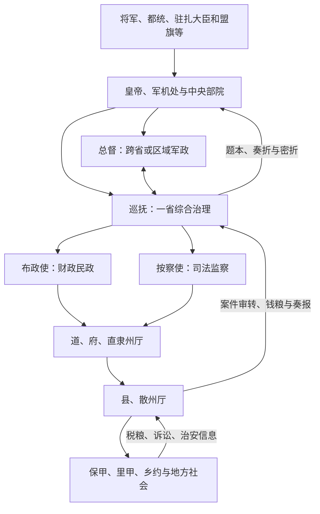

# 清代地方区划

清代内地大体形成省—府 / 直隶州厅—州县体系，省级由总督、巡抚、布政使和按察使等分工。总督、巡抚统筹军政，布政使承办财政民政，按察使负责司法监察；一省并非只有一位“省长”。内地省制之外，东北、新疆、蒙古、西藏和西南土司地区采用将军、盟旗、驻扎大臣、办事大臣及土司等制度，十九世纪又陆续改制。

## 内地层级与长官

| 层级 / 官职 | 职能 |
| --- | --- |
| 总督 | 通常统辖一省或数省军政、边防和重大事务，可兼兵部、都察院衔；辖区和驻地因时期而变。 |
| 巡抚 | 统理一省民政、财政、司法和军务，直接奏事；有的省单设，有的由总督兼理。 |
| 布政使 | 掌一省钱粮、户籍和民政执行，是督抚以下重要承办官。 |
| 按察使 | 掌刑名、司法监察，并管理相关驿传等事务。 |
| 道 | 分守道、分巡道及专务道连接省与府州，职掌和辖界多样，不是一律完整行政层。 |
| 府、直隶州、直隶厅 | 府辖县与散州；直隶州、厅直接隶省并可能领县，厅常用于新开发、边地或族群交错区域。 |
| 县、散州、散厅 | 知县、知州、同知通判等治理，是户籍、税赋、诉讼和治安的基层官僚单位。 |

## 省级分工与信息链

督抚、两司和道府县层层转报形成常规行政；奏折特别是密折又让督抚及特许官员直接向皇帝报告，强化信息控制。官员回避、调任和中央任命防止地方职位世袭化，但层级多、报批慢，紧急时需督抚先行处置再奏。

## 多元边疆制度

- **蒙古**：盟旗制度组织札萨克旗，理藩院与将军、都统等共同管理，保留贵族和属地结构。
- **西藏**：驻藏大臣与达赖、班禅及噶厦等机构并存，中央权力和地方运行随时期、战争与改革变化。
- **新疆**：征服准噶尔后主要由伊犁将军及各地办事、领队大臣管理；1884 年建省，转向较统一的省制。
- **东北**：盛京、吉林、黑龙江将军辖区兼具旗制、驻防和边疆管理，十九世纪末至二十世纪初陆续建省。
- **西南**：土司世袭治理与流官州县并存，雍正时期大规模改土归流，但并未在所有地区同时完成。

## 基层治理与财政

县衙正式官员极少，依赖书吏、衙役、保甲、里甲、乡约、士绅、宗族和商人组织。地丁钱粮趋于定额后，地方经费常靠耗羡、捐纳和各种附加；雍正耗羡归公与养廉银试图规范经费和降低贪索，地区效果不一。重大刑案逐级审转，死刑须中央复核，程序严密也可能拖延。

## 十九世纪变化

太平天国等战争促使地方团练、湘淮军和厘金发展，督抚掌握更强军队与财源；这并非省制自然“自治化”，而是中央在危机中授权地方筹饷作战。海关、总理衙门、洋务企业和新军又创造跨越旧层级的机构。清末新政设新式厅局并筹备地方自治、省谘议局，旧官制与新制度并行。

## 成效与结构成本

内地省制与督抚协调能在广阔疆域内统一政令，又以边疆差异制度适应多种社会。其代价是法律行政不均、督抚与将军等权限重叠、基层正规财政不足。十九世纪地方军政财政上升提高应急能力，也使中央资源更难统一。清亡涉及战争赔款、财政、地方军事化、民族政治、新式教育军队与革命等多重因素，不能只归因于督抚坐大或中央集权。

## 图示

