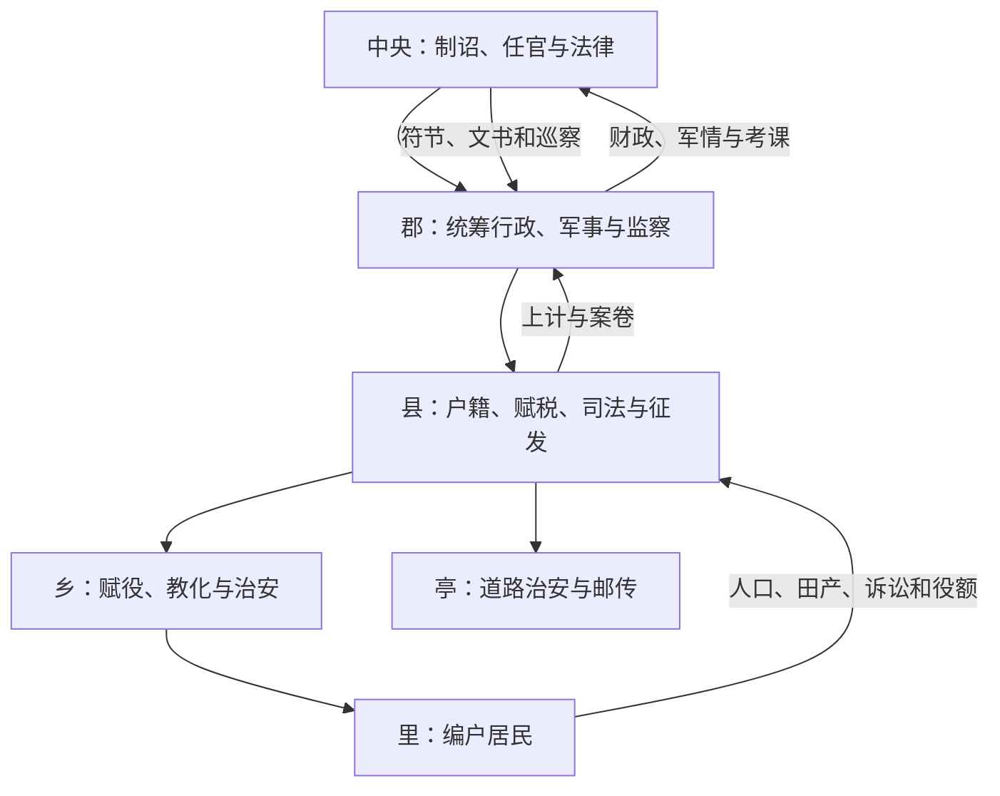

# 秦代地方区划

秦统一后把战国秦国郡县官僚扩展到全国，废除六国王号和主要世袭政治中心，由中央任命地方官。传统记载称初分天下为三十六郡，此后随征服与分置增至四十余；具体郡名、数量和边界因传世文献与出土材料不同而有争议，不能把某一张复原图当作唯一固定疆域。

## 层级与职掌

| 层级 | 主要官员 | 职能 |
| --- | --- | --- |
| 郡 | 守主民政，尉主军事治安，监御史等负责监察，丞协助郡守。 | 承接中央命令，统辖县，汇总户籍、税赋、司法和军情；具体官名配置可能随时期变化。 |
| 县 | 万户以上称令、不满万户称长；丞、尉分理司法文书和治安军事。 | 是稳定的地方行政核心，处理户籍、征税、徭役、诉讼、仓储与征兵。 |
| 乡 | 三老偏教化，有秩或啬夫处理赋役诉讼，游徼掌治安。 | 连接县廷与基层居民，官员及设置并非各地完全一致。 |
| 里 | 里典、里正等组织居民。 | 登记、传达、征发与治安互助，是编户管理的基层单元。 |
| 亭 | 亭长等。 | 偏重治安、邮传和道路节点，不宜与乡、里排成严格同一行政链；“十里一亭”是概括性说法。 |

咸阳及关中核心区由内史等机构管理，边地、新征服区和交通军事要地也可能采用不同设置。

## 中央控制怎样落地

郡县官由中央任免、调动，不能世袭。地方通过年度或阶段性上计报告人口、垦田、租赋和治安，中央以法律、文书格式、印信符节和监察统一执行。道路、驰道、邮传及统一度量衡、书写规范降低跨区治理成本。

## 运行基础

- **编户齐民**：国家把家庭登记为纳税、服役和承担法律责任的单位，户籍变动需申报。
- **法令与吏员**：县级长官人数有限，日常依赖令史、狱吏、仓吏等基层文吏；出土简牍显示文书核验与责任追究细密。
- **财政军役**：田租、口赋、徭役和兵役支持中央工程与战争，具体税率和地域执行并非一成不变。
- **地方社会**：什伍连坐、里组织和地方有力者共同影响执行；中央直辖并不意味着完全绕过本地关系。

## 成效、危机与后续

郡县制有利于统一法令、调动粮兵和拆除六国政治中心，却也把中央高强度征发迅速传到基层。统一后北方防御、南方征服、宫殿陵墓和交通工程叠加，地方官若以严刑和考课压力追征，容易放大社会负担。秦末起义后，反秦势力一度恢复王国封建；汉初最终采用郡国并行，再逐步削弱诸侯王，说明中央与地方安排仍在试验，而非秦制从此原样不变。

## 图示

