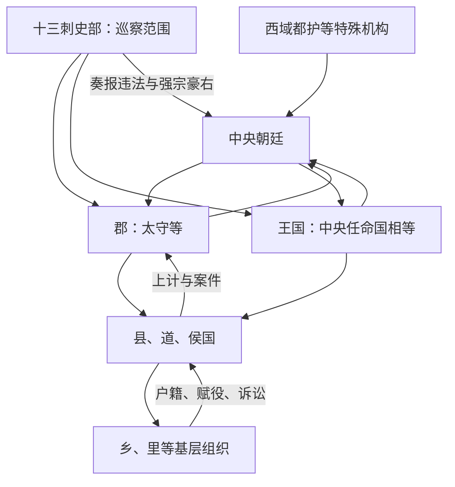

# 西汉地方区划

西汉在秦郡县基础上实行郡国并行：中央直辖郡县与刘氏诸侯王国并存。汉初王国可自置部分官吏、征税并拥有军队，是重建统一时安置宗室和功臣的政治安排；七国之乱及后续改革逐步剥夺其治民军政权。汉武帝又设置刺史分部监察郡国，但“州”当时主要是巡察范围，并非一级常设行政政府。

## 郡、国与封邑

| 类型 | 性质 | 变化 |
| --- | --- | --- |
| 郡 | 中央派太守治理，辖县、道、侯国等县级单位。 | 是中央直辖地方的核心，向中央上计并输送赋税、兵役。 |
| 王国 | 皇子或宗室受封区域，汉初可跨数郡并拥有较大军政权。 | 文景以后由中央派相等官治理，王主要享租税；辖境逐步缩小至近似郡。 |
| 侯国 | 列侯食邑，通常相当于县级单位。 | 列侯主要享受规定租税，不当然拥有独立行政和军权，由中央官吏治民。 |
| 汤沐邑、食邑 | 皇后、公主等封君的收入来源。 | 侧重征收食邑租税，不能与拥有完整统治权的王国等同。 |
| 道 | 多设于民族成分复杂的县级区域。 | 与县、侯国同层性质相近，具体治理结合当地情况。 |

## 削藩过程

- 高祖消灭多数异姓王后，大封刘氏宗王，以为中央屏藩。
- 文帝、景帝时期削减王国辖地和官制；晁错削藩成为前 154 年吴楚七国之乱的直接诱因之一，叛乱平定后诸王军政权进一步收归中央。
- 汉武帝前 127 年采纳主父偃建议推行**推恩令**，允许诸王子弟分封侯国，使王国在继承中不断析分。推恩令不是文帝、景帝时期措施。
- 左官律、附益法等限制官员与诸侯王结党，王国相和重要官员由中央任命，诸王逐渐“惟得衣食租税”。

## 地方与监察链

汉武帝元封五年（前 106 年）在京畿以外设置十三刺史部，刺史以较低秩巡行监察二千石长官和地方强宗。刺史没有一套州级常设行政官府，不能把西汉直接画成州—郡—县三级。京畿、西域及边郡另有司隶校尉、西域都护、属国都尉等不同制度。

## 西域与边疆

西域都护在前 60 年前后设立，协调西域诸国、屯田交通和军事安全，其实际控制随战争、供给和当地政治而变化。边郡往往兼有屯戍、移民和属国管理；“统管三十余国”等数字依时期而变，名义臣属也不等于郡县式直接治理。

## 基层治理与地方社会

县下有乡、亭、里等组织，县官依靠啬夫、三老、游徼、亭长以及大量文吏完成税役、治安和司法。地方豪强通过土地、宗族和宾客网络影响基层；中央一方面依赖郡国推荐人才，另一方面以迁徙豪强、刺史监察和法律限制其势力。察举使地方官拥有推荐权，也可能加强地方社会关系对仕途的影响。

## 制度成效与代价

郡国并行在建国初期兼顾中央直辖和宗室联盟，却产生王国与中央的军事竞争；削藩巩固统一，也强化官僚对地方的直接征发。刺史提高信息与监察能力，但其职权扩张为东汉州行政化提供条件。财政战争、盐铁专卖和对外扩张增加地方负担，说明中央控制增强不等于基层成本下降。

## 图示

