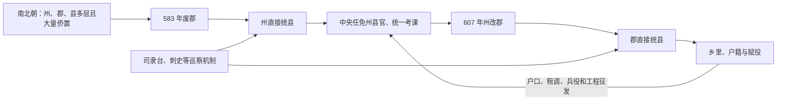

# 隋代地方区划

隋统一南北后面对州郡县层级重叠、区划细碎和冗官问题。隋文帝开皇三年（583 年）废郡，改由州直接统县；隋炀帝大业三年（607 年）又把州改称郡，仍维持郡—县二级。两次改革的共同点是裁并中间层、由中央任命地方长官，而不是简单在“州制”和“郡制”之间复古。

## 两阶段区划

| 阶段 | 常规层级 | 目的与变化 |
| --- | --- | --- |
| 开皇时期 | 州—县 | 废除南北朝大量重叠郡，裁并州县，减少官员和行政层级；州刺史直接领县。 |
| 大业时期 | 郡—县 | 全国州改为郡，刺史改太守，并继续调整郡县范围和官额；名称接近秦汉，实际承接隋初二级治理。 |

京师、陪都、边地、军事要区及少数族群区域仍有特殊官署，不能假定全国行政完全同质。

## 改革怎样运行

总管府源自北周的区域军事统辖，隋初在战略地区兼管军民；随着统一和中央控制加强，许多总管府被裁撤，大业时期进一步废改。炀帝又以司隶台、刺史等方式分部巡察郡县，具体设置、分区和存续曾多次变化，不宜把巡察区直接画成固定行政层级。

## 地方官与基层

- 州刺史或郡太守、县令由中央选任，宗室和地方豪族不再以世袭资格统治普通州县。
- 州县官负责户籍、均田租调、仓储、司法、治安、征兵与工程征发，中央通过考课与使者巡察。
- 县以下乡、里承担编户和赋役组织；开皇“大索貌阅”、输籍定样等措施试图核实隐漏户口。
- 里长、宗族和地方有力者仍是执行中介，户籍清查也会触动豪强庇荫人口的利益。

## 成效与代价

裁并郡县降低了层级与冗官成本，户籍和仓储体系支持统一、边防和灾荒调度。二级制也扩大州或郡直接管理的县数，对交通和官员能力要求更高。大运河、东都建设和高句丽战争把地方治理转为高强度征发，灾荒与役负下文书考课可能促使官员隐瞒困难或强征。611 年以后反叛扩散，说明行政标准化若缺少可持续财政与社会承受力，会加速危机传导。

## 历史影响

唐初把郡重新多称州，基本沿用州—县二级，同时增设道作为监察区；因此隋的关键遗产不是某个名称，而是大规模裁并后的州县网络、中央任官和统一户籍财政体系。后世“三级—二级”比较还应把监察使职和军区算入实际治理，而不能只数正式层级。

## 图示

