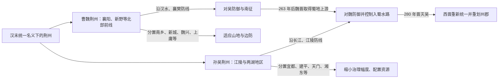

# 荆州：三国时期

220 年以后，曹魏与孙吴分别设置荆州：魏荆州控制汉水、南阳盆地及长江以北前线，吴荆州控制江陵、洞庭湖和湘水流域。两州同名却分属不同政权、各有治所和辖郡；蜀汉在 219 年关羽败亡、222 年夷陵战败后不再实际占有荆州，但仍把恢复荆州视为重要战略议题。

## 分治结构

魏、吴反复分郡，不只是行政膨胀：新郡可安置官员、分割大郡、加强新占地区、控制山道水道，并为军事后勤建立更短的指挥距离。部分郡设置短暂，随战局又省并。

## 曹魏荆州

曹魏初期荆州常概括为南阳、襄阳、南乡、章陵、江夏北部、新城等六郡，治所及州界随战事调整。襄阳—樊城防线保护南阳和中原南缘，新城、上庸、魏兴等控制汉水上游和通往汉中的山地。

| 时间 | 沿革 |
| --- | --- |
| 黄初二年（221 年） | 取得原属蜀汉势力范围的西城等地，改置魏兴郡并纳入荆州体系。 |
| 黄初三年（222 年） | 分南阳置义阳郡，章陵等地并入义阳国；具体沿革随后又调整。 |
| 太和二年（228 年） | 分新城相关地区置上庸、锡等郡，以加强汉水上游治理。 |
| 太和四年（230 年） | 省上庸郡。 |
| 景初元年（237 年）前后 | 魏兴、上庸、锡等郡再有分合，反映边地控制与行政调整。 |
| 正始元年（240 年） | 义阳郡并入南阳郡。 |
| 甘露四年（259 年） | 分新城等地再置上庸郡。 |

后期常见辖郡概括为**南阳、襄阳、南乡、江夏北部、新城、魏兴、上庸**七郡。由于郡界、废置年份和遥领情况在史籍中有差异，数字应与具体年份相配。

## 孙吴荆州

孙吴初期荆州以**南郡、宜都、江夏南部、武陵、长沙、零陵、桂阳**等七郡为核心。江陵是长江中游军政重镇，宜都、建平扼三峡，武陵与天门连接山地，长沙、桂阳、零陵支撑湘水流域税粮与岭南交通。

| 时间 | 沿革 |
| --- | --- |
| 黄武五年（226 年） | 分苍梧等相关地区置临贺郡，后纳入荆州体系；交、广分合使隶属曾变化。 |
| 太平二年（257 年） | 分长沙郡置湘东、衡阳郡。 |
| 永安三年（260 年） | 分宜都郡置建平郡，强化三峡下游控制。 |
| 永安六年（263 年） | 分武陵郡置天门郡。 |
| 甘露元年（265 年） | 分零陵置始安，分桂阳置始兴。 |
| 宝鼎元年（266 年） | 分零陵置昭陵郡，并伴随交州、广州等更大区划调整。 |

吴后期常见荆州辖十五郡的概括为：**南郡、宜都、建平、江夏南部、武陵、天门、长沙、湘东、衡阳、零陵、昭陵、始安、桂阳、始兴、临贺**。不同时点的隶属与名称仍可能变化。

## 军政与地方治理

- 魏荆州重点是襄阳、江夏、上庸等前线，刺史往往兼有军事职责，并与都督荆豫诸军事等跨州军职互动。
- 吴荆州既是对魏前线，也是连接建业与益州、交州的内线；江陵守军和长江水军决定防御。
- 郡县承担户籍、屯田、征兵和运输，山地族群地区又常借当地首领、部曲和军事据点治理。
- 战争造成迁民、屯田和军户增加，同一地区可能先后归属不同政权，行政名单未必等于稳定控制。

## 关键战争与结局

夷陵之后吴守江陵，222—223 年曹魏进攻江陵未能攻克，魏吴分界趋稳。此后双方在襄阳、江夏及长江沿线多次攻防。263 年魏灭蜀改变上游战略，西晋代魏后从益州、荆州及东南多路攻吴；280 年王濬水军顺江而下，配合晋军突破吴荆州防线，孙吴灭亡。荆州重新归于一朝，但西晋随后仍重新分州置郡。

## 历史影响

三国荆州说明行政区划是战争和国家建构的工具：同名州可以服务不同政权，分郡既加强地方控制，也增加官署和财政成本。后来叙述常把“争荆州”归因于个人信义或单场战役，实际更深层原因是三国对长江中游、汉水与益州出口的结构性竞争。
