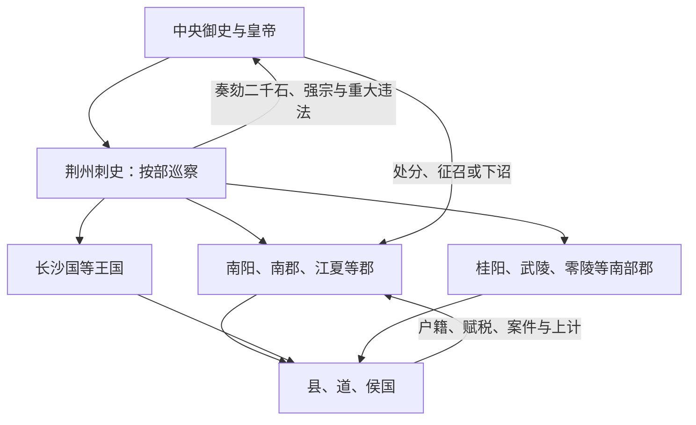

# 荆州：西汉时期

汉武帝元封五年（前 106 年）在京畿以外设置十三刺史部，荆州刺史部是其中之一。其范围大致从今河南南阳一带向南覆盖长江中游和两湖地区。这里的“州”主要是监察分区：刺史巡行所属郡国，直接向中央奏报，并不在郡之上设置一套全面治理户籍、赋税和司法的常设省级政府。

## 设置背景

汉武帝时期郡国数量增加、财政战争事务扩大，中央需要越过太守和国相取得地方信息。刺史秩级低于郡国二千石长官，却奉中央使命巡察，重点纠察地方长官、强宗豪右及重大违法。这种“以小制大”有助于避免监察官本身成为地方行政首长。

## 所辖郡国

按常见西汉后期区划口径，荆州刺史部包括以下郡国；郡国分合、王国改置和史籍统计时点不同，具体名单需结合年代判断。

| 郡国 | 大致位置与特点 |
| --- | --- |
| 南阳郡 | 今河南西南、湖北北部一带，连接关中、洛阳与汉水流域。 |
| 南郡 | 以江陵附近为重要中心，控制长江中游及入蜀交通。 |
| 江夏郡 | 汉水下游至长江北岸一带，位置随时期调整。 |
| 长沙国 | 两湖以南的重要王国，后来王权受中央官僚约束。 |
| 桂阳郡 | 今湖南南部、广东北缘一带，连接岭南。 |
| 武陵郡 | 今湖南西部及邻近山区，族群和交通条件复杂。 |
| 零陵郡 | 今湖南南部及广西东北部一带。 |
| 衡山郡等调整区域 | 不同统计口径会列入衡山相关郡域；其建置分合较多，不宜把八郡国名单视为前 106 年后始终不变。 |

## 监察怎样运作

刺史主要巡察，不直接取代太守、国相治理百姓。郡国仍向中央上计和输送财赋；刺史的报告则为中央考核、罢免地方官和处置豪强提供另一条信息渠道。刺史何时有固定治所、属吏规模如何扩大，存在阶段差异，不能用东汉末州牧官府倒推西汉。

## 区域差异

北部南阳人口和交通较发达，靠近政治中心；南郡、江夏控制江汉水运；武陵、零陵、桂阳等地域广、山地多，中央治理常需借当地首领和郡县吏。刺史巡视如此广阔区域受道路、季节和文书速度限制，实际监督不可能均匀。

## 制度影响

刺史部提高了中央监督郡国的能力，也提供跨郡观察灾害、治安和豪强势力的框架。与此同时，刺史职权在东汉逐渐扩大，州部属吏和治所发展；东汉末战争中州牧掌握军政，荆州遂由监察范围转为刘表等人经营的区域政权。这个后果并非西汉设置时预定，而是长期危机与授权累积的结果。
