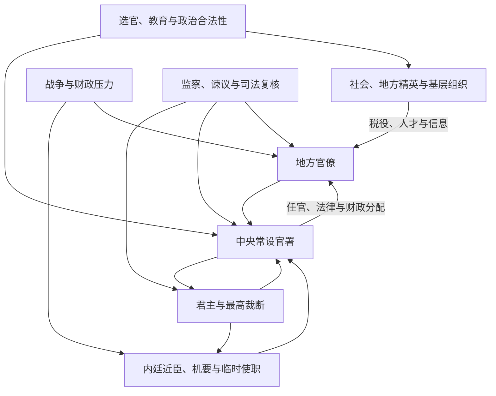

# 政治制度

本目录讨论中国古代政治秩序怎样形成和运作，而不只罗列朝代官名。核心问题包括：最高决策如何产生，中央怎样控制地方，官僚从何而来，财政军队如何组织，制度怎样吸纳地方精英，又为何在继承、战争和财政危机中失灵。

## 专题笔记

| 笔记 | 内容 |
| --- | --- |
| [中国古代政治制度演变](/%E4%BA%BA%E6%96%87%E7%A7%91%E5%AD%A6/%E5%8E%86%E5%8F%B2/%E4%B8%9C%E4%BA%9A/%E4%B8%AD%E5%9B%BD/_%E5%88%B6%E5%BA%A6/%E6%94%BF%E6%B2%BB%E5%88%B6%E5%BA%A6/%E4%B8%AD%E5%9B%BD%E5%8F%A4%E4%BB%A3%E6%94%BF%E6%B2%BB%E5%88%B6%E5%BA%A6%E6%BC%94%E5%8F%98.md) | 从商周复合统治、战国官僚化到明清中枢，比较不同阶段的权力结构与重大转折。 |
| [中央集权制度](/%E4%BA%BA%E6%96%87%E7%A7%91%E5%AD%A6/%E5%8E%86%E5%8F%B2/%E4%B8%9C%E4%BA%9A/%E4%B8%AD%E5%9B%BD/_%E5%88%B6%E5%BA%A6/%E6%94%BF%E6%B2%BB%E5%88%B6%E5%BA%A6/%E4%B8%AD%E5%A4%AE%E9%9B%86%E6%9D%83%E5%88%B6%E5%BA%A6.md) | 区分君主专制与中央集权，分析人事、财政、军事、司法和信息控制的具体机制。 |

## 六条分析轴

| 分析轴 | 关键问题 |
| --- | --- |
| 最高权力 | 君主是否拥有最终裁断；皇太后、摄政、宰辅、贵族和军人何时分享实际权力。 |
| 中枢程序 | 议政、起草、审核、执行和监察是否分工；内廷近臣为何反复取代外朝高官。 |
| 中央—地方 | 地方官由谁任命，税粮、军队、司法和奏报如何连接中央。 |
| 精英进入 | 世袭、军功、察举、九品中正、科举、门荫和吏员升迁各占何种位置。 |
| 财政军事 | 国家怎样登记人口、征税、运输与养兵；战争怎样催生使职、军区和地方授权。 |
| 合法性与社会 | 宗法礼制、天命、儒学、族群秩序和士绅网络如何支持或限制国家运作。 |

## 权力不是单向强化

这套循环会因时代改变。中央常设机关成熟后可能形成强大专业和程序，皇帝于是另用近臣加快机密决策；战时地方获权可提高应变，和平后中央又试图收回军财。所谓“皇权加强”只是其中一条变化，不能替代对财政能力、地方社会和政治联盟的分析。

## 常见误区

- **把君主专制等同中央集权**：皇帝压制宰相，不一定意味着中央更能控制地方；强势地方军阀也可能拥立高度专断的君主。
- **把制度图当作实际政治**：三省、六部、三司等法定机构之外，外戚、宦官、宗室、内阁、军机处和军府都可能掌权。
- **把演变写成线性进步或退化**：分权可能带来纠错，也可能只是相互牵制；集权可提高动员，也可能放大错误。
- **用单因解释王朝兴亡**：继承、财政、军事、生态灾害、疾病、全球贸易和社会动员通常共同作用。
- **忽视地区差异**：内地郡县、省制与都护、羁縻、土司、盟旗等制度长期并存。

## 直接上级

- [中国古代制度](/%E4%BA%BA%E6%96%87%E7%A7%91%E5%AD%A6/%E5%8E%86%E5%8F%B2/%E4%B8%9C%E4%BA%9A/%E4%B8%AD%E5%9B%BD/_%E5%88%B6%E5%BA%A6/README.md)
