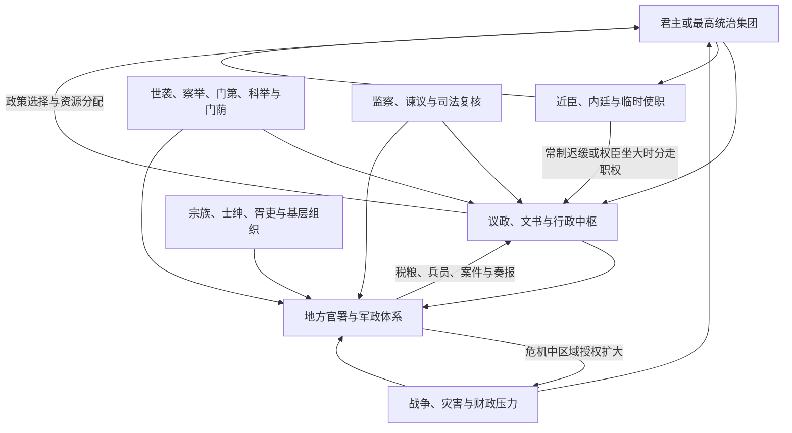

# 中国古代政治制度演变

中国古代政治制度不是从“分封”到“专制顶峰”的单线。长期变化至少包括四条相互关联又不同步的主线：世袭贵族向任官官僚转型；中央对地方的人事、财政和军事控制扩大；内廷近臣与外朝常设机关反复更替；选官从血缘和门第为主逐渐加入察举、科举等资格渠道。每次集中都带来新的协调和信息成本，战争与财政危机又常迫使中央把权力授给地方或临时使职。

## 制度运行的基本循环

这套循环解释了为何尚书、中书、内阁、军机处等常由“近臣小机构”成长为新中枢，也解释了刺史、节度使、巡抚、总督为何从派遣或监察职位转为区域权力中心。

## 分期总览

| 时期 | 中枢与最高权力 | 地方与社会 | 选官及主要张力 |
| --- | --- | --- | --- |
| 史前与传统禅让叙事 | 部落联盟与首领推举的记忆见于后世文献，不能直接当作可验证的固定制度。 | 聚落、亲族和联盟结构多样。 | 考古材料与传世“禅让”叙事之间存在解释争议。 |
| 夏及早期王朝传统 | 王位世袭逐渐成为政治正当性核心，父子、兄弟继承并见。 | 王朝对外围控制的具体形态不详。 | 年代和制度细节多有争议，不宜套用后世官制。 |
| 商 | 商王通过祭祀、战争、贡纳和册命联系王族、贵族与方国。 | 王畿与方国构成强弱变化的复合网络。 | 贵族宗族、贞人和军事首领构成统治集团。 |
| 西周 | 册命分封、宗法礼制和王室卿士组织贵族政治。 | 诸侯、卿大夫有世袭领地和内部治理，向上承担朝觐、贡赋与军役。 | 嫡长继承是重要规范但实践有例外；王室衰弱后卿族竞争加剧。 |
| 春秋战国 | 诸侯国君强化，相、将和文书官僚发展；变法扩展法令、军功和财政。 | 郡县、封君食邑与旧贵族并存，编户、征兵和税役深化。 | 游士、客卿与文吏上升；战争推动国家能力，也加重社会动员。 |
| 秦 | 皇帝居最高裁断，丞相、御史和诸卿分掌政务，统一文书法律。 | 郡县官由中央任命，户籍、上计和征发全国化。 | 军功与官僚任命取代部分世袭政治；高强度役法和继承危机放大崩溃。 |
| 西汉 | 三公九卿延续，武帝后尚书、侍中等中朝近臣进入决策。 | 郡国并行；七国之乱、推恩令后王国削权，刺史监察郡国。 | 察举、征辟、任子等并存；外戚与受遗辅政者因幼主政治掌权。 |
| 东汉 | 尚书台成为日常中枢，三公位尊而实权下降；外戚、宦官争夺宫廷文书。 | 州前期为监察区，188 年后州牧扩权，豪强大族影响地方。 | 察举依赖地方名望；党锢、地方募兵和中央失控促成军阀化。 |
| 三国两晋南北朝 | 尚书、中书、门下逐步分化；权臣、宗王、军府和皇太后政治频繁。 | 州郡县增多，侨置、都督区和各族政权制度并存。 | 九品中正与门第政治发展，但军功、文吏和寒门上升通道未断。 |
| 隋唐 | 三省六部、政事堂与科举形成成熟官僚框架；唐中后期翰林、内枢密使和诸使兴起。 | 隋压缩地方层级；唐道由监察使职发展，安史后藩镇军政财权扩大。 | 科举扩大但门荫、荐举和贵族仍重要；战争财政促成使职侵夺常官。 |
| 宋 | 二府三司分理政、军、财，元丰改制后机构再调整；台谏作用突出。 | 路级多司交叉，文臣知州、通判和转运体系防止割据。 | 科举文官扩大，荫补仍多；高财政与常备军能力伴随官僚、军费负担。 |
| 元 | 中书省、枢密院、御史台与宫廷、诸王体系并存；尚书省数度置废。 | 行省成为高层区域机关，宣政院、投下和多种户计造成差异治理。 | 怯薛、族群身份、吏员、军功和科举并用；皇位继承与财政币制反复。 |
| 明 | 1380 年废丞相，六部直达皇帝；内阁票拟和司礼监批红弥补文书协调。 | 省级三司分权，巡抚总督逐渐常设；里甲、卫所和土司并存。 | 科举成为文官主路，首辅与宦官权力依赖皇帝；财政军务加剧部院与地方压力。 |
| 清 | 议政王大臣会议衰退，内阁处理常务，军机处与奏折强化机要决策。 | 督抚省制与将军辖区、盟旗、驻藏大臣、土司等多元制度并存。 | 满汉复职、科举、捐纳和旗制并存；十九世纪地方练军财源与新政改变中央地方关系。 |

## 七个关键转折

### 战国官僚化

大规模战争要求稳定征兵、税粮、道路和赏罚，各国以编户、郡县、军功爵和成文法加强君主对资源的直接控制。秦的统一制度是这场长期竞争的结果，而非前 221 年突然创造。

### 秦汉帝国化与内外朝

秦建立跨区域官僚帝国，汉初以郡国并行缓和统一与封建联盟的矛盾。诸侯削权后，中央控制加强；与此同时，皇帝用尚书、侍中等近臣制约丞相，使“宫廷小机构—正式中枢”的更替模式形成。幼主政治又让外戚、皇太后和受遗大臣进入权力核心。

### 魏晋南北朝的贵族与军府

三省制度在分裂和多民族政权竞争中逐步形成，九品中正把地方评价与官员资格连接，却逐渐受门第影响。高门士族不是国家之外的单纯障碍，而是提供官僚、文化和地方合作的政治集团；皇权、门阀与军府相互依赖又竞争。

### 隋唐国家重整

隋裁并州郡、清查户籍并整合三省六部，唐以政事堂和科举扩大制度化治理。安史之乱后，均田租庸调基础变化、两税法、节度使和财政使职重塑国家，显示成熟常制仍会被战争迫使改造。

### 唐宋之际的政治社会变化

科举与文官群体扩大，门阀贵族式政治衰退，财政、司法和文书治理更加专业。宋以二府三司和路级多司控制军政地方，国家汲取能力强，却承担庞大军费和行政成本。“宋代弱兵”不能简单由文官政治推出。

### 元明清的大疆域与机要中枢

元将蒙古帝国传统与中原官僚结合，行省和差异治理应对广阔疆域。明废相后以内阁票拟、宦官批红填补协调缺口；清军机处与奏折又形成更小、更快的皇帝机要班子。每次提速都伴随权责依赖个人、正式机关与内廷重叠的问题。

### 十九世纪危机与制度转型

全球军事贸易体系、战争赔款、人口与生态压力、地方团练和新式军队改变清代财政军政。新衙门、新学制和预备立宪与旧制度并行，改革速度、权力再分配及革命动员共同导致帝制终结。

## 长期机制与结构成本

| 机制 | 能力 | 代价 |
| --- | --- | --- |
| 中央任官与轮调 | 防止地方职位世袭，统一法令和考课。 | 官员任期短、信息依赖胥吏和地方精英。 |
| 文书、户籍与财政统计 | 支持跨地区征税、征兵、赈灾和司法复核。 | 数据层层过滤，高考课压力会诱发瞒报和过度征发。 |
| 中枢分工 | 宰辅、三省、二府三司等可提高专业与互相校验。 | 多头协调、责任模糊，皇帝常另设内廷旁路。 |
| 科举与教育 | 扩大共同政治文化和人才来源。 | 不能消除门荫、财富与地域差异，也可能使知识结构围绕考试。 |
| 差异化边疆治理 | 适应多族群、多生态和交通条件。 | 法律财政不一，中央衰弱时中间权力可能自主化。 |

## 认识上的争议

“封建”“专制”“官僚制”“唐宋变革”等概念都有不同学术定义。制度史应避免把西欧经验或近代国家概念机械套用，也不应把中国历史描述为两千年不变。皇权在法理上居最高，并不等于每位皇帝都能有效控制官僚和地方；中央集权的强弱也应以任官、财政、军事、司法和信息等可观察机制分别判断。

## 图示

