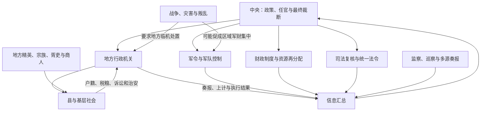

# 中央集权制度

中央集权是中央政权通过人事、财政、军事、司法、行政区划和信息系统约束地方权力，使关键资源与最终裁断汇集到中央的政治组织方式。它与君主专制相关但不相同：君主专制讨论最高统治者与中央官僚、贵族之间的关系；中央集权讨论中央与地方之间的关系。一个皇帝可以在中枢非常专断，却无力控制军阀地方；一个中央也可能由集体机关领导而高度集中地方权力。

## 五个可观察机制

| 机制 | 集权程度较高的表现 | 可能的反向变化 |
| --- | --- | --- |
| 人事 | 中央任免、考核和轮调地方高级官，实行回避，职位不世袭。 | 地方自行任官、军职世袭、长官形成私人幕府和地域网络。 |
| 财政 | 税制、户籍和度量统一，主要收入上供，中央决定转移与军费。 | 地方截留税源、掌专卖和自筹军费，中央依赖临时摊派。 |
| 军事 | 调兵、任将、军籍和后勤由中央或相互分立机构控制。 | 区域长官兼掌兵、财、人事，军队效忠个人或地方。 |
| 司法 | 法典统一，重大案件逐级复核，中央保留终审与赦免。 | 地方拥有独立法权，特殊群体和辖区不受普通审级约束。 |
| 信息 | 上计、奏章、监察、驿传、统计和密折使中央获得多源报告。 | 信息被中间层垄断，数据失真，交通中断，中央只能承认既成事实。 |

因此“地方层级少”不一定更集权：宋代路级多司虽然机构多，却通过分割军财刑权强化中央；唐末名义州县仍在，节度使兼掌多权则削弱中央。

## 控制回路

这个回路只有在中央能收到较真实信息、提供资源并兑现奖惩时才有效。若中央只下命令却没有财政、运输和基层合作，形式上的集权可能与实际治理能力相反。

## 为什么长期出现

中央集权并非由某一种经济或思想“必然决定”，而是多种条件长期互动的结果：

1. **战争竞争与统一安全**：战国兼并和后世边防要求跨区征兵、粮运与道路，推动统一法令、户籍和指挥。
2. **农业税基与人口登记**：以土地、户口为重要税役来源，需要县级官僚和账籍；商业税、盐铁与漕运又促使中央建立专门财政网络。
3. **大河、交通与赈济**：治河、仓储、运河和灾害救济需要跨地区协调，但这些公共工程并不自动推出专制，具体权力安排仍可不同。
4. **政治合法性**：天命、大一统、儒家礼治和法家行政技术为统一国家提供语言与工具；思想能支持制度，也会被不同政治力量作不同解释。
5. **地方精英合作**：中央官员人数有限，必须借助士绅、宗族、里甲、胥吏和地方首领。集权往往不是消灭中间力量，而是认证、利用并轮换它们。
6. **历史路径**：秦汉郡县、文书、法典和皇帝制度形成可供后朝继承的模板，恢复统一者通常在旧机构上改造，制度转换成本较低。

把长期原因概括为“小农经济必然需要集权”或“地主阶级共同需要”过于笼统，难以解释各朝、各区域和不同时段的显著差异。

## 历史阶段

| 阶段 | 主要变化 |
| --- | --- |
| 战国 | 变法、郡县、编户、军功和法令文书发展，君主直接动员地方资源。 |
| 秦汉 | 秦把郡县推广全国；汉初郡国并行，七国之乱、推恩令后王国削权，刺史加强监察。 |
| 魏晋南北朝 | 州郡县、都督军事和侨置交叠，门阀与军镇限制中央，但各政权也发展官僚财政。 |
| 隋唐 | 隋裁并区划、统一户籍；唐前期中央控制较强，安史后节度使和使职财政改变中央地方关系。 |
| 宋 | 文臣知州、通判和路级多司分割地方军财刑权，中央财政汲取强；战时协调成本上升。 |
| 元 | 行省获得较广区域权力，同时受中书、枢密和监察牵制；差异化边疆与投下权益并存。 |
| 明清 | 明三司分权、巡抚总督协调；清督抚省制与多元边疆制度并行，十九世纪地方军队财源上升。 |

这不是“地方权力不断削弱”的直线。东汉末、唐末、南北朝、元末和晚清都出现中央授权地方应急、地方资源随后自主化的循环。

## 集权与君主专制的四种组合

| 情形 | 说明 |
| --- | --- |
| 皇权强、中央对地方也强 | 皇帝能驾驭中枢，中央又掌握地方任官军财；仍受信息和执行能力限制。 |
| 皇权强、中央对地方弱 | 君主在朝廷内专断，却必须容忍军阀、藩镇或地方实力。 |
| 皇权受官僚程序约束、中央对地方强 | 宰辅、台谏和官僚共同决策，同时维持统一任官、财政和司法。 |
| 皇权与中央控制都弱 | 摄政、派系和地方武装分割权力，名义制度难以执行。 |

这种区分比“皇权加强—地方削弱”更能解释不同王朝阶段。

## 功能、成本与失败方式

### 可能功能

- 统一法令、度量和市场交通，降低跨区交易与治理成本；
- 调动跨地区资源进行边防、赈灾、河工和大型建设；
- 通过复核、监察和轮调限制地方世袭与部分地域压迫；
- 维持大范围政治共同体并促进人口、技术和文化交流。

### 结构成本

- 决策距离地方过远，统一政策可能忽视生态、经济和族群差异；
- 信息层层上报易失真，考课压力会诱发隐瞒灾情、过度征收；
- 权力集中可能放大最高层错误，继承危机会迅速影响全国；
- 分割地方权力可防割据，却增加协调和行政成本；
- 基层正式官员不足时，国家依赖胥吏与地方精英，实际负担可能被转嫁。

### 常见失灵过程

财政军役超过社会承受力，地方开始拖欠或加派；中央为平乱授予将领和督抚更多军财权；地方武装和税源围绕区域长官重组；交通、奏报和任官控制进一步失效；中央只能承认地方既成权力。秦末、东汉末、唐末、元末和晚清各有不同版本，不能套成完全相同的周期律。

## 评价与争议

中央集权既不是天然“先进”，也不必然阻碍商业、科学或文化。宋代高度中央化与商业财政扩张并存，明清不同时段的市场和知识变化也不能由“专制”一词单独解释。对具体制度的评价应分别考察它在当时解决了什么协调问题、资源成本由谁承担、有哪些反馈纠错渠道，以及在战争和继承危机中如何变化。
