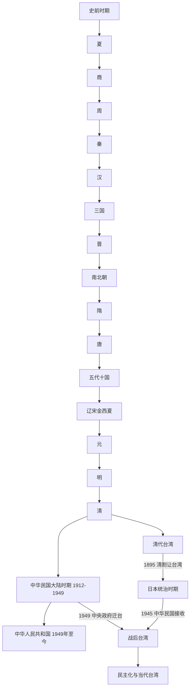

# 中国朝代变迁

## 概括

本目录集中放置中国历史朝代、政权与史籍的横向时间框架，用于帮助读者在进入各朝代目录前把握并立、分裂、继承和史书编纂关系。具体王朝事实、制度、事件和世系仍放入相应朝代目录。

## 朝代主线

> 上图只展示主要阅读主线；并立政权、过渡政权和边疆政权参见各时期笔记，不应被压缩为单线继承。1949年后的分支用于区分不同政权、治理范围和制度阶段，不表示简单的替代或直系继承。

## 导航

| 主题 | 入口 | 说明 |
|---|---|---|
| 中国历史时空图 | [中国历史时空图](/%E4%BA%BA%E6%96%87%E7%A7%91%E5%AD%A6/%E5%8E%86%E5%8F%B2/%E4%B8%9C%E4%BA%9A/%E4%B8%AD%E5%9B%BD/_%E6%9C%9D%E4%BB%A3%E5%8F%98%E8%BF%81/%E4%B8%AD%E5%9B%BD%E5%8E%86%E5%8F%B2%E6%97%B6%E7%A9%BA%E5%9B%BE.md) | 用时间与空间对照主要政权及其并立关系。 |
| 二十四史 | [二十四史](/%E4%BA%BA%E6%96%87%E7%A7%91%E5%AD%A6/%E5%8E%86%E5%8F%B2/%E4%B8%9C%E4%BA%9A/%E4%B8%AD%E5%9B%BD/_%E6%9C%9D%E4%BB%A3%E5%8F%98%E8%BF%81/%E4%BA%8C%E5%8D%81%E5%9B%9B%E5%8F%B2.md) | 整理传统正史体系及其所记朝代范围。 |
| 中国历史总览 | [中国](/%E4%BA%BA%E6%96%87%E7%A7%91%E5%AD%A6/%E5%8E%86%E5%8F%B2/%E4%B8%9C%E4%BA%9A/%E4%B8%AD%E5%9B%BD/README.md) | 返回中国历史时期、制度与民族线索总入口。 |
| 中华人民共和国 | [中华人民共和国](/%E4%BA%BA%E6%96%87%E7%A7%91%E5%AD%A6/%E5%8E%86%E5%8F%B2/%E4%B8%9C%E4%BA%9A/%E4%B8%AD%E5%9B%BD/%E4%B8%AD%E5%8D%8E%E4%BA%BA%E6%B0%91%E5%85%B1%E5%92%8C%E5%9B%BD/README.md) | 1949年以来的现代国家历史。 |
| 台湾历史 | [台湾](/%E4%BA%BA%E6%96%87%E7%A7%91%E5%AD%A6/%E5%8E%86%E5%8F%B2/%E4%B8%9C%E4%BA%9A/%E4%B8%AD%E5%9B%BD/%E5%8F%B0%E6%B9%BE/README.md) | 跨越原住民族、殖民、清代、日本统治和战后治理的区域历史。 |

## 关键辨析

- “朝代”是传统政治史概念，不等同于同一时期只有一个政权。
- 政权更替图需要同时表达并立、征服、继承和制度延续，不能把所有关系都画成直系王朝传承。
- “二十四史”的分类属于史籍编纂传统，不是现代历史分期的唯一标准。
