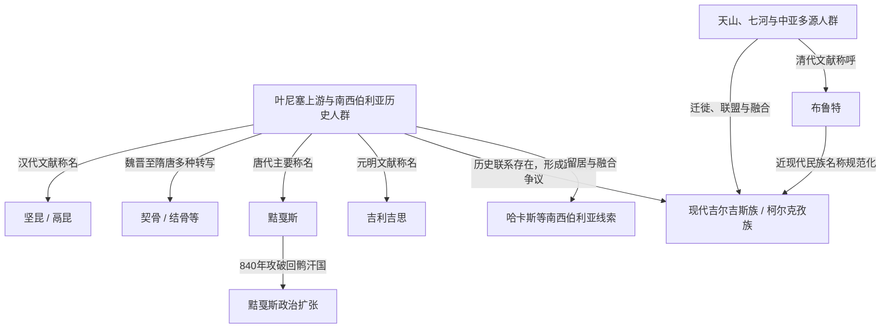

# 叶尼塞吉尔吉斯相关称谓与族群演进

## 概括

本目录整理中国史籍及其后续文献中与 Kyrgyz / Kirghiz 相关的称谓。坚昆、鬲昆、契骨、结骨、黠戛斯、吉利吉思和布鲁特并不是一组可以机械串联的王朝名：其中既有对叶尼塞上游历史人群的时代性音译，也有清代对天山吉尔吉斯部众的称呼。现代吉尔吉斯族形成于叶尼塞传统、天山和中亚草原人群长期迁徙与融合的背景中。

## 关系图

## 称谓导航

| 称谓 | 主要时代 | 大致语境 | 不能简单等同之处 |
|---|---|---|---|
| [坚昆](/%E4%BA%BA%E6%96%87%E7%A7%91%E5%AD%A6/%E5%8E%86%E5%8F%B2/%E4%B8%9C%E4%BA%9A/%E4%B8%AD%E5%9B%BD/_%E6%B0%91%E6%97%8F/%E7%AA%81%E5%8E%A5%E8%AF%AD%E6%97%8F%E4%B8%8E%E5%8C%97%E6%96%B9%E8%8D%89%E5%8E%9F/%E5%8F%B6%E5%B0%BC%E5%A1%9E%E5%90%89%E5%B0%94%E5%90%89%E6%96%AF/%E5%9D%9A%E6%98%86.md) | 汉代文献系统 | 匈奴以北或西北的相关人群，后世常联系叶尼塞吉尔吉斯 | 具体地理定位和与后世人群的连续方式仍需谨慎。 |
| [契骨](/%E4%BA%BA%E6%96%87%E7%A7%91%E5%AD%A6/%E5%8E%86%E5%8F%B2/%E4%B8%9C%E4%BA%9A/%E4%B8%AD%E5%9B%BD/_%E6%B0%91%E6%97%8F/%E7%AA%81%E5%8E%A5%E8%AF%AD%E6%97%8F%E4%B8%8E%E5%8C%97%E6%96%B9%E8%8D%89%E5%8E%9F/%E5%8F%B6%E5%B0%BC%E5%A1%9E%E5%90%89%E5%B0%94%E5%90%89%E6%96%AF/%E5%A5%91%E9%AA%A8.md) | 魏晋南北朝至隋唐 | 契骨、结骨、纥骨、护骨等多种音译 | 多为文献转写差异，不代表每次改名都发生族群更替。 |
| [黠戛斯](/%E4%BA%BA%E6%96%87%E7%A7%91%E5%AD%A6/%E5%8E%86%E5%8F%B2/%E4%B8%9C%E4%BA%9A/%E4%B8%AD%E5%9B%BD/_%E6%B0%91%E6%97%8F/%E7%AA%81%E5%8E%A5%E8%AF%AD%E6%97%8F%E4%B8%8E%E5%8C%97%E6%96%B9%E8%8D%89%E5%8E%9F/%E5%8F%B6%E5%B0%BC%E5%A1%9E%E5%90%89%E5%B0%94%E5%90%89%E6%96%AF/%E9%BB%A0%E6%88%9B%E6%96%AF.md) | 唐、五代及后续史籍 | 叶尼塞上游突厥语政治共同体，840年击破回鹘汗国 | 其政治扩张不等于全体人口永久迁入蒙古高原。 |
| [吉利吉思](/%E4%BA%BA%E6%96%87%E7%A7%91%E5%AD%A6/%E5%8E%86%E5%8F%B2/%E4%B8%9C%E4%BA%9A/%E4%B8%AD%E5%9B%BD/_%E6%B0%91%E6%97%8F/%E7%AA%81%E5%8E%A5%E8%AF%AD%E6%97%8F%E4%B8%8E%E5%8C%97%E6%96%B9%E8%8D%89%E5%8E%9F/%E5%8F%B6%E5%B0%BC%E5%A1%9E%E5%90%89%E5%B0%94%E5%90%89%E6%96%AF/%E5%90%89%E5%88%A9%E5%90%89%E6%80%9D.md) | 元明时期 | 叶尼塞及北方森林—草原人群的汉文音译 | 与天山吉尔吉斯的联系不能只靠名称相似证明。 |
| [布鲁特](/%E4%BA%BA%E6%96%87%E7%A7%91%E5%AD%A6/%E5%8E%86%E5%8F%B2/%E4%B8%9C%E4%BA%9A/%E4%B8%AD%E5%9B%BD/_%E6%B0%91%E6%97%8F/%E7%AA%81%E5%8E%A5%E8%AF%AD%E6%97%8F%E4%B8%8E%E5%8C%97%E6%96%B9%E8%8D%89%E5%8E%9F/%E5%8F%B6%E5%B0%BC%E5%A1%9E%E5%90%89%E5%B0%94%E5%90%89%E6%96%AF/%E5%B8%83%E9%B2%81%E7%89%B9.md) | 清代 | 清廷沿用准噶尔等方面称呼天山吉尔吉斯部众 | 主要是外部称呼，并非所有相关人群的稳定自称。 |
| [吉尔吉斯族](/%E4%BA%BA%E6%96%87%E7%A7%91%E5%AD%A6/%E5%8E%86%E5%8F%B2/%E4%B8%9C%E4%BA%9A/%E4%B8%AD%E5%9B%BD/_%E6%B0%91%E6%97%8F/%E7%AA%81%E5%8E%A5%E8%AF%AD%E6%97%8F%E4%B8%8E%E5%8C%97%E6%96%B9%E8%8D%89%E5%8E%9F/%E5%8F%B6%E5%B0%BC%E5%A1%9E%E5%90%89%E5%B0%94%E5%90%89%E6%96%AF/%E5%90%89%E5%B0%94%E5%90%89%E6%96%AF%E6%97%8F.md) | 近现代 | 中亚主体民族及中国柯尔克孜族等现代身份 | 现代民族由多源人群、语言、政治和地域共同塑造。 |

## 历史主线

- 叶尼塞上游和米努辛斯克盆地长期处于草原与森林草原交界，人口和文化来源复杂。
- 汉唐史籍的多种称名可能记录了同一大范围历史人群的不同时代转写，但地理范围和政治组织会变化。
- 黠戛斯在840年击破回鹘汗国后影响漠北，其核心人口和政治重心仍与南西伯利亚密切相关。
- 蒙古帝国扩张以后，叶尼塞人群被纳入更大的草原帝国；名称也在元明文献中出现新的转写。
- 天山吉尔吉斯的形成包含叶尼塞传统、当地突厥语人群和中亚政治网络，学界对迁徙时间、规模和连续方式存在不同解释。
- 清代“布鲁特”主要指天山吉尔吉斯部众，近现代又形成吉尔吉斯、柯尔克孜等规范译名和民族身份。

## 关键辨析

- 称谓相近可以提示历史联系，但不能单独证明人口、语言和政治组织从古至今完全不变。
- “叶尼塞吉尔吉斯”是史学上的区域性称呼；“吉尔吉斯族 / 柯尔克孜族”是近现代民族名称。
- 留居南西伯利亚的相关人群、迁往天山的人群以及其他被吸收群体形成了不同后续线索。
- 本目录图中的箭头表示文献称谓、可能联系或迁徙融合，除有明确事件标签外不表示确定血缘继承。

## 上级入口

- [突厥语族与北方草原](/%E4%BA%BA%E6%96%87%E7%A7%91%E5%AD%A6/%E5%8E%86%E5%8F%B2/%E4%B8%9C%E4%BA%9A/%E4%B8%AD%E5%9B%BD/_%E6%B0%91%E6%97%8F/%E7%AA%81%E5%8E%A5%E8%AF%AD%E6%97%8F%E4%B8%8E%E5%8C%97%E6%96%B9%E8%8D%89%E5%8E%9F/README.md)
- [华夏周边民族](/%E4%BA%BA%E6%96%87%E7%A7%91%E5%AD%A6/%E5%8E%86%E5%8F%B2/%E4%B8%9C%E4%BA%9A/%E4%B8%AD%E5%9B%BD/_%E6%B0%91%E6%97%8F/README.md)
- [吉尔吉斯斯坦历史](/%E4%BA%BA%E6%96%87%E7%A7%91%E5%AD%A6/%E5%8E%86%E5%8F%B2/%E4%B8%AD%E4%BA%9A/%E5%90%89%E5%B0%94%E5%90%89%E6%96%AF%E6%96%AF%E5%9D%A6/README.md)
