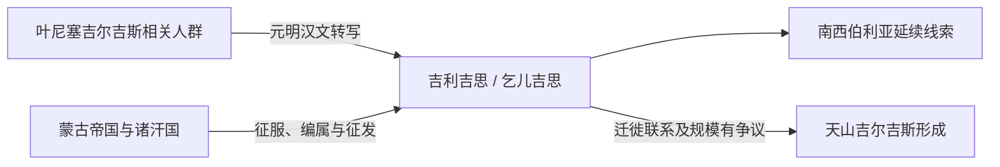

# 吉利吉思

## 时间

蒙古帝国、元代至明代文献中较常见

## 别称

乞儿吉思、吉利吉思等写法反映不同语言转录和汉文用字。

## 概括

吉利吉思是元明时期对 Kyrgyz 相关人群的汉文译名之一。材料多涉及叶尼塞上游、北方森林草原以及蒙古帝国统治下的相关部众。它延续了黠戛斯名称传统，但不能自动等同于后来所有天山吉尔吉斯人。

## 文献与政治背景

| 项目 | 说明 |
|---|---|
| 主要时代 | 蒙古帝国、元代和明代。 |
| 主要区域 | 叶尼塞上游及南西伯利亚；部分叙述延伸到阿尔泰和更广北方地区。 |
| 政治环境 | 蒙古帝国北方扩张、诸汗国分治及瓦剌等草原集团活动。 |
| 名称性质 | 对 Kyrgyz 相关人群的外部转写，不是新王朝国号。 |

## 演变图

## 变迁

- 1207年前后蒙古势力进入叶尼塞地区，相关首领归附，随后又在帝国征发和地方反抗中多次重组。
- 元明文献中的称名可能覆盖不同地域和政治归属的相关部众。
- 蒙古帝国时期的迁徙、军事编组和人口转移加强了叶尼塞、阿尔泰与天山之间的联系。
- 近世天山吉尔吉斯的形成不能仅以一次从叶尼塞整体迁徙来解释，还涉及当地突厥语和中亚人群。

## 关键辨析

- 吉利吉思与黠戛斯在名称传统上相关，但所指地域和政治环境已经变化。
- “元代称吉利吉思”不意味着元代才出现这一人群。
- 吉利吉思不是现代民族识别后的固定法律身份，也不是连续王朝。

## 相关入口

- 分支总览：[叶尼塞吉尔吉斯](/%E4%BA%BA%E6%96%87%E7%A7%91%E5%AD%A6/%E5%8E%86%E5%8F%B2/%E4%B8%9C%E4%BA%9A/%E4%B8%AD%E5%9B%BD/_%E6%B0%91%E6%97%8F/%E7%AA%81%E5%8E%A5%E8%AF%AD%E6%97%8F%E4%B8%8E%E5%8C%97%E6%96%B9%E8%8D%89%E5%8E%9F/%E5%8F%B6%E5%B0%BC%E5%A1%9E%E5%90%89%E5%B0%94%E5%90%89%E6%96%AF/README.md)。
- 上级分类：[突厥语族与北方草原](/%E4%BA%BA%E6%96%87%E7%A7%91%E5%AD%A6/%E5%8E%86%E5%8F%B2/%E4%B8%9C%E4%BA%9A/%E4%B8%AD%E5%9B%BD/_%E6%B0%91%E6%97%8F/%E7%AA%81%E5%8E%A5%E8%AF%AD%E6%97%8F%E4%B8%8E%E5%8C%97%E6%96%B9%E8%8D%89%E5%8E%9F/README.md)。
- 总入口：[华夏周边民族](/%E4%BA%BA%E6%96%87%E7%A7%91%E5%AD%A6/%E5%8E%86%E5%8F%B2/%E4%B8%9C%E4%BA%9A/%E4%B8%AD%E5%9B%BD/_%E6%B0%91%E6%97%8F/README.md)。
- 天山与国家历史：[吉尔吉斯斯坦](/%E4%BA%BA%E6%96%87%E7%A7%91%E5%AD%A6/%E5%8E%86%E5%8F%B2/%E4%B8%AD%E4%BA%9A/%E5%90%89%E5%B0%94%E5%90%89%E6%96%AF%E6%96%AF%E5%9D%A6/README.md)。

