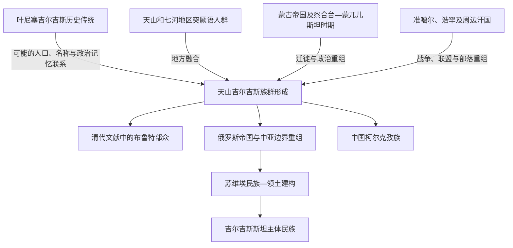

# 吉尔吉斯族

## 时间

近现代民族形成；历史线索可追溯至更早时期

## 别称辨析

- “吉尔吉斯族”常用于中亚及吉尔吉斯斯坦主体民族。
- “柯尔克孜族”是中华人民共和国使用的正式民族名称。
- 两者都与 Kyrgyz 自称相关，但国家、国籍和境内民族身份不能混为一谈。

## 概括

现代吉尔吉斯族主要分布于吉尔吉斯斯坦以及中国新疆、中亚邻国和其他地区。其形成吸收叶尼塞吉尔吉斯历史传统，也经历天山地区突厥语人群、蒙古时代迁徙、察合台与蒙兀儿斯坦政治、准噶尔和浩罕统治、俄罗斯帝国与苏维埃民族建构等长期过程。

## 形成关系图

## 历史形成

| 阶段 | 主要变化 |
|---|---|
| 叶尼塞传统 | Kyrgyz 名称及黠戛斯政治记忆构成长时段历史资源，但与现代民族的具体连续方式存在讨论。 |
| 天山形成 | 天山、七河和中亚人群在突厥语化、伊斯兰化、部落联盟和迁徙中逐渐形成新的共同体。 |
| 蒙古及后蒙古时代 | 帝国编属、人口流动和察合台—蒙兀儿斯坦政治连接叶尼塞、阿尔泰和天山。 |
| 准噶尔、浩罕与清代 | 部众在山地草原间迁徙，清代文献多称布鲁特；不同帝国争夺改变政治归属。 |
| 俄罗斯和苏维埃时期 | 殖民统治、边界划分、文字教育和民族识别强化现代吉尔吉斯民族及领土政治。 |
| 当代 | 吉尔吉斯斯坦主体民族、中国柯尔克孜族和侨居群体共享部分语言文化传统，同时处于不同国家制度中。 |

## 社会与文化线索

- 吉尔吉斯语属于突厥语族，现代语言特征与中亚钦察语群环境密切相关。
- 山地牧业、季节迁徙、部落和亲属组织长期重要，但现代社会并非单一游牧结构。
- 伊斯兰教传播经历长期过程，并与地方习俗和苏维埃时期社会变化交织。
- 《玛纳斯》史诗是重要文化传统，但史诗记忆不能直接替代政治史和人口史证据。

## 关键辨析

- 现代吉尔吉斯族不是某一支古代人群未经变化地整体迁移到天山的结果。
- 叶尼塞吉尔吉斯、哈卡斯等南西伯利亚线索与现代吉尔吉斯有联系，但各自形成路径不同。
- 民族、国家和国籍不同：吉尔吉斯斯坦公民不必都是吉尔吉斯族，吉尔吉斯族也分布于多国。
- 中国“柯尔克孜族”和吉尔吉斯斯坦主体民族属于同一广义民族文化共同体，但经历不同现代国家历史。

## 相关入口

- 分支总览：[叶尼塞吉尔吉斯](/%E4%BA%BA%E6%96%87%E7%A7%91%E5%AD%A6/%E5%8E%86%E5%8F%B2/%E4%B8%9C%E4%BA%9A/%E4%B8%AD%E5%9B%BD/_%E6%B0%91%E6%97%8F/%E7%AA%81%E5%8E%A5%E8%AF%AD%E6%97%8F%E4%B8%8E%E5%8C%97%E6%96%B9%E8%8D%89%E5%8E%9F/%E5%8F%B6%E5%B0%BC%E5%A1%9E%E5%90%89%E5%B0%94%E5%90%89%E6%96%AF/README.md)。
- 上级分类：[突厥语族与北方草原](/%E4%BA%BA%E6%96%87%E7%A7%91%E5%AD%A6/%E5%8E%86%E5%8F%B2/%E4%B8%9C%E4%BA%9A/%E4%B8%AD%E5%9B%BD/_%E6%B0%91%E6%97%8F/%E7%AA%81%E5%8E%A5%E8%AF%AD%E6%97%8F%E4%B8%8E%E5%8C%97%E6%96%B9%E8%8D%89%E5%8E%9F/README.md)。
- 总入口：[华夏周边民族](/%E4%BA%BA%E6%96%87%E7%A7%91%E5%AD%A6/%E5%8E%86%E5%8F%B2/%E4%B8%9C%E4%BA%9A/%E4%B8%AD%E5%9B%BD/_%E6%B0%91%E6%97%8F/README.md)。
- 天山与国家历史：[吉尔吉斯斯坦](/%E4%BA%BA%E6%96%87%E7%A7%91%E5%AD%A6/%E5%8E%86%E5%8F%B2/%E4%B8%AD%E4%BA%9A/%E5%90%89%E5%B0%94%E5%90%89%E6%96%AF%E6%96%AF%E5%9D%A6/README.md)。

- 中亚国家主线：[天山社会、突厥与吉尔吉斯传统](/%E4%BA%BA%E6%96%87%E7%A7%91%E5%AD%A6/%E5%8E%86%E5%8F%B2/%E4%B8%AD%E4%BA%9A/%E5%90%89%E5%B0%94%E5%90%89%E6%96%AF%E6%96%AF%E5%9D%A6/%E5%A4%A9%E5%B1%B1%E7%A4%BE%E4%BC%9A%E3%80%81%E7%AA%81%E5%8E%A5%E4%B8%8E%E5%90%89%E5%B0%94%E5%90%89%E6%96%AF%E4%BC%A0%E7%BB%9F.md)。
