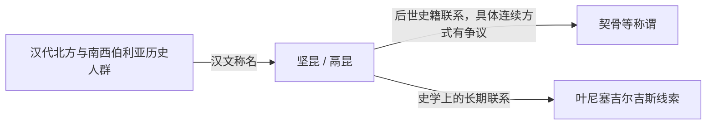

# 坚昆

## 时间

约前2世纪起见于汉代文献系统；后世史籍以更早材料追述

## 概括

坚昆与鬲昆是中国早期史籍中记录的北方人群称名，后世常把它们与契骨、黠戛斯及叶尼塞吉尔吉斯联系起来。其核心线索涉及叶尼塞上游、米努辛斯克盆地和南西伯利亚，但早期文献的方位记述不足以把每一次称名精确对应到固定疆界。

## 文献语境

| 项目 | 说明 |
|---|---|
| 常见写法 | 坚昆、鬲昆；后世还以居勿等名称联系同一音译系统。 |
| 主要时代 | 《史记》《汉书》所反映的汉代北方世界，部分内容追述匈奴扩张。 |
| 政治背景 | 坚昆相关人群曾被置于匈奴征服和北方属部关系中理解。 |
| 大致区域 | 通常联系南西伯利亚、叶尼塞上游或其邻近地区；具体定位仍有讨论。 |

## 活动区域与社会

- 叶尼塞上游连接萨彦—阿尔泰山地、米努辛斯克盆地和蒙古高原北缘，是草原、森林草原与山地交通的交界。
- 早期人口可能包含不同文化和语言成分，不能用后来的单一民族分类倒推。
- 史籍保存的是外部观察和音译称名，不是坚昆社会自身留下的完整政治记录。
- 坚昆不是一个拥有连续君主世系的固定王朝名称。

## 与后续称谓的关系

- 坚昆与契骨、黠戛斯等名称在语音和文献传统上常被联系，但不能据此断言中间没有迁徙、融合或政治变化。
- 唐代以后，黠戛斯成为更清晰记录叶尼塞上游政治共同体的称名。
- 现代吉尔吉斯族与这一历史传统有关，同时还包含天山和中亚多源融合。

## 关键辨析

- “坚昆是现代吉尔吉斯族的早期名字”是一种概括说法，使用时必须同时说明史料间隔和族群形成的复杂性。
- 史籍方位、音译和后世追述可能相互叠加，不宜把坚昆绘成疆界稳定的古代民族国家。
- 与丁零、匈奴及后来的突厥语世界的关系属于长期区域互动，不等同于简单血缘归属。

## 相关入口

- 分支总览：[叶尼塞吉尔吉斯](/%E4%BA%BA%E6%96%87%E7%A7%91%E5%AD%A6/%E5%8E%86%E5%8F%B2/%E4%B8%9C%E4%BA%9A/%E4%B8%AD%E5%9B%BD/_%E6%B0%91%E6%97%8F/%E7%AA%81%E5%8E%A5%E8%AF%AD%E6%97%8F%E4%B8%8E%E5%8C%97%E6%96%B9%E8%8D%89%E5%8E%9F/%E5%8F%B6%E5%B0%BC%E5%A1%9E%E5%90%89%E5%B0%94%E5%90%89%E6%96%AF/README.md)。
- 上级分类：[突厥语族与北方草原](/%E4%BA%BA%E6%96%87%E7%A7%91%E5%AD%A6/%E5%8E%86%E5%8F%B2/%E4%B8%9C%E4%BA%9A/%E4%B8%AD%E5%9B%BD/_%E6%B0%91%E6%97%8F/%E7%AA%81%E5%8E%A5%E8%AF%AD%E6%97%8F%E4%B8%8E%E5%8C%97%E6%96%B9%E8%8D%89%E5%8E%9F/README.md)。
- 总入口：[华夏周边民族](/%E4%BA%BA%E6%96%87%E7%A7%91%E5%AD%A6/%E5%8E%86%E5%8F%B2/%E4%B8%9C%E4%BA%9A/%E4%B8%AD%E5%9B%BD/_%E6%B0%91%E6%97%8F/README.md)。
- 天山与国家历史：[吉尔吉斯斯坦](/%E4%BA%BA%E6%96%87%E7%A7%91%E5%AD%A6/%E5%8E%86%E5%8F%B2/%E4%B8%AD%E4%BA%9A/%E5%90%89%E5%B0%94%E5%90%89%E6%96%AF%E6%96%AF%E5%9D%A6/README.md)。

