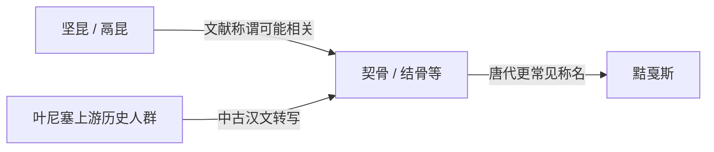

# 契骨

## 时间

魏晋南北朝至隋唐之际；相关异写延续时间不一

## 别称与异写

契骨、结骨、纥骨、护骨等常被视为相近音译，但不同史籍的用字、成书年代和转录来源并不相同。

## 概括

契骨是中国中古史籍对叶尼塞 Kyrgyz 相关人群的一组称名之一。它主要连接汉代坚昆传统与唐代黠戛斯记录；这种关系首先是文献称谓和区域历史的连续线索，而不是一套改名即继承的王朝表。

## 文献与区域

| 项目 | 说明 |
|---|---|
| 文献时代 | 魏晋南北朝至隋唐史籍及后世汇编。 |
| 活动区域 | 叶尼塞上游、南西伯利亚与萨彦—阿尔泰附近。 |
| 周边关系 | 与柔然、突厥汗国、铁勒诸部及回鹘势力的北方格局相关。 |
| 语言线索 | 后期材料通常把相关人群置于突厥语世界，但早期人口构成不能简单化。 |

## 演变关系

- 契骨与坚昆、黠戛斯的联系主要来自音译、方位和后世史籍叙述。
- 称谓变化不必然意味着一个民族消失、另一个民族突然出现。
- 唐代材料对黠戛斯的政治、社会和对外关系记录更为集中，因此后续节点由黠戛斯页展开。

## 说明

- 契骨相关人群处在草原帝国边缘，可能在臣属、联盟和冲突之间多次转换。
- 本称谓不代表固定家族或连续王统，因此不建立君主世系表。
- 现代民族的形成还要考虑蒙古帝国、天山迁徙、中亚联盟和近现代民族分类。

## 关键辨析

- 契骨不是“坚昆王朝”的后继王朝。
- 契骨、结骨等可能是同一或相关名称的不同转写，不宜把每个异写拆成独立族群。
- 它与铁勒、突厥和回鹘世界密切互动，但不应仅凭政治臣属关系判断血缘归属。

## 相关入口

- 分支总览：[叶尼塞吉尔吉斯](/%E4%BA%BA%E6%96%87%E7%A7%91%E5%AD%A6/%E5%8E%86%E5%8F%B2/%E4%B8%9C%E4%BA%9A/%E4%B8%AD%E5%9B%BD/_%E6%B0%91%E6%97%8F/%E7%AA%81%E5%8E%A5%E8%AF%AD%E6%97%8F%E4%B8%8E%E5%8C%97%E6%96%B9%E8%8D%89%E5%8E%9F/%E5%8F%B6%E5%B0%BC%E5%A1%9E%E5%90%89%E5%B0%94%E5%90%89%E6%96%AF/README.md)。
- 上级分类：[突厥语族与北方草原](/%E4%BA%BA%E6%96%87%E7%A7%91%E5%AD%A6/%E5%8E%86%E5%8F%B2/%E4%B8%9C%E4%BA%9A/%E4%B8%AD%E5%9B%BD/_%E6%B0%91%E6%97%8F/%E7%AA%81%E5%8E%A5%E8%AF%AD%E6%97%8F%E4%B8%8E%E5%8C%97%E6%96%B9%E8%8D%89%E5%8E%9F/README.md)。
- 总入口：[华夏周边民族](/%E4%BA%BA%E6%96%87%E7%A7%91%E5%AD%A6/%E5%8E%86%E5%8F%B2/%E4%B8%9C%E4%BA%9A/%E4%B8%AD%E5%9B%BD/_%E6%B0%91%E6%97%8F/README.md)。
- 天山与国家历史：[吉尔吉斯斯坦](/%E4%BA%BA%E6%96%87%E7%A7%91%E5%AD%A6/%E5%8E%86%E5%8F%B2/%E4%B8%AD%E4%BA%9A/%E5%90%89%E5%B0%94%E5%90%89%E6%96%AF%E6%96%AF%E5%9D%A6/README.md)。

