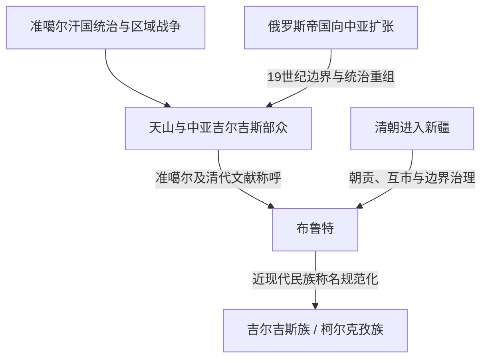

# 布鲁特

## 时间

清代，尤其18—19世纪

## 概括

布鲁特是清代文献中常见的天山吉尔吉斯部众称呼。清廷主要沿用准噶尔及蒙古语境中的名称，把活动于伊塞克湖、天山、喀什噶尔和邻近地区的吉尔吉斯部落按东、西等方向认识和交往。这个名称多为外部称呼，不能简单理解为所有吉尔吉斯人的传统自称。

## 区域和文献语境

| 项目 | 说明 |
|---|---|
| 主要时代 | 清朝平定准噶尔以后至19世纪。 |
| 活动区域 | 伊塞克湖周边、天山南北、七河、喀什噶尔以北及中亚邻近草原山地。 |
| 政治组织 | 多个部落和首领集团，并非统一的“布鲁特国家”。 |
| 清朝关系 | 朝贡、互市、边界交涉、册封和军事冲突并存。 |
| 名称来源 | 清廷多沿用准噶尔等方面的称呼，其语源和适用范围仍有讨论。 |

## 演进图

## 历史变化

- 准噶尔汗国控制天山地区时，吉尔吉斯部众处于战争、纳贡、迁徙和联盟网络之中。
- 18世纪中叶清朝进入新疆后，部分布鲁特首领与清廷建立朝贡和互市关系。
- 清代材料常区分东布鲁特和西布鲁特等部众，但这种行政认识不等于固定现代国界。
- 19世纪浩罕汗国、清朝和俄罗斯帝国的竞争改变天山吉尔吉斯的政治环境。
- 近现代“吉尔吉斯”“柯尔克孜”等称名逐渐规范化，“布鲁特”退出正式民族名称。

## 关键辨析

- 布鲁特不是坚昆、黠戛斯之后必然出现的单线“新名称”，其主要对象和地理中心已转到天山。
- 布鲁特不是统一王朝，也没有可连续排列的统一君主世系。
- 外部称呼、部落自称、民族名称和现代国籍应分开理解。
- 清代“布鲁特”与现代吉尔吉斯族关系密切，但现代民族形成不能只用清代分类解释。

## 相关入口

- 分支总览：[叶尼塞吉尔吉斯](/%E4%BA%BA%E6%96%87%E7%A7%91%E5%AD%A6/%E5%8E%86%E5%8F%B2/%E4%B8%9C%E4%BA%9A/%E4%B8%AD%E5%9B%BD/_%E6%B0%91%E6%97%8F/%E7%AA%81%E5%8E%A5%E8%AF%AD%E6%97%8F%E4%B8%8E%E5%8C%97%E6%96%B9%E8%8D%89%E5%8E%9F/%E5%8F%B6%E5%B0%BC%E5%A1%9E%E5%90%89%E5%B0%94%E5%90%89%E6%96%AF/README.md)。
- 上级分类：[突厥语族与北方草原](/%E4%BA%BA%E6%96%87%E7%A7%91%E5%AD%A6/%E5%8E%86%E5%8F%B2/%E4%B8%9C%E4%BA%9A/%E4%B8%AD%E5%9B%BD/_%E6%B0%91%E6%97%8F/%E7%AA%81%E5%8E%A5%E8%AF%AD%E6%97%8F%E4%B8%8E%E5%8C%97%E6%96%B9%E8%8D%89%E5%8E%9F/README.md)。
- 总入口：[华夏周边民族](/%E4%BA%BA%E6%96%87%E7%A7%91%E5%AD%A6/%E5%8E%86%E5%8F%B2/%E4%B8%9C%E4%BA%9A/%E4%B8%AD%E5%9B%BD/_%E6%B0%91%E6%97%8F/README.md)。
- 天山与国家历史：[吉尔吉斯斯坦](/%E4%BA%BA%E6%96%87%E7%A7%91%E5%AD%A6/%E5%8E%86%E5%8F%B2/%E4%B8%AD%E4%BA%9A/%E5%90%89%E5%B0%94%E5%90%89%E6%96%AF%E6%96%AF%E5%9D%A6/README.md)。

- 天山背景：[天山社会、突厥与吉尔吉斯传统](/%E4%BA%BA%E6%96%87%E7%A7%91%E5%AD%A6/%E5%8E%86%E5%8F%B2/%E4%B8%AD%E4%BA%9A/%E5%90%89%E5%B0%94%E5%90%89%E6%96%AF%E6%96%AF%E5%9D%A6/%E5%A4%A9%E5%B1%B1%E7%A4%BE%E4%BC%9A%E3%80%81%E7%AA%81%E5%8E%A5%E4%B8%8E%E5%90%89%E5%B0%94%E5%90%89%E6%96%AF%E4%BC%A0%E7%BB%9F.md)。
