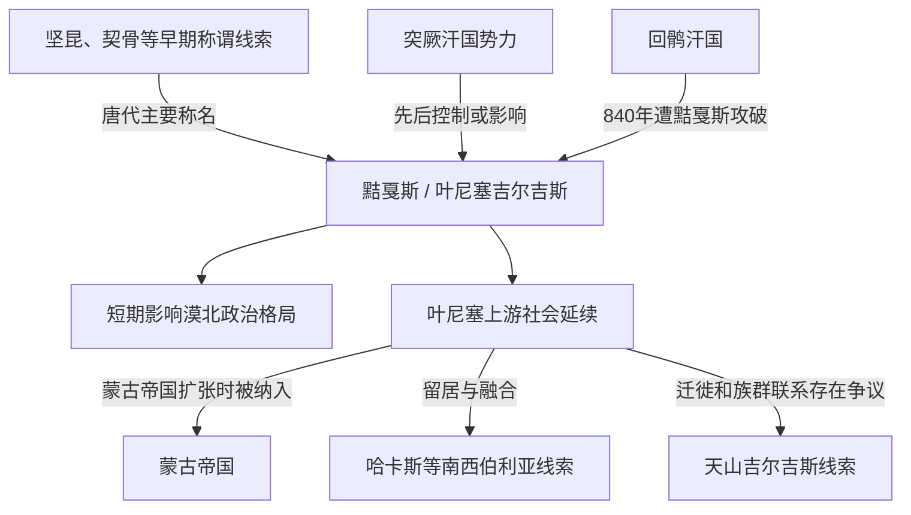

# 黠戛斯

## 时间

6世纪前后至13世纪相关记录；政治扩张高峰在9世纪

## 概括

黠戛斯是唐代及后续史籍对叶尼塞上游突厥语政治共同体的主要称名。其核心区域在叶尼塞上游和米努辛斯克盆地，长期与突厥汗国、回鹘汗国和蒙古高原势力互动。840年黠戛斯军队攻破回鹘汗国中心，改变漠北格局，但不能据此推断全部黠戛斯人口永久迁入蒙古高原。

## 演进图

## 政治与社会

| 项目 | 内容 |
|---|---|
| 核心区域 | 叶尼塞上游、米努辛斯克盆地及萨彦—阿尔泰周边。 |
| 政治组织 | 部族与贵族共同体，统治者使用可汗等称号；完整连续世系不清。 |
| 经济基础 | 牧业、农业、狩猎、冶金和森林草原贸易并存。 |
| 文字与文化 | 与古突厥文字传统及南西伯利亚考古文化相关，但史料来源多样。 |
| 主要对手 | 突厥、回鹘及后来的蒙古诸势力。 |

## 重要转折

- 汉唐之间，相关人群多次处于匈奴、柔然、突厥和回鹘等北方强权影响下。
- 840年，黠戛斯攻破回鹘汗国中心；回鹘集团向河西、天山和其他地区迁徙。
- 黠戛斯虽然影响漠北，但政治重心与人口核心仍同叶尼塞地区密切相关。
- 1207年前后，蒙古帝国向北方森林地区扩张，叶尼塞吉尔吉斯相关首领归附；其后仍发生反抗和再整合。
- 后续一部分传统留在南西伯利亚，一部分被用于解释天山吉尔吉斯形成，具体迁徙规模和时间存在争议。

## 名称与后续

- 元明文献中的吉利吉思等称谓继续记录叶尼塞或北方相关人群。
- 哈卡斯等南西伯利亚民族与叶尼塞吉尔吉斯历史密切相关，但不能简单视为单一人群改名。
- 现代吉尔吉斯族保存 Kyrgyz 名称和历史记忆，其人口、语言和地域形成包含中亚多源成分。

## 世系说明

黠戛斯并非单一家族王朝。唐代材料记录了可汗和贵族称号，但不足以建立无缺漏的连续君主世系；具体人物和政治阶段应以可考史料为限。

## 关键辨析

- “黠戛斯击破回鹘”应写作回鹘汗国遭黠戛斯击破，而不是把征服方向倒置。
- 攻破汗国中心不等于长期控制整个蒙古高原。
- 叶尼塞吉尔吉斯与现代吉尔吉斯有历史关系，但不宜画成完全不变的血缘直线。

## 相关入口

- 分支总览：[叶尼塞吉尔吉斯](/%E4%BA%BA%E6%96%87%E7%A7%91%E5%AD%A6/%E5%8E%86%E5%8F%B2/%E4%B8%9C%E4%BA%9A/%E4%B8%AD%E5%9B%BD/_%E6%B0%91%E6%97%8F/%E7%AA%81%E5%8E%A5%E8%AF%AD%E6%97%8F%E4%B8%8E%E5%8C%97%E6%96%B9%E8%8D%89%E5%8E%9F/%E5%8F%B6%E5%B0%BC%E5%A1%9E%E5%90%89%E5%B0%94%E5%90%89%E6%96%AF/README.md)。
- 上级分类：[突厥语族与北方草原](/%E4%BA%BA%E6%96%87%E7%A7%91%E5%AD%A6/%E5%8E%86%E5%8F%B2/%E4%B8%9C%E4%BA%9A/%E4%B8%AD%E5%9B%BD/_%E6%B0%91%E6%97%8F/%E7%AA%81%E5%8E%A5%E8%AF%AD%E6%97%8F%E4%B8%8E%E5%8C%97%E6%96%B9%E8%8D%89%E5%8E%9F/README.md)。
- 总入口：[华夏周边民族](/%E4%BA%BA%E6%96%87%E7%A7%91%E5%AD%A6/%E5%8E%86%E5%8F%B2/%E4%B8%9C%E4%BA%9A/%E4%B8%AD%E5%9B%BD/_%E6%B0%91%E6%97%8F/README.md)。
- 天山与国家历史：[吉尔吉斯斯坦](/%E4%BA%BA%E6%96%87%E7%A7%91%E5%AD%A6/%E5%8E%86%E5%8F%B2/%E4%B8%AD%E4%BA%9A/%E5%90%89%E5%B0%94%E5%90%89%E6%96%AF%E6%96%AF%E5%9D%A6/README.md)。

- 相关帝国：[蒙古帝国](/%E4%BA%BA%E6%96%87%E7%A7%91%E5%AD%A6/%E5%8E%86%E5%8F%B2/%E4%B8%9C%E4%BA%9A/%E4%B8%AD%E5%9B%BD/%E5%85%83/%E8%92%99%E5%8F%A4%E5%B8%9D%E5%9B%BD.md)。
