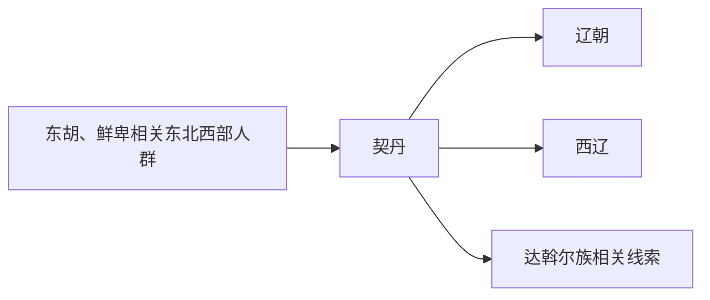

# 契丹与东北旁蒙古

本目录是“蒙古语族与东胡”下的二级线索，用于收纳契丹与东北旁蒙古相关民族、部族或政权笔记。

## 演进图

## 包含笔记

- [契丹](/%E4%BA%BA%E6%96%87%E7%A7%91%E5%AD%A6/%E5%8E%86%E5%8F%B2/%E4%B8%9C%E4%BA%9A/%E4%B8%AD%E5%9B%BD/_%E6%B0%91%E6%97%8F/%E8%92%99%E5%8F%A4%E8%AF%AD%E6%97%8F%E4%B8%8E%E4%B8%9C%E8%83%A1/%E5%A5%91%E4%B8%B9%E4%B8%8E%E4%B8%9C%E5%8C%97%E6%97%81%E8%92%99%E5%8F%A4/%E5%A5%91%E4%B8%B9.md)
- [达斡尔族](/%E4%BA%BA%E6%96%87%E7%A7%91%E5%AD%A6/%E5%8E%86%E5%8F%B2/%E4%B8%9C%E4%BA%9A/%E4%B8%AD%E5%9B%BD/_%E6%B0%91%E6%97%8F/%E8%92%99%E5%8F%A4%E8%AF%AD%E6%97%8F%E4%B8%8E%E4%B8%9C%E8%83%A1/%E5%A5%91%E4%B8%B9%E4%B8%8E%E4%B8%9C%E5%8C%97%E6%97%81%E8%92%99%E5%8F%A4/%E8%BE%BE%E6%96%A1%E5%B0%94%E6%97%8F.md)

## 上级目录

- [蒙古语族与东胡](/%E4%BA%BA%E6%96%87%E7%A7%91%E5%AD%A6/%E5%8E%86%E5%8F%B2/%E4%B8%9C%E4%BA%9A/%E4%B8%AD%E5%9B%BD/_%E6%B0%91%E6%97%8F/%E8%92%99%E5%8F%A4%E8%AF%AD%E6%97%8F%E4%B8%8E%E4%B8%9C%E8%83%A1/README.md)
- [华夏周边民族](/%E4%BA%BA%E6%96%87%E7%A7%91%E5%AD%A6/%E5%8E%86%E5%8F%B2/%E4%B8%9C%E4%BA%9A/%E4%B8%AD%E5%9B%BD/_%E6%B0%91%E6%97%8F/README.md)

## 相关朝代与东亚历史

- 契丹建辽的政权史见[辽](/%E4%BA%BA%E6%96%87%E7%A7%91%E5%AD%A6/%E5%8E%86%E5%8F%B2/%E4%B8%9C%E4%BA%9A/%E4%B8%AD%E5%9B%BD/%E8%BE%BD%E5%AE%8B%E9%87%91%E8%A5%BF%E5%A4%8F/%E8%BE%BD/README.md)；辽与高丽、宋、女真构成东北亚多政权格局。
- 半岛侧相关节点见[高丽王朝](/%E4%BA%BA%E6%96%87%E7%A7%91%E5%AD%A6/%E5%8E%86%E5%8F%B2/%E4%B8%9C%E4%BA%9A/%E6%9C%9D%E9%B2%9C%E5%8D%8A%E5%B2%9B/%E9%AB%98%E4%B8%BD%E7%8E%8B%E6%9C%9D.md)。
