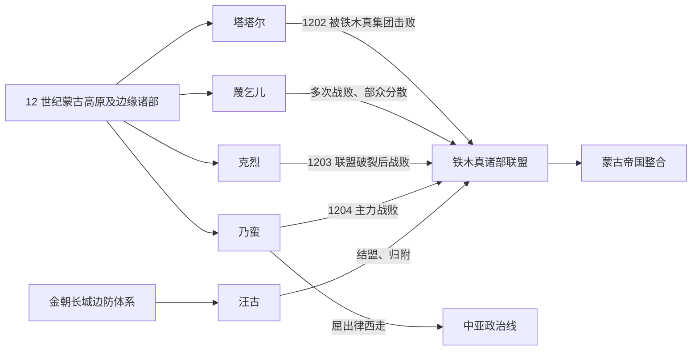

# 蒙古帝国前诸部

## 范围与概括

本目录梳理 12 世纪至 13 世纪初蒙古高原及其南北边缘的若干部族联盟，以及它们在蒙古帝国形成过程中的不同去向。塔塔尔、蔑乞儿、乃蛮、克烈和汪古不是结构相同、边界固定的现代民族；它们可能是部众联盟、政治集团、地域称谓或多种身份的叠合。

这些集团的语言与族属不能只凭后来的归属倒推。蒙古高原长期存在人口迁徙、婚姻、收养、结盟、征服和改编，突厥语与蒙古语人群也持续互动。共同背景集中保留在本页，各节点页专写本部的组织、人物、战争与后续融合。

## 演进主线

图中箭头表示政治过程，不表示各部具有单一血缘，也不表示所有部众都以同一种方式进入帝国。

## 阶段导航

| 节点 | 主要时间 | 核心区域 | 历史作用与后续 |
|---|---|---|---|
| [塔塔尔](/%E4%BA%BA%E6%96%87%E7%A7%91%E5%AD%A6/%E5%8E%86%E5%8F%B2/%E4%B8%9C%E4%BA%9A/%E4%B8%AD%E5%9B%BD/_%E6%B0%91%E6%97%8F/%E8%92%99%E5%8F%A4%E8%AF%AD%E6%97%8F%E4%B8%8E%E4%B8%9C%E8%83%A1/%E8%92%99%E5%8F%A4%E5%B8%9D%E5%9B%BD%E5%89%8D%E8%AF%B8%E9%83%A8/%E5%A1%94%E5%A1%94%E5%B0%94.md) | 12 世纪—1202 年前后 | 呼伦贝尔、克鲁伦河与高原东部 | 与辽、金和蒙古诸部互动；主力被击败，部众被分配、吸收，“鞑靼 / Tatar”后来又形成更宽泛称谓。 |
| [蔑乞儿](/%E4%BA%BA%E6%96%87%E7%A7%91%E5%AD%A6/%E5%8E%86%E5%8F%B2/%E4%B8%9C%E4%BA%9A/%E4%B8%AD%E5%9B%BD/_%E6%B0%91%E6%97%8F/%E8%92%99%E5%8F%A4%E8%AF%AD%E6%97%8F%E4%B8%8E%E4%B8%9C%E8%83%A1/%E8%92%99%E5%8F%A4%E5%B8%9D%E5%9B%BD%E5%89%8D%E8%AF%B8%E9%83%A8/%E8%94%91%E4%B9%9E%E5%84%BF.md) | 12 世纪—13 世纪初 | 色楞格河、鄂尔浑河下游与贝加尔湖以南 | 与铁木真集团长期冲突；多次战败后分散，部分西走。 |
| [克烈](/%E4%BA%BA%E6%96%87%E7%A7%91%E5%AD%A6/%E5%8E%86%E5%8F%B2/%E4%B8%9C%E4%BA%9A/%E4%B8%AD%E5%9B%BD/_%E6%B0%91%E6%97%8F/%E8%92%99%E5%8F%A4%E8%AF%AD%E6%97%8F%E4%B8%8E%E4%B8%9C%E8%83%A1/%E8%92%99%E5%8F%A4%E5%B8%9D%E5%9B%BD%E5%89%8D%E8%AF%B8%E9%83%A8/%E5%85%8B%E7%83%88.md) | 12 世纪—1203 年 | 土拉河、鄂尔浑河一带 | 王汗与铁木真先结盟后决裂；联盟崩解后部众进入蒙古帝国。 |
| [乃蛮](/%E4%BA%BA%E6%96%87%E7%A7%91%E5%AD%A6/%E5%8E%86%E5%8F%B2/%E4%B8%9C%E4%BA%9A/%E4%B8%AD%E5%9B%BD/_%E6%B0%91%E6%97%8F/%E8%92%99%E5%8F%A4%E8%AF%AD%E6%97%8F%E4%B8%8E%E4%B8%9C%E8%83%A1/%E8%92%99%E5%8F%A4%E5%B8%9D%E5%9B%BD%E5%89%8D%E8%AF%B8%E9%83%A8/%E4%B9%83%E8%9B%AE.md) | 12 世纪—1204 年后 | 阿尔泰、杭爱山与高原西部 | 西部强大联盟；主力战败，屈出律西走中亚，其余部众被整合。 |
| [汪古](/%E4%BA%BA%E6%96%87%E7%A7%91%E5%AD%A6/%E5%8E%86%E5%8F%B2/%E4%B8%9C%E4%BA%9A/%E4%B8%AD%E5%9B%BD/_%E6%B0%91%E6%97%8F/%E8%92%99%E5%8F%A4%E8%AF%AD%E6%97%8F%E4%B8%8E%E4%B8%9C%E8%83%A1/%E8%92%99%E5%8F%A4%E5%B8%9D%E5%9B%BD%E5%89%8D%E8%AF%B8%E9%83%A8/%E6%B1%AA%E5%8F%A4.md) | 金末—元代 | 阴山、河套与长城北缘 | 金朝边防集团和草原—农耕中介；较早结盟蒙古，后成为元代重要部众。 |

## 共同历史背景

- **组织形态**：所谓“部”往往包含首领家族、属部、附庸、战俘和盟友，政治边界会随战争与婚姻迅速变化。
- **宗教与交流**：克烈、乃蛮和汪古上层常与东方基督教传统相联系，但部众信仰并不必然一致。
- **帝国整合**：原有集团在征服或归附后，可能被拆分编入千户、怯薛和军队，也可能保留部分名称与精英网络。
- **名称延续**：古代部名后来可成为氏族名、地域名或跨区域称呼；不能据此认定现代民族与某一部落完全等同。
- **世系边界**：各部都不是统一王朝，没有一条覆盖全体部众的连续君主世系；可考首领应放回具体联盟与事件中理解。

## 关键辨析

1. “蒙古帝国前诸部”是历史阶段与政治环境分类，不是语言学上的单一分支。
2. 塔塔尔、乃蛮和克烈等族属分类存在争论，不能机械归为某一现代民族的直系祖先。
3. 汪古主要通过联盟和归附进入蒙古体系，不能与被军事击败的诸部画成同一种“征服”关系。
4. 乃蛮的屈出律西走连接中亚史，但留在草原的乃蛮部众也被纳入帝国，二者应并行书写。

## 相关主线

- [蒙古](/%E4%BA%BA%E6%96%87%E7%A7%91%E5%AD%A6/%E5%8E%86%E5%8F%B2/%E4%B8%9C%E4%BA%9A/%E4%B8%AD%E5%9B%BD/_%E6%B0%91%E6%97%8F/%E8%92%99%E5%8F%A4%E8%AF%AD%E6%97%8F%E4%B8%8E%E4%B8%9C%E8%83%A1/%E5%AE%A4%E9%9F%A6%E8%92%99%E5%8F%A4%E6%BA%90%E6%B5%81/%E8%92%99%E5%8F%A4.md)
- [蒙古帝国（中国史视角）](/%E4%BA%BA%E6%96%87%E7%A7%91%E5%AD%A6/%E5%8E%86%E5%8F%B2/%E4%B8%9C%E4%BA%9A/%E4%B8%AD%E5%9B%BD/%E5%85%83/%E8%92%99%E5%8F%A4%E5%B8%9D%E5%9B%BD.md)
- [蒙古帝国与诸汗国（蒙古史视角）](/%E4%BA%BA%E6%96%87%E7%A7%91%E5%AD%A6/%E5%8E%86%E5%8F%B2/%E4%B8%9C%E4%BA%9A/%E8%92%99%E5%8F%A4/%E8%92%99%E5%8F%A4%E5%B8%9D%E5%9B%BD%E4%B8%8E%E8%AF%B8%E6%B1%97%E5%9B%BD.md)
- [蒙古语族与东胡](/%E4%BA%BA%E6%96%87%E7%A7%91%E5%AD%A6/%E5%8E%86%E5%8F%B2/%E4%B8%9C%E4%BA%9A/%E4%B8%AD%E5%9B%BD/_%E6%B0%91%E6%97%8F/%E8%92%99%E5%8F%A4%E8%AF%AD%E6%97%8F%E4%B8%8E%E4%B8%9C%E8%83%A1/README.md)
- [华夏周边民族](/%E4%BA%BA%E6%96%87%E7%A7%91%E5%AD%A6/%E5%8E%86%E5%8F%B2/%E4%B8%9C%E4%BA%9A/%E4%B8%AD%E5%9B%BD/_%E6%B0%91%E6%97%8F/README.md)
