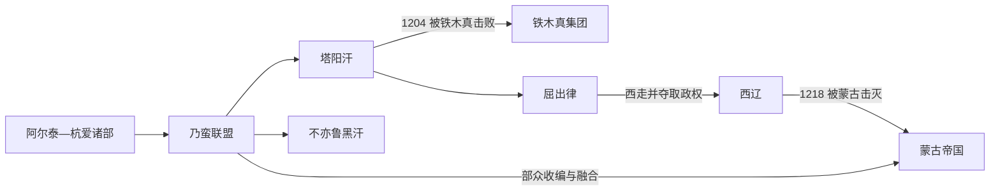

# 乃蛮

## 时间与范围

12 世纪至 13 世纪初；阿尔泰山、杭爱山和蒙古高原西部，并延伸至中亚东缘。

## 概括

乃蛮是蒙古帝国形成前高原西部的强大部族联盟。其语言和族属存在争议，适合放在突厥—蒙古交汇环境中讨论。1204 年塔阳汗主力被铁木真击败后，部分部众被纳入蒙古体系；其子屈出律西走，进入西辽政治，形成一条不同于留在草原部众的中亚支线。

## 演变关系

## 历史过程

- 乃蛮控制蒙古高原西部的重要牧地与交通线，是 12 世纪末草原力量重组中的关键集团。
- 联盟内部存在塔阳汗、不亦鲁黑汗等不同政治中心，并非始终由单一首领统一。
- 1204 年，塔阳汗集团在与铁木真的决战中失败。留在草原的乃蛮部众被拆分、收编或继续抵抗。
- 屈出律向西投奔西辽，后来掌握其政权；1218 年蒙古军击败屈出律。此线把蒙古统一战争与中亚政治直接连接起来。
- 乃蛮名称此后仍见于蒙古帝国及多个欧亚族群内部，说明政治联盟瓦解并未使全部身份痕迹消失。

## 组织、宗教与人物

乃蛮是多部众联盟，不能以一条固定王朝世系概括。其上层与东方基督教传统有联系，但不代表所有部众信仰一致。塔阳汗、不亦鲁黑汗和屈出律分别代表联盟分裂、草原战败和中亚转向三个环节。

## 关键辨析

- 乃蛮究竟主要使用何种语言、应归入何种族属，学界存在争论；不能写成无争议的“纯突厥”或“纯蒙古”集团。
- 1204 年之后存在“并入蒙古帝国”与“屈出律西走”两条并行路径。
- 后世不同民族中的乃蛮部名，不足以证明所有群体都保持单一连续血缘。

## 导航

- [蒙古帝国前诸部](/%E4%BA%BA%E6%96%87%E7%A7%91%E5%AD%A6/%E5%8E%86%E5%8F%B2/%E4%B8%9C%E4%BA%9A/%E4%B8%AD%E5%9B%BD/_%E6%B0%91%E6%97%8F/%E8%92%99%E5%8F%A4%E8%AF%AD%E6%97%8F%E4%B8%8E%E4%B8%9C%E8%83%A1/%E8%92%99%E5%8F%A4%E5%B8%9D%E5%9B%BD%E5%89%8D%E8%AF%B8%E9%83%A8/README.md)
- [蒙古帝国](/%E4%BA%BA%E6%96%87%E7%A7%91%E5%AD%A6/%E5%8E%86%E5%8F%B2/%E4%B8%9C%E4%BA%9A/%E4%B8%AD%E5%9B%BD/%E5%85%83/%E8%92%99%E5%8F%A4%E5%B8%9D%E5%9B%BD.md)
- [蒙古帝国与诸汗国](/%E4%BA%BA%E6%96%87%E7%A7%91%E5%AD%A6/%E5%8E%86%E5%8F%B2/%E4%B8%9C%E4%BA%9A/%E8%92%99%E5%8F%A4/%E8%92%99%E5%8F%A4%E5%B8%9D%E5%9B%BD%E4%B8%8E%E8%AF%B8%E6%B1%97%E5%9B%BD.md)
