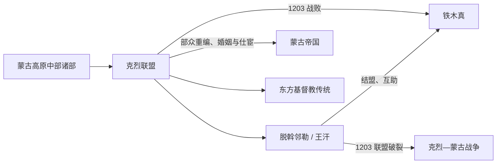

# 克烈

## 时间与范围

11—13 世纪初；土拉河、鄂尔浑河及蒙古高原中部偏西地区。

## 概括

克烈是蒙古帝国形成前的强大部族联盟。脱斡邻勒（王汗）曾与铁木真父子建立政治同盟，双方共同对付塔塔尔、蔑乞儿等对手；随着势力变化和继承矛盾加剧，联盟于 1203 年破裂，克烈主力战败，部众随后进入蒙古帝国的军政与婚姻网络。

## 演变关系

## 历史过程

- 克烈活动于土拉河、鄂尔浑河一带，控制高原中部交通与牧地，是 12 世纪草原政治的重要枢纽。
- 王汗与铁木真家族关系密切，双方的联盟既有“父辈安答”与拟制亲属色彩，也建立在共同战争和实力互补之上。
- 联盟在共同打击蔑乞儿、塔塔尔等集团时扩张，但铁木真势力增长、克烈内部继承竞争和双方互疑使关系恶化。
- 1203 年克烈集团被铁木真击败。部众没有整体消失，而是被编入蒙古诸千户；克烈贵族也通过婚姻和帝国任职延续影响。

## 组织、人物与宗教

- 克烈不是单一王朝，无法排列覆盖全联盟的连续君主世系。
- 脱斡邻勒即汉文材料常称的“王汗”，是理解克烈兴衰的核心人物；其家族与反对者构成联盟内部政治的一部分。
- 克烈上层以东方基督教传统著称，这一宗教联系后来也进入欧洲关于“祭司王约翰”的想象，但传说不能替代具体草原史。
- 语言与族属分类仍有争论，不能把克烈直接等同某一现代民族。

## 关键辨析

1. 铁木真与王汗经历的是“结盟—共同扩张—决裂—战争”，不应只写成自始至终的敌对。
2. 克烈战败是政治联盟瓦解，部众通过重编和婚姻深度参与蒙古帝国。
3. 宗教标签主要说明部分精英与教会网络，不能概括所有人的信仰。

## 导航

- [蒙古帝国前诸部](/%E4%BA%BA%E6%96%87%E7%A7%91%E5%AD%A6/%E5%8E%86%E5%8F%B2/%E4%B8%9C%E4%BA%9A/%E4%B8%AD%E5%9B%BD/_%E6%B0%91%E6%97%8F/%E8%92%99%E5%8F%A4%E8%AF%AD%E6%97%8F%E4%B8%8E%E4%B8%9C%E8%83%A1/%E8%92%99%E5%8F%A4%E5%B8%9D%E5%9B%BD%E5%89%8D%E8%AF%B8%E9%83%A8/README.md)
- [蒙古](/%E4%BA%BA%E6%96%87%E7%A7%91%E5%AD%A6/%E5%8E%86%E5%8F%B2/%E4%B8%9C%E4%BA%9A/%E4%B8%AD%E5%9B%BD/_%E6%B0%91%E6%97%8F/%E8%92%99%E5%8F%A4%E8%AF%AD%E6%97%8F%E4%B8%8E%E4%B8%9C%E8%83%A1/%E5%AE%A4%E9%9F%A6%E8%92%99%E5%8F%A4%E6%BA%90%E6%B5%81/%E8%92%99%E5%8F%A4.md)
- [蒙古帝国与诸汗国](/%E4%BA%BA%E6%96%87%E7%A7%91%E5%AD%A6/%E5%8E%86%E5%8F%B2/%E4%B8%9C%E4%BA%9A/%E8%92%99%E5%8F%A4/%E8%92%99%E5%8F%A4%E5%B8%9D%E5%9B%BD%E4%B8%8E%E8%AF%B8%E6%B1%97%E5%9B%BD.md)
