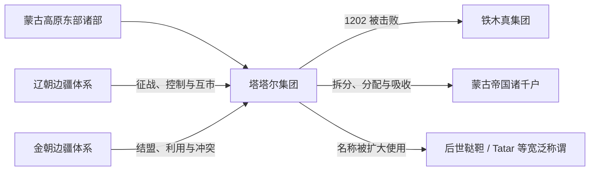

# 塔塔尔

## 时间与范围

约 8 世纪文献称谓至 13 世纪初的草原部族史；本页重点为 12 世纪蒙古高原东部、呼伦贝尔和克鲁伦河一带的塔塔尔集团。

## 概括

塔塔尔是辽金元前后蒙古高原东部的重要部族名称，也是铁木真早期面对的敌对集团之一。其活动与辽、金边疆秩序和蒙古诸部联盟均有关系。1202 年前后主力被铁木真集团击败后，部众被分配、吸收；此后“塔塔尔 / 鞑靼”又被不同语言的文献扩大用于称呼蒙古帝国人群或其他欧亚草原人群。

## 演变关系

## 历史过程

- “塔塔尔”一名在突厥碑铭等较早材料中已出现，但早期所指与 12 世纪塔塔尔集团、后世“鞑靼”的范围并不完全相同。
- 12 世纪塔塔尔诸部位于蒙古高原东缘，与辽西、兴安岭及东北边疆相接；其内部并非单一固定部落。
- 塔塔尔与金朝及蒙古诸集团关系多变。铁木真家族的敌对记忆与现实草原竞争共同推动了冲突。
- 1202 年前后，塔塔尔主力被铁木真集团击败。幸存部众并非消失，而是通过分配、婚姻、收编和迁徙进入新的军政网络。
- 蒙古西征以后，欧洲和西亚文献常将更广泛的蒙古帝国人群称为“Tatars”；俄语及其他语境中的“鞑靼”后来又指向多个不同共同体。

## 组织、人物与关系

塔塔尔不是单一王朝或固定家族，无法排列覆盖全体部众的统一君主世系。其历史应围绕诸部首领、与辽金的边疆关系以及同铁木真集团的战争来理解。进入帝国后，原部名可能继续作为氏族或部众身份存在，但政治组织已经改变。

## 关键辨析

- 中世纪蒙古高原的塔塔尔，不等同于今天所有以“鞑靼 / Tatar”命名的民族。
- 与东胡、鲜卑、室韦、契丹和蒙古诸部的联系反映东北亚长期融合，不能据名称构造单线血缘。
- “被击败”指政治与军事联盟瓦解，不表示人口被完全消灭。

## 导航

- [蒙古帝国前诸部](/%E4%BA%BA%E6%96%87%E7%A7%91%E5%AD%A6/%E5%8E%86%E5%8F%B2/%E4%B8%9C%E4%BA%9A/%E4%B8%AD%E5%9B%BD/_%E6%B0%91%E6%97%8F/%E8%92%99%E5%8F%A4%E8%AF%AD%E6%97%8F%E4%B8%8E%E4%B8%9C%E8%83%A1/%E8%92%99%E5%8F%A4%E5%B8%9D%E5%9B%BD%E5%89%8D%E8%AF%B8%E9%83%A8/README.md)
- [蒙古](/%E4%BA%BA%E6%96%87%E7%A7%91%E5%AD%A6/%E5%8E%86%E5%8F%B2/%E4%B8%9C%E4%BA%9A/%E4%B8%AD%E5%9B%BD/_%E6%B0%91%E6%97%8F/%E8%92%99%E5%8F%A4%E8%AF%AD%E6%97%8F%E4%B8%8E%E4%B8%9C%E8%83%A1/%E5%AE%A4%E9%9F%A6%E8%92%99%E5%8F%A4%E6%BA%90%E6%B5%81/%E8%92%99%E5%8F%A4.md)
- [蒙古帝国](/%E4%BA%BA%E6%96%87%E7%A7%91%E5%AD%A6/%E5%8E%86%E5%8F%B2/%E4%B8%9C%E4%BA%9A/%E4%B8%AD%E5%9B%BD/%E5%85%83/%E8%92%99%E5%8F%A4%E5%B8%9D%E5%9B%BD.md)
