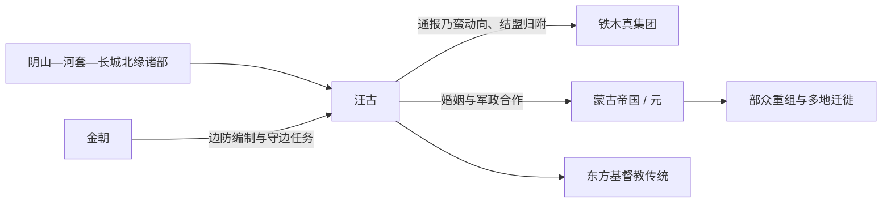

# 汪古

## 时间与范围

约 12—14 世纪；阴山、河套、长城北缘及金元北方边地。

## 概括

汪古是金元时期长城北缘的重要部族集团，连接金朝边防、草原交通和跨欧亚宗教网络。与在统一战争中被击败的塔塔尔、克烈、乃蛮不同，汪古首领较早选择与铁木真结盟、归附，后在蒙古帝国和元朝保持重要地位。

## 演变关系

## 历史过程

- 汪古活动于阴山、河套和长城北缘，是农耕王朝边防与草原世界之间的重要中介。
- 金朝利用汪古承担部分守边职能，说明其政治位置同时面向长城内外。
- 蒙古统一战争期间，汪古首领阿剌兀思剔吉忽里较早与铁木真合作；汪古并非先以强敌身份被完全征服。
- 归附后，汪古贵族与成吉思汗家族建立婚姻关系，部众进入帝国军政体系，在元代仍保持影响。
- 汪古上层及其活动区与东方基督教传统密切相关，也是理解元代宗教多样性的重要节点。

## 组织与身份

汪古不是单一王朝，也不是能够按同一血统排列的固定家族；应区分首领家族、属部、守边编制和后来的元代身份。其语言、族属常在突厥—蒙古及边疆混合背景中讨论，不能仅凭归附蒙古就倒推为单一蒙古部族。

## 关键辨析

- **归附不同于灭亡**：汪古进入帝国主要通过联盟、效忠、婚姻和军政合作。
- **边防集团不同于现代民族**：金朝边防身份、部族身份和宗教身份相互叠合。
- **景教不是唯一特征**：宗教网络重要，但守边、交通与政治选择同样构成汪古历史主线。

## 导航

- [蒙古帝国前诸部](/%E4%BA%BA%E6%96%87%E7%A7%91%E5%AD%A6/%E5%8E%86%E5%8F%B2/%E4%B8%9C%E4%BA%9A/%E4%B8%AD%E5%9B%BD/_%E6%B0%91%E6%97%8F/%E8%92%99%E5%8F%A4%E8%AF%AD%E6%97%8F%E4%B8%8E%E4%B8%9C%E8%83%A1/%E8%92%99%E5%8F%A4%E5%B8%9D%E5%9B%BD%E5%89%8D%E8%AF%B8%E9%83%A8/README.md)
- [蒙古帝国](/%E4%BA%BA%E6%96%87%E7%A7%91%E5%AD%A6/%E5%8E%86%E5%8F%B2/%E4%B8%9C%E4%BA%9A/%E4%B8%AD%E5%9B%BD/%E5%85%83/%E8%92%99%E5%8F%A4%E5%B8%9D%E5%9B%BD.md)
- [蒙古帝国与诸汗国](/%E4%BA%BA%E6%96%87%E7%A7%91%E5%AD%A6/%E5%8E%86%E5%8F%B2/%E4%B8%9C%E4%BA%9A/%E8%92%99%E5%8F%A4/%E8%92%99%E5%8F%A4%E5%B8%9D%E5%9B%BD%E4%B8%8E%E8%AF%B8%E6%B1%97%E5%9B%BD.md)
