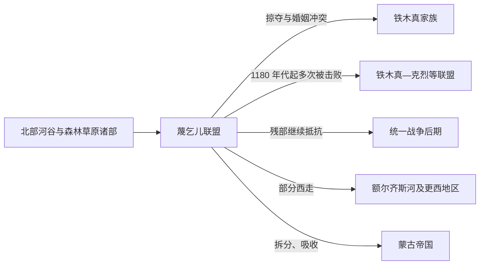

# 蔑乞儿

## 时间与范围

12 世纪至 13 世纪初；色楞格河、鄂尔浑河下游、希洛克河及贝加尔湖以南的河谷—森林草原地带。

## 概括

蔑乞儿是蒙古高原北部的重要部族联盟。它与铁木真家族之间既有婚姻冲突，也有争夺人口、牧地和联盟的政治战争。蔑乞儿在铁木真、札木合和克烈王汗等力量的反复征战中被削弱，残部继续抵抗或西走，最终分散进入蒙古帝国及更西部的政治网络。

## 演变关系

## 历史过程

- 蔑乞儿活动区兼具草原、森林和河流交通条件，是蒙古高原北部网络的重要一环。
- 诃额仑被也速该夺婚，以及后来孛儿帖被蔑乞儿掳走的叙事，反映部族之间以婚姻、报复和人口掠夺相互连接的环境；不能只把长期战争归因于单一私人事件。
- 铁木真在克烈王汗等盟友帮助下夺回孛儿帖，随后又多次征讨蔑乞儿。各次战斗使联盟逐渐分裂，但并非一次战役即告消失。
- 部众一部分被编入蒙古集团，一部分继续北逃或西迁。追击西逃残部的军事行动后来也与蒙古势力进入中亚草原相衔接。

## 组织与人物

蔑乞儿由多个部众和首领网络构成，常见人物包括脱黑脱阿等。它不是单一王朝，没有可覆盖全部部众的连续君主世系。部众在战败后的不同去向，比把名称视为一条不变世系更能解释其历史。

## 关键辨析

- 蔑乞儿的语言、族属和与现代族群的关系不宜仅凭后来被蒙古帝国吸收而倒推。
- “吸收”包含迁徙、收编、婚姻和重新编组，不等于所有人立即失去旧身份。
- 北部森林草原社会与中央草原政权持续往来，不是彼此隔绝的两个世界。

## 导航

- [蒙古帝国前诸部](/%E4%BA%BA%E6%96%87%E7%A7%91%E5%AD%A6/%E5%8E%86%E5%8F%B2/%E4%B8%9C%E4%BA%9A/%E4%B8%AD%E5%9B%BD/_%E6%B0%91%E6%97%8F/%E8%92%99%E5%8F%A4%E8%AF%AD%E6%97%8F%E4%B8%8E%E4%B8%9C%E8%83%A1/%E8%92%99%E5%8F%A4%E5%B8%9D%E5%9B%BD%E5%89%8D%E8%AF%B8%E9%83%A8/README.md)
- [蒙古](/%E4%BA%BA%E6%96%87%E7%A7%91%E5%AD%A6/%E5%8E%86%E5%8F%B2/%E4%B8%9C%E4%BA%9A/%E4%B8%AD%E5%9B%BD/_%E6%B0%91%E6%97%8F/%E8%92%99%E5%8F%A4%E8%AF%AD%E6%97%8F%E4%B8%8E%E4%B8%9C%E8%83%A1/%E5%AE%A4%E9%9F%A6%E8%92%99%E5%8F%A4%E6%BA%90%E6%B5%81/%E8%92%99%E5%8F%A4.md)
- [蒙古帝国与诸汗国](/%E4%BA%BA%E6%96%87%E7%A7%91%E5%AD%A6/%E5%8E%86%E5%8F%B2/%E4%B8%9C%E4%BA%9A/%E8%92%99%E5%8F%A4/%E8%92%99%E5%8F%A4%E5%B8%9D%E5%9B%BD%E4%B8%8E%E8%AF%B8%E6%B1%97%E5%9B%BD.md)
