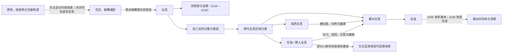

# 女真诸部

## 范围与概括

本目录梳理“女真”称谓、金代女真政治整合、金亡后的分散，以及明代建州、海西、东海等区域性分类如何在 16—17 世纪战争、迁徙、招抚和八旗编制中重新组合。

“建州女真、海西女真、东海女真”主要是明代边疆治理和地理政治语境中的大类，不是三个内部同质、边界固定的民族。满洲共同体也不是三条分支自然汇合的结果，而是以建州集团为核心、通过征服、联盟、迁徙和制度编组形成的新政治身份。

## 演进主线

## 阶段导航

| 节点 | 主要时间 | 核心范围 | 内容重点 |
|---|---|---|---|
| [女真](/%E4%BA%BA%E6%96%87%E7%A7%91%E5%AD%A6/%E5%8E%86%E5%8F%B2/%E4%B8%9C%E4%BA%9A/%E4%B8%AD%E5%9B%BD/_%E6%B0%91%E6%97%8F/%E9%80%9A%E5%8F%A4%E6%96%AF%E8%AF%AD%E6%97%8F%E4%B8%8E%E8%82%83%E6%85%8E/%E5%A5%B3%E7%9C%9F%E8%AF%B8%E9%83%A8/%E5%A5%B3%E7%9C%9F.md) | 10—17 世纪 | 东北亚 | 女真称谓、辽金时期、生熟女真、金朝及金亡后重组。 |
| [建州女真](/%E4%BA%BA%E6%96%87%E7%A7%91%E5%AD%A6/%E5%8E%86%E5%8F%B2/%E4%B8%9C%E4%BA%9A/%E4%B8%AD%E5%9B%BD/_%E6%B0%91%E6%97%8F/%E9%80%9A%E5%8F%A4%E6%96%AF%E8%AF%AD%E6%97%8F%E4%B8%8E%E8%82%83%E6%85%8E/%E5%A5%B3%E7%9C%9F%E8%AF%B8%E9%83%A8/%E5%BB%BA%E5%B7%9E%E5%A5%B3%E7%9C%9F.md) | 14—17 世纪 | 辽东以东、浑江—鸭绿江—长白山地区 | 卫所与迁徙、内部诸部、努尔哈赤统一和后金形成。 |
| [海西女真](/%E4%BA%BA%E6%96%87%E7%A7%91%E5%AD%A6/%E5%8E%86%E5%8F%B2/%E4%B8%9C%E4%BA%9A/%E4%B8%AD%E5%9B%BD/_%E6%B0%91%E6%97%8F/%E9%80%9A%E5%8F%A4%E6%96%AF%E8%AF%AD%E6%97%8F%E4%B8%8E%E8%82%83%E6%85%8E/%E5%A5%B3%E7%9C%9F%E8%AF%B8%E9%83%A8/%E6%B5%B7%E8%A5%BF%E5%A5%B3%E7%9C%9F.md) | 15—17 世纪初 | 松花江中游及辉发河流域 | 哈达、乌拉、叶赫、辉发四部及其与建州的战争。 |
| [东海女真](/%E4%BA%BA%E6%96%87%E7%A7%91%E5%AD%A6/%E5%8E%86%E5%8F%B2/%E4%B8%9C%E4%BA%9A/%E4%B8%AD%E5%9B%BD/_%E6%B0%91%E6%97%8F/%E9%80%9A%E5%8F%A4%E6%96%AF%E8%AF%AD%E6%97%8F%E4%B8%8E%E8%82%83%E6%85%8E/%E5%A5%B3%E7%9C%9F%E8%AF%B8%E9%83%A8/%E4%B8%9C%E6%B5%B7%E5%A5%B3%E7%9C%9F.md) | 15—17 世纪 | 黑龙江、乌苏里江、松花江下游及东北更北部 | 明代泛称、分散部众、后金征讨招抚及多元后续。 |
| [满洲与满族](/%E4%BA%BA%E6%96%87%E7%A7%91%E5%AD%A6/%E5%8E%86%E5%8F%B2/%E4%B8%9C%E4%BA%9A/%E4%B8%AD%E5%9B%BD/_%E6%B0%91%E6%97%8F/%E9%80%9A%E5%8F%A4%E6%96%AF%E8%AF%AD%E6%97%8F%E4%B8%8E%E8%82%83%E6%85%8E/%E6%BB%A1%E6%B4%B2%E6%BB%A1%E6%97%8F/README.md) | 17 世纪以后 | 东北及清帝国各地 | 满洲身份、八旗组织、清朝与现代满族形成。 |

## 共同历史背景

- **辽金时期**：女真内部存在受辽控制程度、生产方式和地域不同的集团。完颜阿骨打整合部分女真力量，于 1115 年建立金朝。
- **金亡以后**：女真人口与政治网络并未消失，而是在元代和明代边疆秩序中迁徙、分散和重组。
- **明代分类**：建州、海西、东海等名称兼具地理、行政和政治含义；同一大类内部仍有多个互相竞争的部落与首领集团。
- **满洲形成**：努尔哈赤和皇太极时期，以建州为核心的政权通过军事征服、联盟、婚姻、迁徙及八旗制度吸收多种人群；1635 年“满洲”成为新的官方族名。
- **多元后续**：并非所有东海或北方人群都进入满洲八旗；一些群体在后来的赫哲、鄂伦春等东北亚民族形成史中有复杂联系，但不能画成简单直系分支。

## 关键辨析

1. “肃慎—挹娄—勿吉—靺鞨—女真”可作为东北亚长时段文献与人群联系来理解，不应写成同一个民族名称的连续改译。
2. “女真”既可指语言文化相近的人群，也可指特定时期的政治身份；金朝臣民更不全是女真。
3. 明代三大女真分类不是自然族群谱系，彼此边界会因迁徙和政治关系改变。
4. “女真改称满洲”背后是政权与制度重组，现代满族身份还经历清代和近现代的长期形成。

## 相关政权与区域

- [金朝](/%E4%BA%BA%E6%96%87%E7%A7%91%E5%AD%A6/%E5%8E%86%E5%8F%B2/%E4%B8%9C%E4%BA%9A/%E4%B8%AD%E5%9B%BD/%E8%BE%BD%E5%AE%8B%E9%87%91%E8%A5%BF%E5%A4%8F/%E9%87%91/README.md)
- [清朝](/%E4%BA%BA%E6%96%87%E7%A7%91%E5%AD%A6/%E5%8E%86%E5%8F%B2/%E4%B8%9C%E4%BA%9A/%E4%B8%AD%E5%9B%BD/%E6%B8%85/README.md)
- [高丽王朝](/%E4%BA%BA%E6%96%87%E7%A7%91%E5%AD%A6/%E5%8E%86%E5%8F%B2/%E4%B8%9C%E4%BA%9A/%E6%9C%9D%E9%B2%9C%E5%8D%8A%E5%B2%9B/%E9%AB%98%E4%B8%BD%E7%8E%8B%E6%9C%9D.md)
- [朝鲜王朝](/%E4%BA%BA%E6%96%87%E7%A7%91%E5%AD%A6/%E5%8E%86%E5%8F%B2/%E4%B8%9C%E4%BA%9A/%E6%9C%9D%E9%B2%9C%E5%8D%8A%E5%B2%9B/%E6%9C%9D%E9%B2%9C%E7%8E%8B%E6%9C%9D.md)
- [通古斯语族与肃慎](/%E4%BA%BA%E6%96%87%E7%A7%91%E5%AD%A6/%E5%8E%86%E5%8F%B2/%E4%B8%9C%E4%BA%9A/%E4%B8%AD%E5%9B%BD/_%E6%B0%91%E6%97%8F/%E9%80%9A%E5%8F%A4%E6%96%AF%E8%AF%AD%E6%97%8F%E4%B8%8E%E8%82%83%E6%85%8E/README.md)
