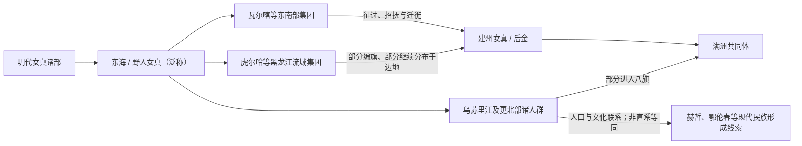

# 东海女真

## 时间与范围

约 15—17 世纪；黑龙江、乌苏里江、松花江下游、滨海地区及东北更北部。

## 别称

明代材料也常用“野人女真”等称呼。此类名称带有中原王朝的地理和治理视角，不应理解为这些人群共同使用的固定自称。

## 概括

东海女真是明代对东北北部、东部多个分散女真部众的宽泛分类，所含人群的地域、组织和生活方式差异很大。16—17 世纪，建州与后金通过征讨、招抚、迁徙和编旗吸收其中一部分；另一些人群在更北和更东地区继续演变，并与赫哲、鄂伦春等现代东北亚民族形成史存在复杂、非单线的联系。

## 演进图

## 组织与区域差异

- 东海女真并非单一部落联盟，更没有统一王朝或能够连续排列的君主世系。
- 其范围常涵盖松花江、黑龙江、乌苏里江、滨海和长白山以东的多个集团；不同材料中的边界与名称并不完全一致。
- 瓦尔喀、虎尔哈等名称可指特定区域或部众，不能把所有东北北部人群都视作同一政治单位。
- 渔猎、采集、农耕、牧养和河流贸易在不同区域以不同组合存在，边疆社会也与朝鲜、明朝、蒙古和更北方网络互动。

## 被纳入后金与多元后续

- 努尔哈赤和皇太极时期，建州与后金对东海诸部发动多次军事行动，同时使用授官、招抚、婚姻和贸易等方式。
- 一部分部众被迁往建州核心区或编入八旗，成为满洲共同体的组成部分。
- 另一些群体留在黑龙江、乌苏里江和更北地区，在清代边疆制度和近现代民族识别中形成不同身份。
- 因此，不能把东海女真整体直接画成满族，也不能把赫哲、鄂伦春等现代民族简单写成某一古代部落的直系后代。

## 关键辨析

1. “东海女真”是外部文献中的区域泛称，不等于统一自称。
2. 被后金征服、主动归附、迁徙编旗和继续留居是并行过程。
3. 族名变化反映政治整合与知识分类变化，不是简单同名改译。
4. 与现代东北亚民族的联系应写为人口、地域和文化线索，不写成确定直系谱系。

## 导航

- [女真诸部](/%E4%BA%BA%E6%96%87%E7%A7%91%E5%AD%A6/%E5%8E%86%E5%8F%B2/%E4%B8%9C%E4%BA%9A/%E4%B8%AD%E5%9B%BD/_%E6%B0%91%E6%97%8F/%E9%80%9A%E5%8F%A4%E6%96%AF%E8%AF%AD%E6%97%8F%E4%B8%8E%E8%82%83%E6%85%8E/%E5%A5%B3%E7%9C%9F%E8%AF%B8%E9%83%A8/README.md)
- [通古斯语族与肃慎](/%E4%BA%BA%E6%96%87%E7%A7%91%E5%AD%A6/%E5%8E%86%E5%8F%B2/%E4%B8%9C%E4%BA%9A/%E4%B8%AD%E5%9B%BD/_%E6%B0%91%E6%97%8F/%E9%80%9A%E5%8F%A4%E6%96%AF%E8%AF%AD%E6%97%8F%E4%B8%8E%E8%82%83%E6%85%8E/README.md)
- [满洲与满族](/%E4%BA%BA%E6%96%87%E7%A7%91%E5%AD%A6/%E5%8E%86%E5%8F%B2/%E4%B8%9C%E4%BA%9A/%E4%B8%AD%E5%9B%BD/_%E6%B0%91%E6%97%8F/%E9%80%9A%E5%8F%A4%E6%96%AF%E8%AF%AD%E6%97%8F%E4%B8%8E%E8%82%83%E6%85%8E/%E6%BB%A1%E6%B4%B2%E6%BB%A1%E6%97%8F/README.md)
- [华夏周边民族](/%E4%BA%BA%E6%96%87%E7%A7%91%E5%AD%A6/%E5%8E%86%E5%8F%B2/%E4%B8%9C%E4%BA%9A/%E4%B8%AD%E5%9B%BD/_%E6%B0%91%E6%97%8F/README.md)
- [建州女真](/%E4%BA%BA%E6%96%87%E7%A7%91%E5%AD%A6/%E5%8E%86%E5%8F%B2/%E4%B8%9C%E4%BA%9A/%E4%B8%AD%E5%9B%BD/_%E6%B0%91%E6%97%8F/%E9%80%9A%E5%8F%A4%E6%96%AF%E8%AF%AD%E6%97%8F%E4%B8%8E%E8%82%83%E6%85%8E/%E5%A5%B3%E7%9C%9F%E8%AF%B8%E9%83%A8/%E5%BB%BA%E5%B7%9E%E5%A5%B3%E7%9C%9F.md)
