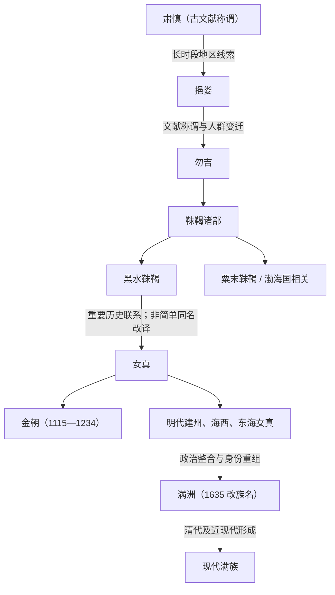

# 女真

## 时间与范围

约 10—17 世纪；活动范围以松花江、黑龙江、乌苏里江、长白山和辽东东部等东北亚地区为中心。

## 概括

女真是辽金至明代东北亚重要人群与政治称谓，其语言属于通古斯语族满—女真支。女真与黑水靺鞨等早期人群存在历史联系，但“肃慎—女真”是长时段文献与人口演变线索，不是同一民族名称的连续改译。完颜阿骨打整合部分女真力量，于 1115 年建立金朝；金亡后各部在元明边疆体系中重新组合，明代又出现建州、海西、东海等区域分类。

## 演进图

## 起源与辽代分化

- 女真兴起于辽金时期东北，常从黑水靺鞨等历史线索讨论其形成。
- 辽代文献中的“生女真、熟女真”等分类，主要反映地域、社会形态和受辽控制程度的差别，并不是固定血缘支系。
- 女真社会由多个部落、首领和地域网络构成，不存在自古统一的政治中心。

## 金朝与政治整合

完颜阿骨打以完颜部为核心统一部分女真诸部，反辽并建立金朝。金朝随后灭辽和北宋，统治范围扩展到华北；其政权内部同时包含女真、汉、契丹、渤海等多种人群。金代女真制度、猛安谋克与汉地官僚体系并存并不断调整。

### 主要世系表（金朝）

| 顺序 | 姓名 | 庙号 / 谥号 | 在位时间 | 关键事件 / 备注 |
|---|---|---|---|---|
| 1 | **完颜阿骨打** | 金太祖 | 1115—1123 | 建立金朝，起兵反辽。 |
| 2 | 完颜晟 | 金太宗 | 1123—1135 | 灭辽、北宋。 |
| 3 | 完颜亶 | 金熙宗 | 1135—1150 | 推行汉制，后被弑。 |
| 4 | 完颜亮 | 海陵王 | 1150—1161 | 迁都燕京，南侵失败被杀。 |
| 5 | **完颜雍** | 金世宗 | 1161—1189 | 金朝治世代表。 |
| 6 | 完颜璟 | 金章宗 | 1189—1208 | 金朝文化高峰，后期衰弱。 |
| 7 | 完颜永济 | 卫绍王 | 1208—1213 | 蒙古压力加重。 |
| 8 | 完颜珣 | 金宣宗 | 1213—1224 | 迁都汴京。 |
| 9 | 完颜守绪 | 金哀宗 | 1224—1234 | 1234 年蒙宋灭金。 |
| 10 | 完颜承麟 | 金末帝 | 1234 | 在位极短，金亡。 |

完整政权史见[金朝](/%E4%BA%BA%E6%96%87%E7%A7%91%E5%AD%A6/%E5%8E%86%E5%8F%B2/%E4%B8%9C%E4%BA%9A/%E4%B8%AD%E5%9B%BD/%E8%BE%BD%E5%AE%8B%E9%87%91%E8%A5%BF%E5%A4%8F/%E9%87%91/README.md)。

## 金亡后的重组

- 1234 年金亡后，女真各部散处东北和华北，在元代军政与地方社会中延续。
- 明代边疆治理中形成建州、海西、东海等区域性分类，各类内部仍包含多个部落和政治集团。
- 努尔哈赤以建州女真为核心扩张，征服或招抚海西、东海等集团；皇太极于 1635 年改族名为“满洲”。
- 清代满洲共同体与现代满族并非旧女真部众原样延续，而是在八旗制度、帝国迁徙和近现代民族识别中形成。

## 关键辨析

- 古代文献称谓、语言亲缘、政治身份和现代民族是四种不同层次。
- 金朝是女真建立的多民族王朝，不能把金朝全部臣民都等同为女真。
- 女真、满洲、现代满族之间有连续性，也有大规模政治与社会重组，不能画成毫无变化的单线继承。

## 相关笔记

- [建州女真](/%E4%BA%BA%E6%96%87%E7%A7%91%E5%AD%A6/%E5%8E%86%E5%8F%B2/%E4%B8%9C%E4%BA%9A/%E4%B8%AD%E5%9B%BD/_%E6%B0%91%E6%97%8F/%E9%80%9A%E5%8F%A4%E6%96%AF%E8%AF%AD%E6%97%8F%E4%B8%8E%E8%82%83%E6%85%8E/%E5%A5%B3%E7%9C%9F%E8%AF%B8%E9%83%A8/%E5%BB%BA%E5%B7%9E%E5%A5%B3%E7%9C%9F.md)
- [海西女真](/%E4%BA%BA%E6%96%87%E7%A7%91%E5%AD%A6/%E5%8E%86%E5%8F%B2/%E4%B8%9C%E4%BA%9A/%E4%B8%AD%E5%9B%BD/_%E6%B0%91%E6%97%8F/%E9%80%9A%E5%8F%A4%E6%96%AF%E8%AF%AD%E6%97%8F%E4%B8%8E%E8%82%83%E6%85%8E/%E5%A5%B3%E7%9C%9F%E8%AF%B8%E9%83%A8/%E6%B5%B7%E8%A5%BF%E5%A5%B3%E7%9C%9F.md)
- [东海女真](/%E4%BA%BA%E6%96%87%E7%A7%91%E5%AD%A6/%E5%8E%86%E5%8F%B2/%E4%B8%9C%E4%BA%9A/%E4%B8%AD%E5%9B%BD/_%E6%B0%91%E6%97%8F/%E9%80%9A%E5%8F%A4%E6%96%AF%E8%AF%AD%E6%97%8F%E4%B8%8E%E8%82%83%E6%85%8E/%E5%A5%B3%E7%9C%9F%E8%AF%B8%E9%83%A8/%E4%B8%9C%E6%B5%B7%E5%A5%B3%E7%9C%9F.md)
- [满洲](/%E4%BA%BA%E6%96%87%E7%A7%91%E5%AD%A6/%E5%8E%86%E5%8F%B2/%E4%B8%9C%E4%BA%9A/%E4%B8%AD%E5%9B%BD/_%E6%B0%91%E6%97%8F/%E9%80%9A%E5%8F%A4%E6%96%AF%E8%AF%AD%E6%97%8F%E4%B8%8E%E8%82%83%E6%85%8E/%E6%BB%A1%E6%B4%B2%E6%BB%A1%E6%97%8F/%E6%BB%A1%E6%B4%B2.md)
- [满族](/%E4%BA%BA%E6%96%87%E7%A7%91%E5%AD%A6/%E5%8E%86%E5%8F%B2/%E4%B8%9C%E4%BA%9A/%E4%B8%AD%E5%9B%BD/_%E6%B0%91%E6%97%8F/%E9%80%9A%E5%8F%A4%E6%96%AF%E8%AF%AD%E6%97%8F%E4%B8%8E%E8%82%83%E6%85%8E/%E6%BB%A1%E6%B4%B2%E6%BB%A1%E6%97%8F/%E6%BB%A1%E6%97%8F.md)
- [华夏周边民族](/%E4%BA%BA%E6%96%87%E7%A7%91%E5%AD%A6/%E5%8E%86%E5%8F%B2/%E4%B8%9C%E4%BA%9A/%E4%B8%AD%E5%9B%BD/_%E6%B0%91%E6%97%8F/README.md)
