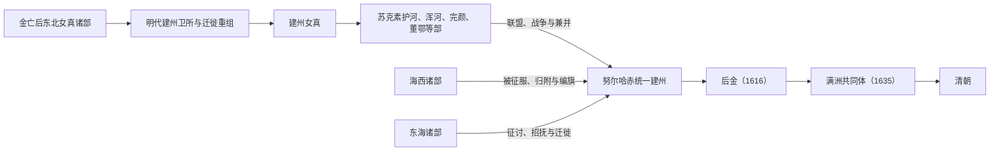

# 建州女真

## 时间与范围

约 14 世纪末至 17 世纪前期；核心活动区在长白山、浑江、鸭绿江和辽东以东。

## 概括

建州女真是明代女真三大区域集团之一。它的形成包含元明之际的迁徙、部族重组以及明朝卫所、朝贡和互市体系的影响。16 世纪末，努尔哈赤以建州内部力量为核心，先统一邻近诸部，再征服或吸收海西、东海等女真集团，于 1616 年建立后金。

## 演进图

## 形成与明朝边疆体系

- 建州女真的形成与女真集团南迁、朝鲜半岛北部及辽东边地的政治变化密切相关。
- 明朝设置建州诸卫，以首领授官、朝贡、互市和边防关系管理相关部众；卫所名称并不等于固定部族边界。
- 建州内部包含苏克素护河、浑河、完颜、董鄂等多种部族线索，各部既竞争也结盟。

## 统一与后金形成

- 1583 年以后，努尔哈赤以祖、父遗留部众起兵，逐步统一建州内部集团。
- 建州势力通过战争、婚姻、盟约和招抚向海西与东海扩张，并建立八旗组织。
- 1616 年努尔哈赤称汗，建立后金；皇太极时期继续扩大政权，1635 年正式改称“满洲”，1636 年改国号为清。
- 建州女真是满洲八旗和清初统治集团的核心之一，但满洲共同体还吸收了海西、东海、蒙古、汉军等多种人口，不能等同于建州原部的简单放大。

## 主要世系表（建州女真至后金）

| 顺序 | 姓名 | 身份 / 称号 | 在位 / 掌权时间 | 关键事件 / 备注 |
|---|---|---|---|---|
| 1 | 猛哥帖木儿 | 建州女真首领 | 14 世纪末—1433 | 建州左卫重要祖先。 |
| 2 | 董山 | 建州女真首领 | 15 世纪 | 明代建州重要首领。 |
| 3 | 福满 | 爱新觉罗氏祖先 | 16 世纪 | 清皇室追尊兴祖直皇帝。 |
| 4 | 觉昌安 | 建州首领 | 不详—1583 | 努尔哈赤祖父。 |
| 5 | 塔克世 | 建州首领 | 不详—1583 | 努尔哈赤之父。 |
| 6 | **努尔哈赤** | 后金天命汗 / 清太祖 | 1616—1626 | 统一建州并扩展至女真诸部，建立后金。 |
| 7 | **皇太极** | 后金汗 / 清太宗 | 1626—1643 | 改族名满洲，改国号清。 |

## 关键辨析

1. 建州女真是政治—地域集合，不是自古边界固定的氏族。
2. “统一女真”包含征服、归附、迁徙与八旗编组，不能只用自然汇合箭头表示。
3. 建州、后金、满洲和清朝分别属于部族集团、政权、身份共同体和王朝层次。

## 导航

- [女真诸部](/%E4%BA%BA%E6%96%87%E7%A7%91%E5%AD%A6/%E5%8E%86%E5%8F%B2/%E4%B8%9C%E4%BA%9A/%E4%B8%AD%E5%9B%BD/_%E6%B0%91%E6%97%8F/%E9%80%9A%E5%8F%A4%E6%96%AF%E8%AF%AD%E6%97%8F%E4%B8%8E%E8%82%83%E6%85%8E/%E5%A5%B3%E7%9C%9F%E8%AF%B8%E9%83%A8/README.md)
- [通古斯语族与肃慎](/%E4%BA%BA%E6%96%87%E7%A7%91%E5%AD%A6/%E5%8E%86%E5%8F%B2/%E4%B8%9C%E4%BA%9A/%E4%B8%AD%E5%9B%BD/_%E6%B0%91%E6%97%8F/%E9%80%9A%E5%8F%A4%E6%96%AF%E8%AF%AD%E6%97%8F%E4%B8%8E%E8%82%83%E6%85%8E/README.md)
- [满洲与满族](/%E4%BA%BA%E6%96%87%E7%A7%91%E5%AD%A6/%E5%8E%86%E5%8F%B2/%E4%B8%9C%E4%BA%9A/%E4%B8%AD%E5%9B%BD/_%E6%B0%91%E6%97%8F/%E9%80%9A%E5%8F%A4%E6%96%AF%E8%AF%AD%E6%97%8F%E4%B8%8E%E8%82%83%E6%85%8E/%E6%BB%A1%E6%B4%B2%E6%BB%A1%E6%97%8F/README.md)
- [华夏周边民族](/%E4%BA%BA%E6%96%87%E7%A7%91%E5%AD%A6/%E5%8E%86%E5%8F%B2/%E4%B8%9C%E4%BA%9A/%E4%B8%AD%E5%9B%BD/_%E6%B0%91%E6%97%8F/README.md)
- [清朝](/%E4%BA%BA%E6%96%87%E7%A7%91%E5%AD%A6/%E5%8E%86%E5%8F%B2/%E4%B8%9C%E4%BA%9A/%E4%B8%AD%E5%9B%BD/%E6%B8%85/README.md)
