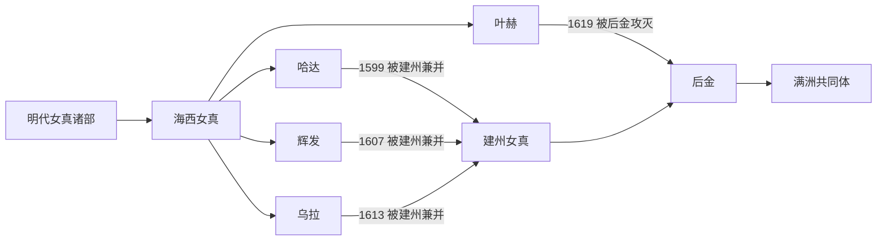

# 海西女真

## 时间与范围

约 15 世纪至 1619 年；主要位于松花江中游、辉发河流域及哈达、乌拉、叶赫等地。

## 概括

海西女真是明代女真三大集团之一，内部以哈达、乌拉、叶赫、辉发“四部”最具代表性。四部不是统一国家，各有首领家族并相互竞争，也在明朝、蒙古势力和建州女真之间结盟或战争。16 世纪末至 17 世纪初，四部先后被努尔哈赤领导的建州政权兼并。

## 演进图

## 形成与四部政治

- 海西女真核心区位于松花江中游及周边水系，是辽东、蒙古高原和东北腹地之间的交通地带。
- 哈达、乌拉、叶赫、辉发各有首领家族和城寨网络，彼此争夺贸易、朝贡资格、人口与盟友。
- 明朝通过授官、贡市和边防政策介入诸部关系；海西各部也与蒙古势力和建州集团形成不断变化的联盟。

## 与建州的战争及整合

- 哈达一度在王台时期强盛，王台死后内争加剧，1599 年被建州兼并。
- 辉发首领拜音达里在联盟变动中失势，1607 年辉发被建州攻灭。
- 乌拉首领布占泰曾与建州和战反复，1613 年乌拉被兼并。
- 叶赫长期联合其他力量抵抗努尔哈赤；1619 年后金攻灭叶赫，金台石、布扬古等首领败亡。
- 被兼并部众被迁徙、收编入旗或与其他集团重组，海西贵族与名称仍在清代社会中留下影响。

## 主要首领表（海西四部节选）

| 顺序 | 部族 | 代表人物 | 时间 | 关键事件 / 备注 |
|---|---|---|---|---|
| 1 | 哈达 | 万汗 / 王台 | 16 世纪 | 海西女真强势首领。 |
| 2 | 乌拉 | 布占泰 | 16—17 世纪 | 与建州女真多次战争，后乌拉被并。 |
| 3 | 叶赫 | 金台石、布扬古 | 16—17 世纪 | 叶赫那拉氏重要首领，后被努尔哈赤灭。 |
| 4 | 辉发 | 拜音达里 | 17 世纪初 | 辉发部后被建州女真兼并。 |

## 关键辨析

- “海西四部”是四个政治集团的合称，不是一个统一王朝。
- 演进图按“被兼并者 → 兼并者”书写；这表示政治征服，不代表人口消失。
- 海西诸部进入满洲共同体经历战争、迁徙、编旗和婚姻，不是自然、同时发生的三支汇合。

## 导航

- [女真诸部](/%E4%BA%BA%E6%96%87%E7%A7%91%E5%AD%A6/%E5%8E%86%E5%8F%B2/%E4%B8%9C%E4%BA%9A/%E4%B8%AD%E5%9B%BD/_%E6%B0%91%E6%97%8F/%E9%80%9A%E5%8F%A4%E6%96%AF%E8%AF%AD%E6%97%8F%E4%B8%8E%E8%82%83%E6%85%8E/%E5%A5%B3%E7%9C%9F%E8%AF%B8%E9%83%A8/README.md)
- [通古斯语族与肃慎](/%E4%BA%BA%E6%96%87%E7%A7%91%E5%AD%A6/%E5%8E%86%E5%8F%B2/%E4%B8%9C%E4%BA%9A/%E4%B8%AD%E5%9B%BD/_%E6%B0%91%E6%97%8F/%E9%80%9A%E5%8F%A4%E6%96%AF%E8%AF%AD%E6%97%8F%E4%B8%8E%E8%82%83%E6%85%8E/README.md)
- [满洲与满族](/%E4%BA%BA%E6%96%87%E7%A7%91%E5%AD%A6/%E5%8E%86%E5%8F%B2/%E4%B8%9C%E4%BA%9A/%E4%B8%AD%E5%9B%BD/_%E6%B0%91%E6%97%8F/%E9%80%9A%E5%8F%A4%E6%96%AF%E8%AF%AD%E6%97%8F%E4%B8%8E%E8%82%83%E6%85%8E/%E6%BB%A1%E6%B4%B2%E6%BB%A1%E6%97%8F/README.md)
- [华夏周边民族](/%E4%BA%BA%E6%96%87%E7%A7%91%E5%AD%A6/%E5%8E%86%E5%8F%B2/%E4%B8%9C%E4%BA%9A/%E4%B8%AD%E5%9B%BD/_%E6%B0%91%E6%97%8F/README.md)
- [建州女真](/%E4%BA%BA%E6%96%87%E7%A7%91%E5%AD%A6/%E5%8E%86%E5%8F%B2/%E4%B8%9C%E4%BA%9A/%E4%B8%AD%E5%9B%BD/_%E6%B0%91%E6%97%8F/%E9%80%9A%E5%8F%A4%E6%96%AF%E8%AF%AD%E6%97%8F%E4%B8%8E%E8%82%83%E6%85%8E/%E5%A5%B3%E7%9C%9F%E8%AF%B8%E9%83%A8/%E5%BB%BA%E5%B7%9E%E5%A5%B3%E7%9C%9F.md)
