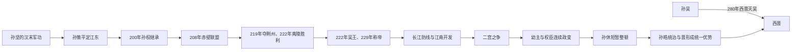

# 东吴（孙）

## 时间

222年-280年

## 别称

孙吴、吴、东吴

## 概括

东吴由孙氏经营江东发展而来。孙坚、孙策奠定军事声望和江东基础，孙权继承后联合江东大族、山越部众与水军，在曹魏、蜀汉之间周旋。222年孙权接受魏封为吴王，229年称帝，定都建业。东吴依托长江防线和江南开发维持最久，280年被西晋灭亡。

孙权晚年二宫之争破坏继承秩序；幼主时期诸葛恪、孙峻、孙綝相继掌权，政变频繁。孙休一度恢复皇权，孙皓却以高压清洗和大规模工程消耗统治；晋灭蜀、代魏后取得北方与上游优势，最终水陆并进灭吴。

## 兴亡主线

## 建立、发展与统治结构

| 阶段 | 具体过程 | 权力结构 |
|---|---|---|
| 孙策创业 | 借袁术兵力渡江，击败江东地方势力并招纳周瑜、张昭等，200年遇刺。 | 孙氏外来军人集团与吴郡、会稽等地方大族开始合作。 |
| 孙权守成扩张 | 孙权稳定旧部，208年与刘备抗曹；长期争夺合肥、荆州，219年取荆州。 | 皇权协调淮泗武人、江东士族和宗室；将领部曲具有私人、世袭色彩。 |
| 吴王与称帝 | 夷陵战前向魏称臣获封吴王，以避免两线受敌；229年独立称帝。 | 对魏、蜀关系务实变化，政治名号服务于战争与联盟。 |
| 鼎盛维持 | 以建业、武昌为政治军事节点，水军守长江，开发江南、岭南并控制交州。 | 顾、陆、朱、张等大族进入官僚，将领领有世袭部曲，中央以婚姻和任官平衡。 |
| 二宫之争 | 太子孙和与鲁王孙霸竞争，朝臣分党；孙权废太子、赐死孙霸，改立幼子孙亮。 | 皇帝晚年决策摧毁稳定储位，继承人年幼使托孤权臣坐大。 |
| 权臣与政变 | 诸葛恪北伐失败被孙峻所杀，孙峻死后孙綝专权并废孙亮；孙休即位后诛孙綝。 | 禁军和宫廷控制决定废立，士族官僚难以约束武装权臣。 |
| 孙皓与灭亡 | 孙皓迁都、再迁建业，北伐和工程并行，以酷刑清洗；晋在益州造船并多路南下。 | 皇帝维持高压但失去臣下信任；长江各战区缺乏统一协同。 |

## 重要事件

1. 194—200年孙策平定江东诸郡，为孙氏取得独立税源和军队。
2. 208年赤壁之战，孙刘联军阻止曹操控制长江；周瑜随后攻取南郡部分地区。
3. 215年孙刘湘水划界，219年吕蒙袭取荆州、关羽败亡，吴取得长江中游关键地带。
4. 222年陆逊在夷陵击败刘备，同年孙权受魏封吴王；随后重新与蜀结盟。
5. 229年孙权称帝，三国君主并立完成；建业成为主要都城。
6. 吴军多次攻合肥、淮南未能突破魏防线，说明水军优势难转换为中原占领。
7. 230年派船队至夷洲等地的记载反映海上活动，具体地点、规模和成效仍有讨论。
8. 241—250年代二宫之争持续，太子孙和被废，许多重臣遭流放或诛杀。
9. 252年孙权死、孙亮幼立；诸葛恪取得东兴之战胜利后因新城北伐失败而被杀。
10. 258年孙綝废孙亮立孙休，随后被孙休诛杀；皇权短暂恢复。
11. 263年蜀亡使吴失去西部盟友；265年西晋代魏，北方资源整合完成。
12. 279—280年晋军从益州顺江而下，并由荆州、淮南多路渡江；王濬水军抵建业，孙皓投降。

## 崛起、维系与鼎盛机制

- 江东河网和长江天险适合水军防守，曹魏骑兵与北方陆军难以快速跨江。
- 孙氏保留淮泗旧部军事核心，同时与江东大族共享官位、婚姻和地方控制，克服外来集团的合法性不足。
- 山越战争、招抚和迁民为军队、农业提供人口，但也伴随强制征发和长期地方冲突。
- 江南稻作、手工业、长江与海上交通不断发展，孙吴促进南方经济政治重心成长。
- 在魏、蜀之间灵活称臣、结盟或开战，使吴避免长期两线夹击。
- 世袭领兵和地方大族能稳定边防，却削弱中央对军队、人口的直接统一控制。

## 衰落与灭亡原因

### 结构因素

- 曹魏人口财赋远多于吴，吴能长期守江，却难以单独征服北方。
- 将领部曲和大族地方基础具有半世袭性，中央需要持续平衡，改革和集中军权成本高。
- 荆州上游对长江防线至关重要；蜀亡后，晋可在益州造舰顺流而下，吴的天险从侧后被破解。
- 长期宫廷斗争使统帅、官僚和皇族反复清洗，托孤制度失去可信度。

### 统治因素

- 二宫之争是关键转折：孙权迟迟不定储位并纵容两派，最后同时废黜，留下年幼继承人。
- 诸葛恪、孙峻、孙綝依次以禁军发动政变，中央治理围绕个人存亡而非长期战略。
- 孙皓滥刑、迁都、工程和对外用兵增加财政与官僚压力；后世暴君叙事或有夸张，但臣将离心已有多方记载。
- 吴未能趁西晋内部尚未稳定时取得决定性防御改革，边将对晋军多路进攻缺乏统一指挥。

### 直接灭亡

晋武帝先命王濬在益州造大型战船，再由杜预、王浑等从荆州、淮南配合。280年晋军突破沿江铁锁和要塞，上游水军顺流推进；各地吴军被分割，建业无法集中救援。孙皓投降后中央法统消失，地方迅速归附，三国时代结束。

## 君主世系

| 顺序 | 姓名 | 庙号 | 谥号 | 年号 | 在位时间 | 生卒时间 | 与前任关系 | 关键事件 / 备注 / 说明 |
|---:|---|---|---|---|---|---|---|---|
| 追尊 | **孙坚** | 始祖 | 武烈皇帝 | 无 | 未称帝；孙权追尊 | 155年-191年 | 孙氏江东基业的先辈 | 汉末将领，参与讨董，后战死；孙权称帝后追尊。 |
| 追尊 | 孙策 | 无 | 长沙桓王 | 无 | 194年-200年经营江东；未称帝 | 175年-200年 | 孙坚长子，孙权兄 | 平定江东，奠定孙吴基础；早逝后由孙权继承势力。 |
| 1 | **孙权** | 太祖 | 大皇帝 | 黄武、黄龙、嘉禾、赤乌、太元、神凤 | 200年-222年统领江东；222年-229年为吴王；229年-252年为皇帝 | 182年-252年 | 孙策之弟；继承江东势力 | 赤壁之战后巩固江东；222年称吴王，229年称帝；晚年二宫之争导致继承秩序受损。 |
| 2 | 孙亮 | 无 | 会稽王；后世常称吴废帝 | 建兴、五凤、太平 | 252年-258年 | 243年-260年 | 孙权幼子 | 年幼即位，诸葛恪、孙峻、孙綝相继专权；258年被废。 |
| 3 | 孙休 | 无 | 景皇帝 | 永安 | 258年-264年 | 235年-264年 | 孙权之子，孙亮兄 | 诛杀孙綝，试图恢复皇权；在位期间蜀汉灭亡。 |
| 追尊 | 孙和 | 无 | 文皇帝 | 无 | 未称帝；孙皓追尊 | 224年-253年 | 孙权之子，孙皓之父 | 曾为太子，二宫之争中被废，后被赐死；孙皓即位后追尊。 |
| 4 | 孙皓 | 无 | 无正式美谥；后世常称吴末帝 | 元兴、甘露、宝鼎、建衡、凤凰、天册、天玺、天纪 | 264年-280年 | 242年-284年 | 孙和之子，孙休侄；继孙休后即位 | 后期政治残酷失序；280年西晋灭吴，孙皓投降，三国结束。 |

## 说明

- 孙坚、孙策未称帝，但对孙吴建国具有奠基意义，因此列入追尊节点。
- 孙权从200年继承江东势力，到222年称吴王，再到229年称帝，存在多阶段身份变化。
- 东吴是三国中最后灭亡的政权，280年晋灭吴后中国短暂统一。

## 演变关系

- 前一节点：[../汉/汉末群雄.md](/%E4%BA%BA%E6%96%87%E7%A7%91%E5%AD%A6/%E5%8E%86%E5%8F%B2/%E4%B8%9C%E4%BA%9A/%E4%B8%AD%E5%9B%BD/%E6%B1%89/%E6%B1%89%E6%9C%AB%E7%BE%A4%E9%9B%84.md)。
- 并列政权：[魏（曹）](/%E4%BA%BA%E6%96%87%E7%A7%91%E5%AD%A6/%E5%8E%86%E5%8F%B2/%E4%B8%9C%E4%BA%9A/%E4%B8%AD%E5%9B%BD/%E4%B8%89%E5%9B%BD/%E9%AD%8F%EF%BC%88%E6%9B%B9%EF%BC%89.md)、[蜀汉（刘）](/%E4%BA%BA%E6%96%87%E7%A7%91%E5%AD%A6/%E5%8E%86%E5%8F%B2/%E4%B8%9C%E4%BA%9A/%E4%B8%AD%E5%9B%BD/%E4%B8%89%E5%9B%BD/%E8%9C%80%E6%B1%89%EF%BC%88%E5%88%98%EF%BC%89.md)。
- 后一节点：280年被西晋灭亡。
