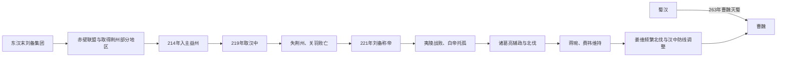

# 蜀汉（刘）

## 时间

221年-263年

## 别称

蜀、汉、季汉

## 概括

蜀汉由刘备建立，定都成都。刘备以汉室宗亲身份延续汉统，国号仍为“汉”；后世为了区别西汉、东汉，常称“蜀汉”。蜀汉控制益州和汉中，地理上相对险固，但人口、土地和财政资源少于曹魏。

刘备死后，刘禅即位，诸葛亮辅政并多次北伐。诸葛亮去世后，蒋琬、费祎、姜维等依次主持军政。263年魏军分道伐蜀，钟会突破汉中、牵制姜维于剑阁，邓艾偷渡阴平进入成都平原，刘禅投降，蜀汉灭亡。

## 兴亡主线

## 建立、维系与统治结构

| 阶段 | 具体过程 | 权力结构 |
|---|---|---|
| 流动军政集团 | 刘备先后依附多个诸侯，以汉宗亲、仁义声望和关羽、张飞等私人部曲维持核心。 | 缺乏固定税源，依赖军事联盟与地方士人加入。 |
| 荆益立足 | 赤壁后据荆州部分地区，214年击败刘璋入益州，219年取汉中并称汉中王。 | 荆州旧部、益州本地士人和刘璋旧臣共同组成政权，利益需要平衡。 |
| 称帝与夷陵 | 曹丕代汉后刘备称帝；为夺荆州伐吴，222年夷陵大败。 | 开国君主直接统军，战败损失精锐，吴蜀联盟被迫重建。 |
| 诸葛亮辅政 | 刘禅幼年继位，诸葛亮作为丞相掌军政，南征后以汉中为基地多次北伐。 | 皇帝保留法统，丞相府实际统筹行政、财政、外交和军队。 |
| 蒋费时期 | 蒋琬、费祎继续辅政，减少大规模冒险，维持与吴联盟和内部稳定。 | 尚书、中军与大将军等分担权力，没有立即形成世袭权臣。 |
| 姜维后期 | 费祎死后姜维扩大北伐，宦官黄皓影响宫廷；前线与成都决策分离。 | 姜维掌外军但不能完全控制中枢，刘禅仍作最终决策。 |
| 魏军灭蜀 | 钟会取汉中、姜维守剑阁，邓艾绕道阴平击败诸葛瞻，直逼成都。 | 成都缺乏可迅速集结的战略预备军，刘禅在援军未至前选择投降。 |

## 重要事件

1. 208年刘备与孙权联盟在赤壁击退曹操，获得在荆州扩张的窗口。
2. 214年刘备迫刘璋投降，占据益州；219年汉中之战后控制秦岭南侧战略门户。
3. 219年关羽北攻襄樊时孙权袭取荆州，关羽败亡，蜀汉失去东向和北向双重基地。
4. 221年刘备在成都称帝；222年夷陵之战败于陆逊，吴蜀重新结盟成为存续必要条件。
5. 223年刘禅即位，诸葛亮受托孤；225年南中战争后重建后方控制和物资来源。
6. 228—234年诸葛亮多次北伐，在祁山、陈仓、五丈原等方向与魏军对峙，未能取得关中。
7. 234年诸葛亮去世，蒋琬、费祎先后主持政务，蜀汉维持约二十年相对稳定。
8. 244年魏军攻汉中，王平等利用山险击退，显示防御体系仍有效。
9. 253年费祎遇刺后，姜维更频繁北伐；战果与损耗并存，朝廷资源和民众负担增加。
10. 263年魏以邓艾、钟会、诸葛绪多路进攻；邓艾突破阴平后，成都迅速投降。
11. 蜀亡后姜维试图利用钟会与司马昭矛盾复国，264年兵变失败，不能算蜀汉政权正式延续。

## 崛起、鼎盛与维系机制

- 刘备以汉室继承和个人声望吸引流动士人、兵众，能在多次失败后保留核心集团。
- 荆州连接益州、中原和长江，益州盆地则提供人口、粮食、盐铁和山川防御；两地结合时战略条件最佳。
- 诸葛亮以法令、考课和农业供给整顿益州，维持较清廉有效的战时政府。
- 与孙吴联盟分担曹魏压力，使魏不能集中全部南方兵力攻蜀。
- 汉中、剑阁、秦岭构成多层山地防线，较少人口也能拒守强敌。
- 蜀锦、盐铁和屯田支持财政，但小国长期远征的承受能力仍有限。

## 衰落与灭亡原因

### 结构因素

- 失去荆州后只剩益州—汉中单一战略轴，无法从长江中游和秦岭同时威胁魏。
- 人口、军队和税源显著少于曹魏，任何精锐损失都更难补充。
- 益州本地大族、荆州旧部与外来官僚需长期平衡；政权合法性依赖“复汉”目标，防守与北伐之间存在张力。
- 山地易守却也使成都到汉中补给漫长，一旦外围关隘被突破，盆地内纵深有限。

### 统治与军事因素

- 刘备夷陵战败损失将领兵员，荆州已经无法恢复。
- 诸葛亮北伐未能夺取关中，但尚维持可控节奏；姜维后期频繁用兵、调整汉中守备，增加资源压力。
- 黄皓干政、前线与中枢不和是后期问题，但不能把灭亡归于单一宦官；刘禅、姜维和朝臣都参与关键决策。
- 魏在司马昭主导下利用蜀内部误判，集中多路兵力发动一次战略突袭。

### 直接灭亡

钟会突破外围并把姜维牵制在剑阁，常规主力未被歼灭却无法回援。邓艾选择高风险阴平路线，越过防线击败诸葛瞻于绵竹。成都既无坚固前沿军队，也无法等待吴援，刘禅接受谯周等投降建议。蜀亡关键是防线被绕过和政治中心迅速放弃抵抗，而非全军已败。

## 君主世系

| 顺序 | 姓名 | 庙号 | 谥号 | 年号 | 在位时间 | 生卒时间 | 与前任关系 | 关键事件 / 备注 / 说明 |
|---:|---|---|---|---|---|---|---|---|
| 1 | **刘备** | 烈祖 | 昭烈皇帝 | 章武 | 214年-221年据益州；221年-223年为皇帝 | 161年-223年 | 汉室宗亲，汉末群雄之一；在曹丕代汉后称帝 | 先后依附公孙瓒、陶谦、曹操、袁绍、刘表；赤壁后取得荆州部分地区，后入益州；221年称帝；夷陵之战败于东吴。 |
| 2 | 刘禅 | 无 | 思公；后被前赵刘渊追谥为孝怀皇帝 | 建兴、延熙、景耀、炎兴 | 223年-263年 | 207年-271年 | 刘备之子 | 诸葛亮辅政并北伐；后由蒋琬、费祎、姜维等执政或主军事；263年向曹魏投降，蜀汉灭亡。 |

## 重要辅政与执政人物

| 人物 | 时期 | 说明 |
|---|---|---|
| 诸葛亮 | 刘禅前期 | 托孤大臣，主持蜀汉军政，多次北伐，234年卒于五丈原。 |
| 蒋琬 | 诸葛亮之后 | 接续诸葛亮执政路线，维持蜀汉政局。 |
| 费祎 | 蒋琬之后 | 主张休养和谨慎用兵，维持蜀汉稳定。 |
| 姜维 | 后期 | 多次北伐，军事消耗较大；蜀亡后试图借钟会之乱复国，失败被杀。 |
| 黄皓 | 后期 | 宦官，影响朝政，被视为蜀汉后期政治败坏的重要人物。 |

## 说明

- 蜀汉自称“汉”，其政治合法性来自刘备的汉室宗亲身份和“继承汉统”的主张。
- 蜀汉只有两位皇帝，世系很短，但诸葛亮、蒋琬、费祎、姜维等辅政和执政人物对政权走向影响很大。
- 263年刘禅投降后被迁往洛阳，封安乐公。

## 演变关系

- 前一节点：[../汉/汉末群雄.md](/%E4%BA%BA%E6%96%87%E7%A7%91%E5%AD%A6/%E5%8E%86%E5%8F%B2/%E4%B8%9C%E4%BA%9A/%E4%B8%AD%E5%9B%BD/%E6%B1%89/%E6%B1%89%E6%9C%AB%E7%BE%A4%E9%9B%84.md)。
- 并列政权：[魏（曹）](/%E4%BA%BA%E6%96%87%E7%A7%91%E5%AD%A6/%E5%8E%86%E5%8F%B2/%E4%B8%9C%E4%BA%9A/%E4%B8%AD%E5%9B%BD/%E4%B8%89%E5%9B%BD/%E9%AD%8F%EF%BC%88%E6%9B%B9%EF%BC%89.md)、[东吴（孙）](/%E4%BA%BA%E6%96%87%E7%A7%91%E5%AD%A6/%E5%8E%86%E5%8F%B2/%E4%B8%9C%E4%BA%9A/%E4%B8%AD%E5%9B%BD/%E4%B8%89%E5%9B%BD/%E4%B8%9C%E5%90%B4%EF%BC%88%E5%AD%99%EF%BC%89.md)。
- 后一节点：263年被曹魏灭亡。
