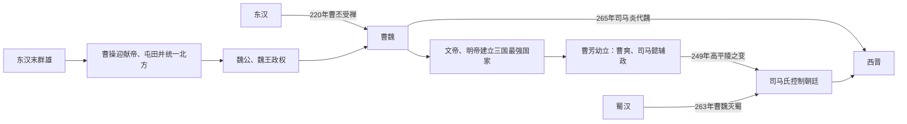

# 魏（曹）

## 时间

220年-265年

## 别称

曹魏、魏

## 概括

曹魏由曹丕代汉建立，控制华北、中原、关中、凉州和辽东等地，是三国中人口、土地和制度资源最强的政权。曹魏的基础由曹操在东汉末年奠定：迎汉献帝、统一北方，以汉朝丞相和魏王体系整合军政。220年曹丕迫汉献帝禅让，建立魏。

曹魏后期因明帝早逝、幼主继位和宗室缺乏军权，辅政大臣掌握禁军。249年司马懿发动高平陵之变后，司马师、司马昭逐步控制朝廷；265年司马炎代魏建晋。曹魏不是被蜀吴击败，而是在最强大的军政集团内部完成权力替代。

## 兴亡主线

## 建立、发展与统治结构

| 阶段 | 具体过程 | 权力结构 |
|---|---|---|
| 曹操奠基 | 196年迎献帝至许，借汉廷任官和号令；官渡胜袁绍后统一北方，实行屯田并吸收流民军队。 | 汉帝保留法统，曹操以司空、丞相、魏公、魏王逐层建立独立官属和封国。 |
| 曹丕建国 | 曹丕继魏王后完成受禅，定都洛阳，设置魏朝官僚；对孙权一度封吴王。 | 皇帝与尚书、中书等中枢合作；陈群主持九品中正，把地方人物评议纳入选官。 |
| 明帝守成 | 曹叡抵御诸葛亮、孙吴进攻，238年命司马懿平辽东公孙渊。 | 皇帝重用曹真、司马懿等统帅，却压制成年宗室军权，托孤只能依赖外臣。 |
| 幼主辅政 | 曹芳即位时年幼，曹爽与司马懿共同受遗诏；曹爽控制中枢并排挤司马懿。 | 辅政权缺少稳定分工，禁军和洛阳控制权决定政变成败。 |
| 司马氏专政 | 249年司马懿诛曹爽；司马师废曹芳，司马昭平淮南反抗并杀曹髦。 | 皇帝只保留名义，司马氏掌军队、尚书和人事，逐步取得晋公、晋王地位。 |
| 灭蜀与代魏 | 263年钟会、邓艾灭蜀，军事声望和新增领土归于司马昭集团；司马炎继承后称帝。 | 曹奂无独立军政基础，只能受禅退位。 |

## 重要事件

1. 196年曹操迎汉献帝，以汉廷官爵整合盟友和敌对势力，许都成为政治中心。
2. 200年官渡之战击败袁绍主力，随后多年兼并河北，形成北方优势。
3. 208年赤壁之战失败，曹操未能乘统一北方之势控制长江，三方格局逐渐形成。
4. 213、216年曹操先后为魏公、魏王，建立可由曹氏继承的封国内廷。
5. 220年曹丕受禅建魏；221—222年刘备、孙权相继建立各自君主权，三国正式化。
6. 228—234年诸葛亮多次北伐，魏依靠关中纵深和粮运防守；吴也长期进攻合肥、淮南。
7. 238年司马懿攻灭辽东公孙渊，曹魏把东北重要据点纳入。
8. 249年高平陵之变后曹爽集团被诛，司马氏取得决定性权力。
9. 251、255、257—258年淮南先后发生反司马氏叛乱，失败后忠于曹氏的地方军政力量被清除。
10. 260年曹髦亲自讨司马昭而被杀，皇权已无法约束权臣。
11. 263年魏灭蜀；265年司马炎迫曹奂禅位，建立西晋。

## 崛起、鼎盛与衰亡原因

### 优势与鼎盛

- 曹操控制黄河流域主要人口、农业和旧汉官僚中心，资源规模超过蜀、吴。
- 屯田将流民、荒地和军粮供应结合，缓解长期战争下的粮运问题；其范围和效果各地不同，并非全国统一制度。
- 以汉帝名义用人降低兼并诸侯的政治成本，随后魏王国官属平稳转为新朝中枢。
- 九品中正和士族合作提高战后官僚整合，但也使高门家族逐渐垄断高品。
- 洛阳、关中、淮南和合肥等多层防线，使蜀吴难以把局部胜利转化为灭国攻势。

### 结构隐患

- 曹丕、曹叡为防宗室争权，限制诸王就国和掌兵；这避免早期内战，却使幼帝遭外臣政变时没有宗室军队救援。
- 明帝晚年工程、战争和宫廷开支较重，又在无亲生成年继承人的情况下托孤。
- 曹爽、司马懿双辅政没有明确权力边界，曹爽改革和排挤使冲突只能以政变解决。
- 司马氏长期统领对蜀、辽东和淮南战争，掌握军功、将领与地方资源，权力基础超过皇室。

### 直接灭亡

高平陵之变夺走禁军和中枢后，司马氏通过废帝、平淮南三叛、杀曹髦逐步清除反对者。灭蜀进一步提升威望，司马昭获晋王；其子司马炎继承完整军政集团，曹奂既无军队也无宗室支援，265年禅让遂成为事实权力的形式确认。

## 君主世系

| 顺序 | 姓名 | 庙号 | 谥号 | 年号 | 在位时间 | 生卒时间 | 与前任关系 | 关键事件 / 备注 / 说明 |
|---:|---|---|---|---|---|---|---|---|
| 追尊 | 曹腾 | 无 | 高皇帝 | 无 | 曹丕追尊，未实际在位 | 100年-159年 | 曹嵩养父，曹操祖父辈 | 东汉宦官，曹魏建立后被追尊。 |
| 追尊 | 曹嵩 | 无 | 太皇帝 | 无 | 曹丕追尊，未实际在位 | 不详-193年 | 曹腾养子，曹操之父 | 被曹丕追尊为太皇帝。 |
| 追尊 | **曹操** | 太祖 | 武皇帝 | 无 | 213年为魏公；216年-220年为魏王；未称帝 | 155年-220年 | 曹嵩之子 | 统一北方，控制汉献帝，奠定曹魏基础；死后曹丕追尊为武皇帝。 |
| 1 | **曹丕** | 世祖 | 文皇帝 | 黄初 | 220年-226年 | 187年-226年 | 曹操之子；代汉称帝 | 逼汉献帝禅让，建立曹魏；推行九品中正制。 |
| 2 | 曹叡 | 烈祖 | 明皇帝 | 太和、青龙、景初 | 226年-239年 | 204年或206年-239年 | 曹丕之子 | 对蜀、吴长期用兵；晚年托孤曹爽、司马懿。 |
| 3 | 曹芳 | 无 | 厉公；原为齐王，后贬邵陵县公 | 正始、嘉平 | 239年-254年 | 232年-274年 | 曹叡养子；继明帝后即位 | 幼主即位，曹爽、司马懿辅政；高平陵之变后司马氏掌权，后被废。 |
| 4 | 曹髦 | 无 | 高贵乡公 | 正元、甘露 | 254年-260年 | 241年-260年 | 曹丕之孙、东海定王曹霖之子；继曹芳被废后即位 | 试图讨伐司马昭，被成济所杀。 |
| 5 | 曹奂 | 无 | 元皇帝 | 景元、咸熙 | 260年-265年 | 246年-302年 | 曹操之孙、燕王曹宇之子；继曹髦死后即位 | 263年魏灭蜀；265年禅位司马炎，曹魏灭亡。 |

## 说明

- 曹操是曹魏实际奠基者，但未称帝；本表将其列为追尊节点。
- 曹魏后期真正掌权者逐渐变为司马懿、司马师、司马昭父子。
- 曹魏灭蜀后不久即被司马炎取代，统一事业由西晋完成。

## 演变关系

- 前一节点：[../汉/汉末群雄.md](/%E4%BA%BA%E6%96%87%E7%A7%91%E5%AD%A6/%E5%8E%86%E5%8F%B2/%E4%B8%9C%E4%BA%9A/%E4%B8%AD%E5%9B%BD/%E6%B1%89/%E6%B1%89%E6%9C%AB%E7%BE%A4%E9%9B%84.md)。
- 并列政权：[蜀汉（刘）](/%E4%BA%BA%E6%96%87%E7%A7%91%E5%AD%A6/%E5%8E%86%E5%8F%B2/%E4%B8%9C%E4%BA%9A/%E4%B8%AD%E5%9B%BD/%E4%B8%89%E5%9B%BD/%E8%9C%80%E6%B1%89%EF%BC%88%E5%88%98%EF%BC%89.md)、[东吴（孙）](/%E4%BA%BA%E6%96%87%E7%A7%91%E5%AD%A6/%E5%8E%86%E5%8F%B2/%E4%B8%9C%E4%BA%9A/%E4%B8%AD%E5%9B%BD/%E4%B8%89%E5%9B%BD/%E4%B8%9C%E5%90%B4%EF%BC%88%E5%AD%99%EF%BC%89.md)。
- 后一节点：西晋。
