# 2012年以来的中国

## 时间与核验范围

2012年11月至今。中共中央领导交接以2012年11月为起点，国家主席与国务院总理交接发生于2013年3月。现任职务核验截止到2026年7月14日；本阶段尚未结束，对政策成效与历史定位只作阶段性概括。

## 概括

2012年以来，中国从高速增长后期进入经济结构调整、人口老龄化与外部战略竞争增强的新阶段。中共中央强化集中统一领导，长期反腐败、党和国家机构改革及军队改革改变治理结构；脱贫攻坚、基础设施、数字产业和新能源制造扩展国家能力与产业规模。与此同时，房地产调整、地方债务、就业和收入预期、低生育与人口负增长、民营经济信心、公共卫生治理，以及中美贸易科技竞争构成持续压力。

## 阶段脉络

```mermaid
flowchart LR
  Transition["2012—2013 领导交接"] --> Governance["反腐败与全面深化改革"]
  Governance --> Centralization["党和国家机构、军队与监督体系重组"]
  Centralization --> Upgrading["产业升级、数字化与绿色转型"]
  Upgrading --> Trade["2018后贸易科技竞争加剧"]
  Trade --> Pandemic["2020—2022 新冠疫情与防控"]
  Pandemic --> Reopening["2022年底后防控转段与经济恢复"]
  Reopening --> Adjustment["房地产、地方债务与人口结构调整"]
  Adjustment --> Ongoing["截至2026-07-14 进行中的发展阶段"]
```

## 分阶段过程

| 阶段 | 时间 | 具体过程 |
|---|---|---|
| 领导交接与治理整顿 | 2012—2015年 | 习近平接任中共中央总书记、中央军委主席和国家主席，李克强任总理；反腐败调查覆盖党政军和国企，中央全面深化改革领导机制建立。 |
| 机构与发展战略重组 | 2015—2018年 | 军队领导指挥体制改革、供给侧结构性改革、扶贫攻坚和生态治理推进；2018年宪法与党和国家机构改革强化党的领导和中央统筹。 |
| 外部竞争与国内调整 | 2018—2019年 | 中美关税与科技限制升级，出口、供应链和技术自主议题权重上升；减税、金融风险治理与房地产调控并行。 |
| 疫情冲击 | 2020—2022年 | 新冠疫情初期采取封控、检测、边境与健康码等措施，早期压低传播但社会经济成本随时间增加；2022年底防控政策迅速转段并出现大规模感染。 |
| 新一届任期与再平衡 | 2022年底以来 | 中共二十大和2023年国家机构换届后，习近平继续兼任党、国家和军队主要职务，李强任总理；经济面对房地产收缩、地方财政、消费需求和青年就业压力，同时新能源、先进制造与数字产业继续扩张。 |

## 现任职务与权力结构

截至2026年7月14日：

| 层级 | 人物与职务 | 权力说明 |
|---|---|---|
| 执政党最高领导 | 习近平，中共中央总书记 | 主持中共中央政治局及常委会工作，党内最高职务。 |
| 国家元首 | 习近平，中华人民共和国主席 | 国家机构职位；2013年起任职，2018年、2023年连任。 |
| 军事领导 | 习近平，中共中央军委主席、国家中央军委主席 | 2012年起任党军委主席，2013年起任国家军委主席。 |
| 政府首脑 | 李强，国务院总理 | 2023年3月起领导国务院行政工作。 |
| 国家权力机关常设机构 | 赵乐际，全国人大常委会委员长 | 2023年3月起主持全国人大常委会工作。 |
| 实际最高权力 | 习近平兼任总书记、两个军委主席和国家主席 | 党政军主要最高职位集中于一人；国务院总理仍是法定政府首脑，不能与总书记或国家主席混写。 |

完整历任序列、任期与交接见[中华人民共和国历任领导职务表](/%E4%BA%BA%E6%96%87%E7%A7%91%E5%AD%A6/%E5%8E%86%E5%8F%B2/%E4%B8%9C%E4%BA%9A/%E4%B8%AD%E5%9B%BD/%E4%B8%AD%E5%8D%8E%E4%BA%BA%E6%B0%91%E5%85%B1%E5%92%8C%E5%9B%BD/%E4%B8%AD%E5%8D%8E%E4%BA%BA%E6%B0%91%E5%85%B1%E5%92%8C%E5%9B%BD%E5%8E%86%E4%BB%BB%E9%A2%86%E5%AF%BC%E8%81%8C%E5%8A%A1%E8%A1%A8.md)。

## 重要事件

| 时间 | 事件 | 过程与影响 |
|---|---|---|
| 2012—2013年 | 中共十八大与国家机构换届 | 习近平接任总书记、军委主席和国家主席，李克强任总理，新一轮领导交接完成。 |
| 2012年以来 | 持续反腐败运动 | 中央纪委和国家监委体系查处大量党政军干部；提升纪律控制与公众关注，也使监督集中化和程序保障成为讨论议题。 |
| 2013年 | 全面深化改革决定与“一带一路”倡议 | 改革统筹机构建立；基础设施、贸易和金融合作扩展至多地区，同时带来项目债务、环境和地缘政治争议。 |
| 2014年 | 全面推进依法治国部署 | 强调依宪治国、司法改革和党内法规，同时坚持党的领导高于制度设计。 |
| 2015—2016年 | 军队改革 | 原七大军区改为五大战区，重组军委机关与军种结构，强化联合作战和中央军委集中领导。 |
| 2015年以来 | 供给侧结构性改革与产业政策 | 去产能、降杠杆、房地产去库存等目标先后调整，新能源、半导体和高端制造获得更多政策支持。 |
| 2017—2018年 | 中共十九大、宪法修正与机构改革 | “习近平新时代中国特色社会主义思想”写入党章和宪法；国家主席任期限制删除，国家监察委员会成立，党政机构进一步整合。 |
| 2018年以来 | 中美贸易与科技竞争 | 关税、出口管制、投资审查和供应链调整扩大，技术自主与安全政策的重要性上升。 |
| 2019—2020年 | 香港抗议与香港国安法实施 | 2019年修例争议引发长期抗议；2020年全国人大常委会制定香港国安法，治理与政治空间发生重大变化。 |
| 2020—2022年 | 新冠疫情和“动态清零” | 武汉早期暴发后采取严格公共卫生措施；奥密克戎阶段封控成本上升，2022年12月政策快速放开。 |
| 2020年 | 宣布现行标准下农村贫困人口全部脱贫 | 大规模财政、干部和基础设施投入改善许多贫困地区条件；脱贫标准、长期增收和返贫风险需继续观察。 |
| 2021年 | 第七次全国人口普查结果公布 | 老龄化、家庭规模缩小和地区人口流动更加明显，三孩政策及生育支持措施随后推出。 |
| 2022—2023年 | 中共二十大与十四届全国人大一次会议 | 习近平继续任总书记和国家主席，李强接任总理，新一届党和国家领导机构形成。 |
| 2023年 | 党和国家机构改革 | 科技、金融、社会工作和数据治理等领域的中央机构调整，进一步强化党的集中统一领导。 |
| 2023年以来 | 房地产与地方债务调整 | 房企流动性、住房销售和土地收入下降冲击地方财政与家庭预期；中央和地方以保交房、债务置换等方式应对。 |
| 2024年 | 中共二十届三中全会 | 通过进一步全面深化改革的决定，涉及市场、财税、科技、社会治理和安全等领域，具体效果仍待长期观察。 |

## 发展机制与主要领域

| 领域 | 变化机制 | 成果与压力 |
|---|---|---|
| 国家治理 | 党中央议事协调机构、巡视、监察和党内法规加强；党组织更深入政府、国企与社会领域。 | 决策和动员集中度提高；地方试错、信息反馈、权力制约与政策可预期性成为治理挑战。 |
| 产业科技 | 产业链政策、研发投入、数字平台、新能源汽车、电池、光伏和先进制造扩张。 | 部分产业形成全球竞争力；芯片、基础软件、外部出口管制和重复投资构成约束。 |
| 财政房地产 | 土地财政、住房和地方融资平台支撑多年投资，后进入去杠杆与风险处置。 | 城市基础设施完善；房价、债务、空置与地方收入模式需要再平衡。 |
| 社会人口 | 城镇化、教育和社保覆盖继续扩大，户籍改革局部推进。 | 老龄化、低生育、人口负增长、青年就业和照护负担长期化。 |
| 生态能源 | 污染治理、碳达峰碳中和目标和可再生能源建设并行。 | 空气质量与清洁能源能力改善；煤炭安全、能源需求和减排节奏之间仍需协调。 |
| 外交安全 | “一带一路”、多边机构参与、军力现代化与周边安全政策同步推进。 | 国际影响力扩大；中美竞争、南海与台海风险、俄乌战争外溢和全球供应链分化增加不确定性。 |

## 阶段形成、维系与风险

- **形成条件：**此前高速增长积累了工业、基础设施和财政能力，也留下房地产、地方债务、环境与不平等问题；2012年后领导层以反腐败和集中统筹回应治理碎片化。
- **维系机制：**中国共产党组织体系、国有经济关键部门、数字治理、产业政策和地方行政动员维持较强政策执行能力。
- **经济动力：**完整制造业体系、工程与教育人才、国内大市场和绿色产业提供增长基础；消费需求、民营投资与生产率提升决定转型质量。
- **外部压力：**贸易科技限制、地缘政治冲突和全球需求波动促使“安全”和自主可控权重上升，也提高创新与供应链成本。
- **直接冲击：**新冠疫情及防控转段、房地产企业债务事件和外部科技限制，分别加速公共卫生、增长模式与产业战略调整。
- **尚未定型：**本阶段没有“灭亡”或完成节点；人口、债务、房地产、社会信心、科技突破和国际关系的长期结果仍需持续核验。

## 关键辨析

- “国家主席”“中共中央总书记”“国务院总理”“中央军委主席”是不同职务；兼任不等于制度上合并。
- 经济总量、居民收入、地区差距、人口趋势、环境成本和政治权利是不同维度，不能用单一指标替代全部历史评价。
- 中华人民共和国实际管辖中国大陆、香港和澳门；台湾、澎湖、金门、马祖等由中华民国政府实际管辖。主权主张与事实管辖应分开表述。
- 由于时间尚近，政策文本、执行结果和社会体验可能不同；结论应注明时间范围并继续修订。

## 演变关系

- 前一阶段：[转折、改革开放与现代化建设](/%E4%BA%BA%E6%96%87%E7%A7%91%E5%AD%A6/%E5%8E%86%E5%8F%B2/%E4%B8%9C%E4%BA%9A/%E4%B8%AD%E5%9B%BD/%E4%B8%AD%E5%8D%8E%E4%BA%BA%E6%B0%91%E5%85%B1%E5%92%8C%E5%9B%BD/%E8%BD%AC%E6%8A%98%E3%80%81%E6%94%B9%E9%9D%A9%E5%BC%80%E6%94%BE%E4%B8%8E%E7%8E%B0%E4%BB%A3%E5%8C%96%E5%BB%BA%E8%AE%BE.md)
- 总览：[中华人民共和国](/%E4%BA%BA%E6%96%87%E7%A7%91%E5%AD%A6/%E5%8E%86%E5%8F%B2/%E4%B8%9C%E4%BA%9A/%E4%B8%AD%E5%9B%BD/%E4%B8%AD%E5%8D%8E%E4%BA%BA%E6%B0%91%E5%85%B1%E5%92%8C%E5%9B%BD/README.md)
- 区域背景：[东亚通史](/%E4%BA%BA%E6%96%87%E7%A7%91%E5%AD%A6/%E5%8E%86%E5%8F%B2/%E4%B8%9C%E4%BA%9A/_%E9%80%9A%E5%8F%B2/README.md)
