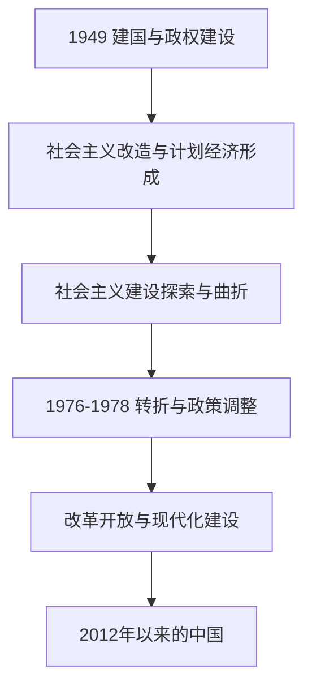

# 中华人民共和国

## 概括

中华人民共和国成立于1949年10月1日。其历史主线包括国家政权与制度建设、社会主义改造和计划经济、社会主义建设中的探索与曲折、改革开放、市场化与工业化、对外关系调整，以及21世纪以来国家治理和社会经济结构的变化。

本目录按重要制度与发展阶段组织，不把政治史等同于领导人更替，也不以单一指标概括复杂的社会变化。

## 历史主线

## 阶段导航

| 顺序 | 阶段 | 时间 | 概括 |
|---:|---|---|---|
| 1 | [建国与社会主义改造](/%E4%BA%BA%E6%96%87%E7%A7%91%E5%AD%A6/%E5%8E%86%E5%8F%B2/%E4%B8%9C%E4%BA%9A/%E4%B8%AD%E5%9B%BD/%E4%B8%AD%E5%8D%8E%E4%BA%BA%E6%B0%91%E5%85%B1%E5%92%8C%E5%9B%BD/%E5%BB%BA%E5%9B%BD%E4%B8%8E%E7%A4%BE%E4%BC%9A%E4%B8%BB%E4%B9%89%E6%94%B9%E9%80%A0.md) | 1949-1956年 | 完成政权建设、土地改革和社会主义改造，形成计划经济基本制度。 |
| 2 | [社会主义建设探索与曲折](/%E4%BA%BA%E6%96%87%E7%A7%91%E5%AD%A6/%E5%8E%86%E5%8F%B2/%E4%B8%9C%E4%BA%9A/%E4%B8%AD%E5%9B%BD/%E4%B8%AD%E5%8D%8E%E4%BA%BA%E6%B0%91%E5%85%B1%E5%92%8C%E5%9B%BD/%E7%A4%BE%E4%BC%9A%E4%B8%BB%E4%B9%89%E5%BB%BA%E8%AE%BE%E6%8E%A2%E7%B4%A2%E4%B8%8E%E6%9B%B2%E6%8A%98.md) | 1956-1976年 | 工业化和社会建设继续推进，也经历“大跃进”、困难时期和“文化大革命”。 |
| 3 | [转折、改革开放与现代化建设](/%E4%BA%BA%E6%96%87%E7%A7%91%E5%AD%A6/%E5%8E%86%E5%8F%B2/%E4%B8%9C%E4%BA%9A/%E4%B8%AD%E5%9B%BD/%E4%B8%AD%E5%8D%8E%E4%BA%BA%E6%B0%91%E5%85%B1%E5%92%8C%E5%9B%BD/%E8%BD%AC%E6%8A%98%E3%80%81%E6%94%B9%E9%9D%A9%E5%BC%80%E6%94%BE%E4%B8%8E%E7%8E%B0%E4%BB%A3%E5%8C%96%E5%BB%BA%E8%AE%BE.md) | 1976-2012年 | 工作重心转向现代化建设，农村、城市和对外开放改革逐步展开。 |
| 4 | [2012年以来的中国](/%E4%BA%BA%E6%96%87%E7%A7%91%E5%AD%A6/%E5%8E%86%E5%8F%B2/%E4%B8%9C%E4%BA%9A/%E4%B8%AD%E5%9B%BD/%E4%B8%AD%E5%8D%8E%E4%BA%BA%E6%B0%91%E5%85%B1%E5%92%8C%E5%9B%BD/2012%E5%B9%B4%E4%BB%A5%E6%9D%A5%E7%9A%84%E4%B8%AD%E5%9B%BD.md) | 2012年至今 | 国家治理、产业升级、数字化、对外关系和人口社会结构出现新的变化。 |

## 政治结构辨析

| 层级 | 主要职务或机构 | 说明 |
|---|---|---|
| 国家元首 | 中华人民共和国主席 | 国家机构中的国家主席职务；其制度地位和具体职权随宪法变迁而调整。 |
| 政府首脑 | 国务院总理 | 领导国务院工作，属于国家行政体系。 |
| 执政党领导 | 中国共产党中央委员会主席或总书记 | 党内最高领导职务名称先后发生变化，不能与国家主席、国务院总理混同。 |
| 国家权力机关 | 全国人民代表大会及其常务委员会 | 构成国家权力机关体系。 |
| 军事领导 | 中央军事委员会主席 | 国家与党的军事领导机构在制度上分别设置，实践中领导人员通常重合。 |

## 关键辨析

- 1949年是中华人民共和国成立的节点，不意味着此前形成的社会、制度和经济结构同时消失。
- 1956年通常用于标记社会主义改造基本完成，而不是所有制度变化在同一天结束。
- 1978年是改革开放的重要转折点；相关政策调整和权力重组从1976年后逐步展开。
- “改革开放”包括农村改革、城市经济体制改革、对外开放、财政金融和国有企业调整等多条进程。
- 当代内容以整理时能够核实的制度和长期趋势为主，避免把短期政策动态直接写成已经定型的历史结论。

## 相关入口

- 前一阶段：[民国](/%E4%BA%BA%E6%96%87%E7%A7%91%E5%AD%A6/%E5%8E%86%E5%8F%B2/%E4%B8%9C%E4%BA%9A/%E4%B8%AD%E5%9B%BD/%E6%B0%91%E5%9B%BD/README.md)
- 台湾历史：[台湾](/%E4%BA%BA%E6%96%87%E7%A7%91%E5%AD%A6/%E5%8E%86%E5%8F%B2/%E4%B8%9C%E4%BA%9A/%E4%B8%AD%E5%9B%BD/%E5%8F%B0%E6%B9%BE/README.md)
- 上级目录：[中国](/%E4%BA%BA%E6%96%87%E7%A7%91%E5%AD%A6/%E5%8E%86%E5%8F%B2/%E4%B8%9C%E4%BA%9A/%E4%B8%AD%E5%9B%BD/README.md)
