# 中华人民共和国

## 时间与范围

1949年10月1日至今。本目录按国家建立、制度与经济转型的关键阶段组织；“至今”资料的现任职务核验截止到2026年7月14日，尚在发展的政策与社会趋势不作终局判断。

## 概括

中华人民共和国是在中国共产党领导的人民解放军取得国共内战主要胜利、原中华民国中央政府迁往台湾的背景下建立的。1949—1956年完成中央政权建构、经济恢复、土地改革和社会主义改造；1956—1976年在计划经济框架内推进工业、国防与社会事业，同时经历“大跃进”、严重经济困难和“文化大革命”；1976年后政策与权力结构转折，1978年起改革开放逐步改变农业、企业、价格、财政和对外贸易体制；2012年以来则处于产业升级、治理集中、人口结构变化、数字化和外部战略竞争交织的新阶段。

政治史不能只按国家主席更替书写。中华人民共和国主席是国家机构职位，国务院总理是政府首脑，中共中央主席或总书记是执政党最高领导职务，中央军委主席领导武装力量；这些职位的任期有时不同步，1975—1982年国家主席职务还曾被宪法取消。

## 历史主线

```mermaid
flowchart LR
  CivilWar["国共内战与大陆政权转换"] --> Founding["1949 建国与政权建设"]
  Founding --> Transformation["1953—1956 社会主义改造"]
  Transformation --> Planning["计划经济下的建设与曲折"]
  Planning --> CulturalRevolution["1966—1976 文化大革命"]
  CulturalRevolution --> Transition["1976—1978 政策与领导转折"]
  Transition --> Reform["改革开放与市场化转型"]
  Reform --> Globalization["工业化、城市化与全球化"]
  Globalization --> NewStage["2012年以来的新发展阶段"]
```

## 阶段导航

| 顺序 | 阶段 | 时间 | 历史主线 |
|---:|---|---|---|
| 1 | [建国与社会主义改造](/%E4%BA%BA%E6%96%87%E7%A7%91%E5%AD%A6/%E5%8E%86%E5%8F%B2/%E4%B8%9C%E4%BA%9A/%E4%B8%AD%E5%9B%BD/%E4%B8%AD%E5%8D%8E%E4%BA%BA%E6%B0%91%E5%85%B1%E5%92%8C%E5%9B%BD/%E5%BB%BA%E5%9B%BD%E4%B8%8E%E7%A4%BE%E4%BC%9A%E4%B8%BB%E4%B9%89%E6%94%B9%E9%80%A0.md) | 1949—1956年 | 以《共同纲领》和1954年宪法建立国家机构，完成经济恢复、土地改革、第一个五年计划初期建设与所有制改造。 |
| 2 | [社会主义建设探索与曲折](/%E4%BA%BA%E6%96%87%E7%A7%91%E5%AD%A6/%E5%8E%86%E5%8F%B2/%E4%B8%9C%E4%BA%9A/%E4%B8%AD%E5%9B%BD/%E4%B8%AD%E5%8D%8E%E4%BA%BA%E6%B0%91%E5%85%B1%E5%92%8C%E5%9B%BD/%E7%A4%BE%E4%BC%9A%E4%B8%BB%E4%B9%89%E5%BB%BA%E8%AE%BE%E6%8E%A2%E7%B4%A2%E4%B8%8E%E6%9B%B2%E6%8A%98.md) | 1956—1976年 | 在计划经济中扩展工业、国防和社会服务，同时经历政治运动、经济失衡、饥荒和“文化大革命”。 |
| 3 | [转折、改革开放与现代化建设](/%E4%BA%BA%E6%96%87%E7%A7%91%E5%AD%A6/%E5%8E%86%E5%8F%B2/%E4%B8%9C%E4%BA%9A/%E4%B8%AD%E5%9B%BD/%E4%B8%AD%E5%8D%8E%E4%BA%BA%E6%B0%91%E5%85%B1%E5%92%8C%E5%9B%BD/%E8%BD%AC%E6%8A%98%E3%80%81%E6%94%B9%E9%9D%A9%E5%BC%80%E6%94%BE%E4%B8%8E%E7%8E%B0%E4%BB%A3%E5%8C%96%E5%BB%BA%E8%AE%BE.md) | 1976—2012年 | 拨乱反正和工作重心转移后，农村、城市、价格、企业与对外开放改革推进，市场机制、城市化与全球联系扩大。 |
| 4 | [2012年以来的中国](/%E4%BA%BA%E6%96%87%E7%A7%91%E5%AD%A6/%E5%8E%86%E5%8F%B2/%E4%B8%9C%E4%BA%9A/%E4%B8%AD%E5%9B%BD/%E4%B8%AD%E5%8D%8E%E4%BA%BA%E6%B0%91%E5%85%B1%E5%92%8C%E5%9B%BD/2012%E5%B9%B4%E4%BB%A5%E6%9D%A5%E7%9A%84%E4%B8%AD%E5%9B%BD.md) | 2012年至今 | 反腐败、党和国家机构调整、脱贫与乡村振兴、产业升级、人口老龄化、疫情及国际环境变化共同塑造这一阶段。 |
| 专表 | [中华人民共和国历任领导职务表](/%E4%BA%BA%E6%96%87%E7%A7%91%E5%AD%A6/%E5%8E%86%E5%8F%B2/%E4%B8%9C%E4%BA%9A/%E4%B8%AD%E5%9B%BD/%E4%B8%AD%E5%8D%8E%E4%BA%BA%E6%B0%91%E5%85%B1%E5%92%8C%E5%9B%BD/%E4%B8%AD%E5%8D%8E%E4%BA%BA%E6%B0%91%E5%85%B1%E5%92%8C%E5%9B%BD%E5%8E%86%E4%BB%BB%E9%A2%86%E5%AF%BC%E8%81%8C%E5%8A%A1%E8%A1%A8.md) | 1949年至今 | 完整区分国家元首安排、国务院总理、执政党最高职务、党和国家军委、人大常委会及实际权力阶段。 |

## 重要转折与时间节点

| 时间 | 转折 | 长期意义 |
|---|---|---|
| 1949年 | 中央人民政府成立 | 建立新的中央国家机构，并开始接管大陆各地。 |
| 1950—1953年 | 土地改革、抗美援朝与经济恢复 | 改变农村土地关系，强化国家动员，同时承担战争财政与安全压力。 |
| 1953—1956年 | 第一个五年计划与社会主义改造 | 重工业优先、计划配置和公有制成为制度核心。 |
| 1958—1961年 | “大跃进”、人民公社化与严重困难 | 高指标、激励失真、征购与基层信息失灵等因素造成经济和人口灾难。 |
| 1966—1976年 | “文化大革命” | 党政法律与教育秩序遭受长期冲击，权力运作高度运动化。 |
| 1971—1972年 | 联合国席位与中美关系转折 | 国际代表权和冷战外交环境发生变化。 |
| 1976—1978年 | 毛泽东逝世、“四人帮”被捕与三中全会 | 领导格局重组，国家工作重心逐步转向现代化建设。 |
| 1978—1992年 | 农村改革、经济特区、城市改革与市场化方向确立 | 资源配置从单一计划逐渐转为计划与市场并存，再向社会主义市场经济转型。 |
| 1997—2001年 | 香港、澳门回归与加入世界贸易组织 | 特别行政区制度落地，中国更深进入全球生产和贸易体系。 |
| 2008年以后 | 金融危机应对、高速基建与经济再平衡压力 | 投资和信贷稳定增长，也累积地方债务、房地产和产能结构问题。 |
| 2012年以来 | 治理、发展与外部环境新阶段 | 权力与监督体系调整，产业科技竞争、人口负增长和安全议题权重上升。 |

## 政治结构辨析

| 维度 | 主要职务或机构 | 不能混淆之处 |
|---|---|---|
| 国家元首 | 中央人民政府主席；1954年后中华人民共和国主席；1975—1982年由全国人大常委会体系承担相关国家代表职能 | 国家主席并非政府首脑；职位曾空缺、取消并恢复。 |
| 政府首脑 | 政务院总理、国务院总理 | 主持国家行政机关；与中共中央最高职务和国家主席分属不同制度层级。 |
| 执政党最高职务 | 中共中央主席（至1982年）、中共中央总书记 | 决定党内最高领导序列；“总书记”与1949—1982年的“主席”不可机械并称。 |
| 军事领导 | 中共中央军委主席；1983年起另有国家中央军委主席 | 两个军委在制度上分设、实践中组成人员高度重合；交接日期可能不同于党和国家其他职位。 |
| 国家权力机关 | 全国人大及其常委会 | 全国人大常委会委员长主持常委会；国家主席取消期间，常委会体系承担部分国家元首性职能。 |
| 政协 | 中国人民政治协商会议及全国委员会 | 1949年一届政协全体会议代行全国人大职权；1954年全国人大成立后，政协转为统一战线和政治协商组织。 |

截至2026年7月14日，习近平任中共中央总书记、中华人民共和国主席和中央军委主席，李强任国务院总理，赵乐际任全国人大常委会委员长。完整任期与交叉交接见[中华人民共和国历任领导职务表](/%E4%BA%BA%E6%96%87%E7%A7%91%E5%AD%A6/%E5%8E%86%E5%8F%B2/%E4%B8%9C%E4%BA%9A/%E4%B8%AD%E5%9B%BD/%E4%B8%AD%E5%8D%8E%E4%BA%BA%E6%B0%91%E5%85%B1%E5%92%8C%E5%9B%BD/%E4%B8%AD%E5%8D%8E%E4%BA%BA%E6%B0%91%E5%85%B1%E5%92%8C%E5%9B%BD%E5%8E%86%E4%BB%BB%E9%A2%86%E5%AF%BC%E8%81%8C%E5%8A%A1%E8%A1%A8.md)。

## 国家形成、维系与转型机制

- **建立背景：**抗日战争后的政治军事冲突、土地与农村动员、共产党组织能力及国民政府财政军事危机共同决定大陆政权转换。
- **国家整合：**中央组织、党政干部体系、人民解放军和群众组织使政策能够下达到县乡；民族区域自治、省级行政和中央部门逐步制度化。
- **计划体制：**重工业优先和统购统销集中资源，迅速建立工业基础，也造成价格、激励和信息高度行政化。
- **改革机制：**家庭承包、地方试验、双轨制、特区开放和企业改革先局部试行再推广；财政分权与地方竞争推动增长，也产生区域差距和债务激励。
- **外部条件：**中苏关系、冷战、对美关系、加入世贸后的全球化以及近年的贸易科技限制，持续改变发展空间。
- **长期制约：**人口老龄化、城乡与地区差异、环境资源、房地产和地方财政、技术升级及社会保障可持续性相互关联。
- **进行中的阶段：**中华人民共和国仍在延续，不能套用“灭亡原因”模板；应分别讨论制度韧性、发展条件、风险与尚未定型的政策后果。

## 管辖与两岸表述

1949年以来，中华人民共和国政府实际管辖中国大陆，并先后恢复对香港、澳门行使主权；中华民国政府实际管辖台湾、澎湖、金门、马祖等地。双方的宪制主张、政治立场与实际控制范围不是同一概念，相关历史分别见[民国](/%E4%BA%BA%E6%96%87%E7%A7%91%E5%AD%A6/%E5%8E%86%E5%8F%B2/%E4%B8%9C%E4%BA%9A/%E4%B8%AD%E5%9B%BD/%E6%B0%91%E5%9B%BD/README.md)与[台湾](/%E4%BA%BA%E6%96%87%E7%A7%91%E5%AD%A6/%E5%8E%86%E5%8F%B2/%E4%B8%9C%E4%BA%9A/%E4%B8%AD%E5%9B%BD/%E5%8F%B0%E6%B9%BE/README.md)。

## 相关

- 前一大陆阶段：[民国](/%E4%BA%BA%E6%96%87%E7%A7%91%E5%AD%A6/%E5%8E%86%E5%8F%B2/%E4%B8%9C%E4%BA%9A/%E4%B8%AD%E5%9B%BD/%E6%B0%91%E5%9B%BD/README.md)
- 台湾历史：[台湾](/%E4%BA%BA%E6%96%87%E7%A7%91%E5%AD%A6/%E5%8E%86%E5%8F%B2/%E4%B8%9C%E4%BA%9A/%E4%B8%AD%E5%9B%BD/%E5%8F%B0%E6%B9%BE/README.md)
- 直接上级：[中国](/%E4%BA%BA%E6%96%87%E7%A7%91%E5%AD%A6/%E5%8E%86%E5%8F%B2/%E4%B8%9C%E4%BA%9A/%E4%B8%AD%E5%9B%BD/README.md)
