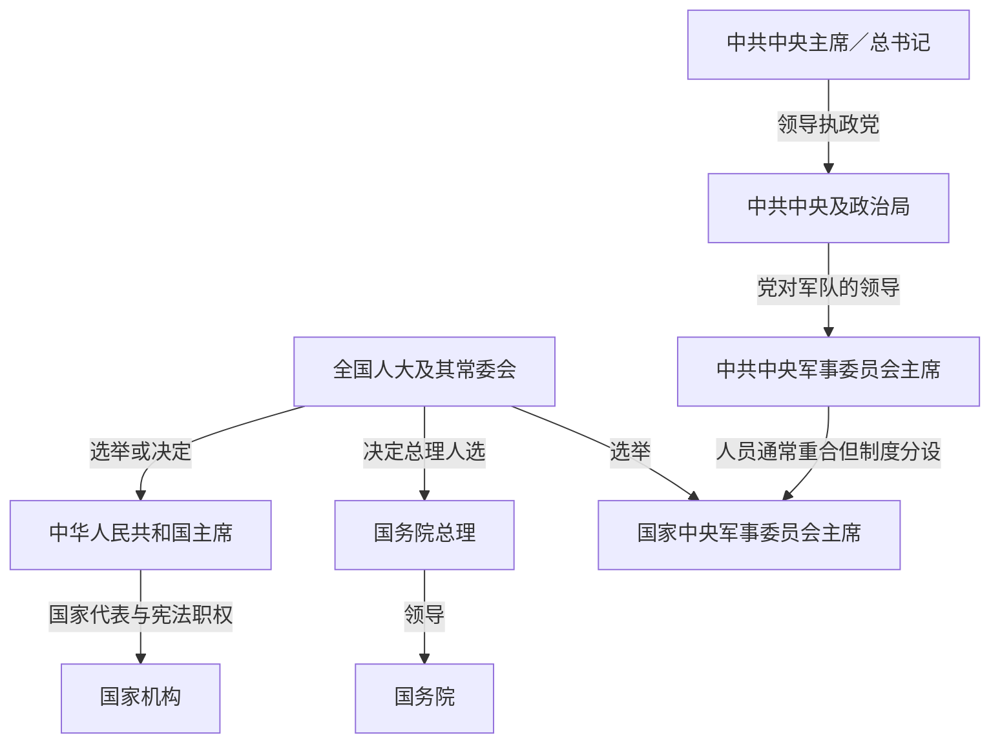

# 中华人民共和国历任领导职务表

## 范围与读表规则

本表核验截止到2026年7月14日。中华人民共和国的国家元首、政府首脑、执政党最高领导和军队最高领导是不同序列：同一人兼任多个职位时仍分别列出；职位交接日期不同，不合并为笼统的“最高领导人任期”。

- 1949—1954年国家元首性职位为中央人民政府主席。
- 1954年宪法设置中华人民共和国主席；刘少奇被撤销职务后长期缺位，1975年宪法取消该职，1982年宪法恢复，1983年选出恢复后的首任主席。
- “实际最高权力”是对党、军队、干部任免和重大决策影响力的历史分析，不是另一项法定职位。
- 代理、集体代行和两个中央军委交接错位均单列。

## 职务关系

## 国家元首及国家代表职能完整序列

| 顺序 | 人物或安排 | 职务 | 任期 | 继承、制度与关键说明 |
|---:|---|---|---|---|
| 1 | **毛泽东** | 中央人民政府主席 | 1949-10-01—1954-09-27 | 由中国人民政治协商会议第一届全体会议选举；主持中央人民政府委员会。 |
| 2 | **毛泽东** | 中华人民共和国主席 | 1954-09-27—1959-04-27 | 第一届全国人大依1954年宪法选举。 |
| 3 | **刘少奇** | 中华人民共和国主席 | 1959-04-27—1968-10-31 | 1965年连任；“文化大革命”中被撤销党内外职务，国家主席职位此后实质空缺。 |
| 4 | 宋庆龄、董必武 | 国家副主席代行相关职能 | 1968-10-31—1975-01-17 | 刘少奇失位后，两位副主席按当时制度承担国家代表事务；并非二人正式继任国家主席。董必武自1972年起在若干外交礼仪中以代主席口径履职。 |
| 5 | 朱德 | 全国人大常委会委员长，承担国家元首性职能 | 1975-01-17—1976-07-06 | 1975年宪法取消国家主席，由全国人大常委会体系承担公布法律、接受使节等职能；朱德任内去世。 |
| 6 | 全国人大常委会副委员长集体 | 集体承担常委会及国家代表职能 | 1976-07-06—1978-03-05 | 朱德逝世至新一届人大选出委员长。成员包括宋庆龄、刘伯承、吴德、韦国清、赛福鼎·艾则孜、郭沫若、徐向前、聂荣臻、陈云、谭震林、李井泉、张鼎丞、蔡畅、乌兰夫、阿沛·阿旺晋美、周建人、许德珩、胡厥文、李素文、姚连蔚；邓颖超于1976年12月增补。 |
| 7 | 叶剑英 | 全国人大常委会委员长，承担国家元首性职能 | 1978-03-05—1983-06-18 | 1978年宪法仍未恢复国家主席；1982年宪法恢复该职，至1983年选出国家主席前由常委会体系延续相关职能。 |
| 特别称号 | 宋庆龄 | 中华人民共和国名誉主席 | 1981-05-16—1981-05-29 | 全国人大常委会授予的名誉称号，不属于宪法国家主席任期序列。 |
| 8 | 李先念 | 中华人民共和国主席 | 1983-06-18—1988-04-08 | 1982年宪法恢复国家主席后的首任。 |
| 9 | 杨尚昆 | 中华人民共和国主席 | 1988-04-08—1993-03-27 | 任内经历1989年政治风波及军队领导调整。 |
| 10 | 江泽民 | 中华人民共和国主席 | 1993-03-27—2003-03-15 | 1998年连任；与其总书记、军委主席任期不完全同步。 |
| 11 | 胡锦涛 | 中华人民共和国主席 | 2003-03-15—2013-03-14 | 2008年连任；2004／2005年才分别接任党、国家军委主席。 |
| 12 | 习近平 | 中华人民共和国主席 | 2013-03-14—现任（截至2026-07-14） | 2018年、2023年连任；2018年宪法修正案删除国家主席连续任职不得超过两届的规定。 |

## 政府首脑完整序列

| 顺序 | 人物或安排 | 职务状态 | 任期 | 关键说明 |
|---:|---|---|---|---|
| 1 | **周恩来** | 政务院总理；1954年起国务院总理 | 1949-10-01—1976-01-08 | 连续主持中央政府行政，任内去世。 |
| — | 国务院副总理集体 | 集体主持国务院日常工作 | 1976-01-08—1976-02-02 | 周恩来逝世至华国锋任代总理。时任副总理包括邓小平、张春桥、李先念、陈锡联、纪登奎、华国锋、陈永贵、吴桂贤、王震、余秋里、谷牧、孙健。 |
| 2 | 华国锋 | 国务院代总理 | 1976-02-02—1976-04-07 | 中共中央政治局决定代理。 |
| 3 | **华国锋** | 国务院总理 | 1976-04-07—1980-09-10 | 任内同时担任中共中央主席和中央军委主席，后在改革派权力上升中辞任总理。 |
| 4 | 赵紫阳 | 国务院总理 | 1980-09-10—1987-11-24 | 推动农村和城市经济改革，后转任中共中央总书记。 |
| 5 | 李鹏 | 国务院代总理 | 1987-11-24—1988-04-09 | 赵紫阳离任总理后的代理期。 |
| 6 | 李鹏 | 国务院总理 | 1988-04-09—1998-03-17 | 1993年连任。 |
| 7 | 朱镕基 | 国务院总理 | 1998-03-17—2003-03-16 | 推进财政金融、国企与政府机构改革，任内中国加入世贸组织。 |
| 8 | 温家宝 | 国务院总理 | 2003-03-16—2013-03-15 | 2008年连任；任内应对非典、汶川地震和全球金融危机。 |
| 9 | 李克强 | 国务院总理 | 2013-03-15—2023-03-11 | 2018年连任；任内经历经济结构调整与新冠疫情。 |
| 10 | 李强 | 国务院总理 | 2023-03-11—现任（截至2026-07-14） | 第十四届全国人大一次会议决定任命。 |

## 中国共产党最高领导职务完整序列

| 顺序 | 人物或安排 | 最高职务 | 任期 | 继承与备注 |
|---:|---|---|---|---|
| 1 | **毛泽东** | 中共中央主席 | 1949-10-01前已任；本表列1949-10-01—1976-09-09 | 任内逝世；党主席、国家主席和政府总理并非同一职务。 |
| — | 中共中央政治局集体；华国锋任第一副主席 | 过渡主持 | 1976-09-09—1976-10-07 | 毛泽东逝世至中央政治局确认华国锋为主席的短暂过渡。 |
| 2 | 华国锋 | 中共中央主席 | 1976-10-07—1981-06-29 | “四人帮”被捕后就任；十一届六中全会辞职。 |
| 3 | 胡耀邦 | 中共中央主席 | 1981-06-29—1982-09-12 | 党章改制前最后一任中共中央主席。 |
| 4 | 胡耀邦 | 中共中央总书记 | 1982-09-12—1987-01-16 | 十二大后以总书记为党内最高职务；辞职。 |
| 5 | 赵紫阳 | 代理中共中央总书记 | 1987-01-16—1987-11-02 | 胡耀邦辞职后的代理期。 |
| 6 | 赵紫阳 | 中共中央总书记 | 1987-11-02—1989-06-23 | 十三届四中全会被撤职。 |
| 7 | 江泽民 | 中共中央总书记 | 1989-06-24—2002-11-15 | 1992年、1997年连任；2002年交接总书记。 |
| 8 | 胡锦涛 | 中共中央总书记 | 2002-11-15—2012-11-15 | 2007年连任。 |
| 9 | 习近平 | 中共中央总书记 | 2012-11-15—现任（截至2026-07-14） | 2017年、2022年连任。 |

## 中共中央军事委员会主席完整序列

| 顺序 | 人物 | 任期 | 说明 |
|---:|---|---|---|
| 1 | **毛泽东** | 本表列1949-10-01—1976-09-09 | 机构名称在1949—1954年间有所变化，1954年后为中共中央军事委员会；任内逝世。 |
| 2 | 华国锋 | 1976-10-07—1981-06-28 | 与中共中央主席职务同时交出军委领导。 |
| 3 | **邓小平** | 1981-06-28—1989-11-09 | 在未任国家主席或总书记的情况下，通过军委及党内资历保持核心影响。 |
| 4 | 江泽民 | 1989-11-09—2004-09-19 | 2002年卸任总书记后继续任军委主席近两年。 |
| 5 | 胡锦涛 | 2004-09-19—2012-11-15 | 先接党军委，2005年再接国家军委。 |
| 6 | 习近平 | 2012-11-15—现任（截至2026-07-14） | 与总书记同日就任。 |

## 国家中央军事委员会主席完整序列

国家中央军事委员会依1982年宪法设立，1983年选出首任主席；它与中共中央军委制度分设，领导人员通常重合。

| 顺序 | 人物 | 任期 | 与党军委交接差 |
|---:|---|---|---|
| 1 | **邓小平** | 1983-06-18—1990-04-04 | 1989年11月已卸任中共中央军委主席，1990年4月再卸任国家军委主席。 |
| 2 | 江泽民 | 1990-04-03／04—2005-03-13 | 2004年9月卸任党军委，2005年3月卸任国家军委。 |
| 3 | 胡锦涛 | 2005-03-13—2013-03-14 | 2012年11月卸任党军委，2013年3月卸任国家军委。 |
| 4 | 习近平 | 2013-03-14—现任（截至2026-07-14） | 与中华人民共和国主席同日就任国家军委主席。 |

## 全国人大常委会委员长完整序列

| 顺序 | 人物或安排 | 任期 | 说明 |
|---:|---|---|---|
| 1 | 刘少奇 | 1954-09-27—1959-04-27 | 第一届全国人大常委会委员长，后转任国家主席。 |
| 2 | 朱德 | 1959-04-28—1976-07-06 | 连任至任内去世；1975年国家主席取消后，常委会体系承担更多国家代表职能。 |
| — | 副委员长集体 | 1976-07-06—1978-03-05 | 朱德去世后的集体过渡，成员见国家元首序列表。 |
| 3 | 叶剑英 | 1978-03-05—1983-06-18 | 1978年宪法时期承担委员长及相关国家代表职能。 |
| 4 | 彭真 | 1983-06-18—1988-04-13 | 1982年宪法实施后的第一届。 |
| 5 | 万里 | 1988-04-13—1993-03-27 | 第七届全国人大常委会委员长。 |
| 6 | 乔石 | 1993-03-27—1998-03-16 | 第八届。 |
| 7 | 李鹏 | 1998-03-16—2003-03-15 | 第九届。 |
| 8 | 吴邦国 | 2003-03-15—2013-03-14 | 第十、十一届。 |
| 9 | 张德江 | 2013-03-14—2018-03-17 | 第十二届。 |
| 10 | 栗战书 | 2018-03-17—2023-03-10 | 第十三届。 |
| 11 | 赵乐际 | 2023-03-10—现任（截至2026-07-14） | 第十四届全国人大常委会委员长。 |

## 名义职务与实际最高权力阶段

| 时段 | 名义国家元首／代表安排 | 政府首脑 | 党军及重大决策的主要核心 |
|---|---|---|---|
| 1949—1959年 | 毛泽东 | 周恩来 | 毛泽东任中共中央主席并长期领导军队，是党政军重大决策核心。 |
| 1959—1968年 | 刘少奇 | 周恩来 | 刘少奇任国家主席，但毛泽东仍任党主席并保持最高政治和军事权威；两者职务不可互换。 |
| 1968—1976年 | 副主席代行、后由人大常委会体系承担 | 周恩来；1976年华国锋 | 毛泽东仍居核心；“文化大革命”中中央文革小组、林彪及后来的“四人帮”等阶段性权力上升。 |
| 1976—1978年 | 人大常委会体系 | 华国锋 | 华国锋兼任党主席、总理和党军委主席；叶剑英、李先念等老干部在粉碎“四人帮”和过渡中有重要作用。 |
| 1978—1989年 | 叶剑英体系，后李先念、杨尚昆 | 华国锋、赵紫阳、李鹏代理 | 邓小平不任国家主席或总书记，却凭军委、党内资历与改革路线居核心；制度职务与实际影响明显分离。 |
| 1989—1992年 | 杨尚昆 | 李鹏 | 江泽民任总书记，邓小平仍有关键影响；1992年南方谈话推动改革方向再确认。 |
| 1992—2002年 | 江泽民 | 李鹏、朱镕基 | 江泽民逐步兼任总书记、国家主席和军委主席，形成党政军职务集中。 |
| 2002—2004／05年 | 胡锦涛 | 温家宝 | 胡任总书记、国家主席；江泽民继续任党军委至2004年、国家军委至2005年，交接分阶段完成。 |
| 2004／05—2012年 | 胡锦涛 | 温家宝 | 胡锦涛兼任总书记、国家主席和两个军委主席。 |
| 2012／13年至今 | 习近平 | 温家宝至2013年、李克强、李强 | 习近平自2012年任总书记和党军委主席，2013年任国家主席和国家军委主席；截至2026-07-14仍任上述职务。 |

## 阶段链接

- [建国与社会主义改造](/%E4%BA%BA%E6%96%87%E7%A7%91%E5%AD%A6/%E5%8E%86%E5%8F%B2/%E4%B8%9C%E4%BA%9A/%E4%B8%AD%E5%9B%BD/%E4%B8%AD%E5%8D%8E%E4%BA%BA%E6%B0%91%E5%85%B1%E5%92%8C%E5%9B%BD/%E5%BB%BA%E5%9B%BD%E4%B8%8E%E7%A4%BE%E4%BC%9A%E4%B8%BB%E4%B9%89%E6%94%B9%E9%80%A0.md)
- [社会主义建设探索与曲折](/%E4%BA%BA%E6%96%87%E7%A7%91%E5%AD%A6/%E5%8E%86%E5%8F%B2/%E4%B8%9C%E4%BA%9A/%E4%B8%AD%E5%9B%BD/%E4%B8%AD%E5%8D%8E%E4%BA%BA%E6%B0%91%E5%85%B1%E5%92%8C%E5%9B%BD/%E7%A4%BE%E4%BC%9A%E4%B8%BB%E4%B9%89%E5%BB%BA%E8%AE%BE%E6%8E%A2%E7%B4%A2%E4%B8%8E%E6%9B%B2%E6%8A%98.md)
- [转折、改革开放与现代化建设](/%E4%BA%BA%E6%96%87%E7%A7%91%E5%AD%A6/%E5%8E%86%E5%8F%B2/%E4%B8%9C%E4%BA%9A/%E4%B8%AD%E5%9B%BD/%E4%B8%AD%E5%8D%8E%E4%BA%BA%E6%B0%91%E5%85%B1%E5%92%8C%E5%9B%BD/%E8%BD%AC%E6%8A%98%E3%80%81%E6%94%B9%E9%9D%A9%E5%BC%80%E6%94%BE%E4%B8%8E%E7%8E%B0%E4%BB%A3%E5%8C%96%E5%BB%BA%E8%AE%BE.md)
- [2012年以来的中国](/%E4%BA%BA%E6%96%87%E7%A7%91%E5%AD%A6/%E5%8E%86%E5%8F%B2/%E4%B8%9C%E4%BA%9A/%E4%B8%AD%E5%9B%BD/%E4%B8%AD%E5%8D%8E%E4%BA%BA%E6%B0%91%E5%85%B1%E5%92%8C%E5%9B%BD/2012%E5%B9%B4%E4%BB%A5%E6%9D%A5%E7%9A%84%E4%B8%AD%E5%9B%BD.md)
- [中华人民共和国](/%E4%BA%BA%E6%96%87%E7%A7%91%E5%AD%A6/%E5%8E%86%E5%8F%B2/%E4%B8%9C%E4%BA%9A/%E4%B8%AD%E5%9B%BD/%E4%B8%AD%E5%8D%8E%E4%BA%BA%E6%B0%91%E5%85%B1%E5%92%8C%E5%9B%BD/README.md)
