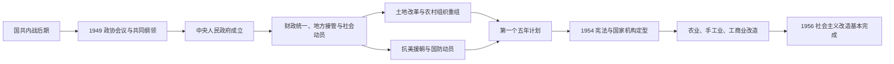

# 建国与社会主义改造

## 时间

1949年10月—1956年底。政权接管、土地改革和战争影响在不同地区的起止并不完全一致，第一个五年计划则持续至1957年。

## 建立背景

1945年抗日战争结束后，国共谈判未能形成双方共同接受的军政整合方案，内战逐步扩大。中国共产党凭借根据地政权、土地政策、基层组织和人民解放军，在1948—1949年取得决定性军事优势；中华民国中央政府逐步失去大陆控制并迁台。新政权面对战争破坏、通货膨胀、财政分割、城乡供应紧张、土匪与残余武装，以及如何把革命根据地制度扩展为全国国家制度等任务。

## 政权建立与制度转型

## 分阶段过程

| 阶段 | 时间 | 具体过程 |
|---|---|---|
| 建国与接管 | 1949—1950年 | 政协通过《共同纲领》，中央人民政府成立；人民解放军继续向华南、西南及沿海岛屿推进，各地建立军管会并接收旧政权机构、企业和学校。 |
| 财政经济恢复 | 1949—1952年 | 统一财政收支、物资调度和货币体系，稳定物价；国营经济控制金融、铁路和重要工业，私营工商业在管制与合作中继续运行。 |
| 土地与社会重组 | 1950—1953年 | 新解放区实施土地改革，地主土地转给农民；婚姻法、基层政权建设及一系列政治运动改变乡村和城市权力关系。 |
| 战争与国家动员 | 1950—1953年 | 中国人民志愿军参加朝鲜战争，国内开展军事、财政和社会动员；战争强化安全意识和重工业优先倾向。 |
| 计划工业化 | 1953—1957年 | 第一个五年计划借鉴苏联计划体制，以重工业、能源、交通和国防相关项目为重点，苏联提供设备、贷款和技术援助。 |
| 社会主义改造 | 1953—1956年 | 农业合作化由互助组、初级社向高级社加速；手工业组织合作社，资本主义工商业由加工订货、公私合营转向全行业公私合营。 |

## 统治结构与权力

| 层级 | 人物或机构 | 本阶段作用 |
|---|---|---|
| 执政党 | 中共中央；毛泽东任中共中央主席 | 党组织决定重大路线和干部配置，并通过各级党委领导国家与社会组织。 |
| 国家元首 | 毛泽东任中央人民政府主席，1954年起任中华人民共和国主席 | 1949—1954年主持中央人民政府委员会；1954年宪法建立国家主席制度。 |
| 政府首脑 | 周恩来任政务院总理，1954年起任国务院总理 | 主持行政、外交和经济协调。 |
| 国家权力机关 | 1949年政协全体会议代行全国人大职权；1954年第一届全国人大成立 | 《共同纲领》先具临时宪制作用，1954年宪法确立人大制度与新的国家机构。 |
| 军事领导 | 中央人民政府人民革命军事委员会及中共中央军委体系 | 统一指挥人民解放军，完成大陆主要地区军事控制并参加朝鲜战争。 |
| 地方治理 | 大行政区、军政委员会、省市县人民政府及基层组织 | 先以军政接管稳定秩序，再逐步转入常规行政；1954年前后大行政区撤销，中央集权加强。 |

完整任职、机构更名与交接见[中华人民共和国历任领导职务表](/%E4%BA%BA%E6%96%87%E7%A7%91%E5%AD%A6/%E5%8E%86%E5%8F%B2/%E4%B8%9C%E4%BA%9A/%E4%B8%AD%E5%9B%BD/%E4%B8%AD%E5%8D%8E%E4%BA%BA%E6%B0%91%E5%85%B1%E5%92%8C%E5%9B%BD/%E4%B8%AD%E5%8D%8E%E4%BA%BA%E6%B0%91%E5%85%B1%E5%92%8C%E5%9B%BD%E5%8E%86%E4%BB%BB%E9%A2%86%E5%AF%BC%E8%81%8C%E5%8A%A1%E8%A1%A8.md)。

## 重要事件

| 时间 | 事件 | 过程与影响 |
|---|---|---|
| 1949年9—10月 | 政协一届全体会议与中华人民共和国成立 | 通过《共同纲领》，选举中央人民政府委员会，确定国号、首都等国家象征。 |
| 1949—1950年 | 统一财经与稳定物价 | 人民币流通、财政收支和国营贸易逐步统一，恶性通胀受控，为恢复生产创造条件。 |
| 1950年 | 《婚姻法》颁布 | 确立婚姻自由、一夫一妻和男女权利原则；基层落实受到地区习俗和社会冲突影响。 |
| 1950—1953年 | 土地改革 | 在新解放区没收、征收地主土地并分配，改变农村阶级和土地占有；运动中的暴力、处决与地区差异也构成历史后果。 |
| 1950—1953年 | 抗美援朝战争 | 中国军队入朝参战，1953年签署停战协定；战争强化国防动员，也增加财政与人员负担。 |
| 1950—1952年 | 镇压反革命、三反与五反等运动 | 新政权打击武装和政治反对力量、整肃官僚与工商业违法；在建立控制的同时伴随强制、扩大化与社会压力。 |
| 1951年 | 西藏和平解放协议 | 中央人民政府与西藏地方政府代表签署十七条协议，人民解放军随后进驻；实际执行、地方政治与后续冲突具有复杂性。 |
| 1952年 | 国民经济恢复目标大体完成 | 工农业生产回升，国营经济和计划管理能力增强。 |
| 1953年 | 过渡时期总路线和第一个五年计划启动 | 工业化与所有制改造被结合起来，重工业建设获得最高优先级。 |
| 1953—1954年 | 首次基层普选与第一届全国人大 | 在选举法框架下逐级选举代表；1954年全国人大通过宪法并重组国务院等机构。 |
| 1954—1955年 | 日内瓦会议、和平共处五项原则与万隆会议 | 新中国拓展对外交往，和平共处原则成为外交表述的重要组成。 |
| 1955—1956年 | 合作化和全行业公私合营加速 | 所有制结构快速改变，个体农业、手工业和私人资本主义工商业空间大幅缩小。 |

## 建立、巩固与转折机制

- **崛起条件：**共产党在战争中形成跨区域党政军网络，通过土地动员、军队纪律和基层组织扩大支持；国民政府则受通胀、军事失败和治理危机削弱。
- **国家整合：**军管接收、统一货币财政、组织化干部下沉和群众运动，使新政权迅速建立基层控制。
- **外部压力：**朝鲜战争、美国对台政策和冷战封锁强化安全与重工业优先；苏联援助提供工业化设备和制度范本。
- **结构性代价：**高度集中能够快速调配资源，却压缩地方和市场信息；政治运动式治理带来法制不足、扩大化和个人权利受损。
- **直接转折：**1956年农业高级合作化和全行业公私合营基本完成，公有制与计划经济成为主导，发展任务由“改造所有制”转向“怎样建设社会主义”。

## 演变关系

- 前一阶段：[民国大陆时期](/%E4%BA%BA%E6%96%87%E7%A7%91%E5%AD%A6/%E5%8E%86%E5%8F%B2/%E4%B8%9C%E4%BA%9A/%E4%B8%AD%E5%9B%BD/%E6%B0%91%E5%9B%BD/README.md)
- 后一阶段：[社会主义建设探索与曲折](/%E4%BA%BA%E6%96%87%E7%A7%91%E5%AD%A6/%E5%8E%86%E5%8F%B2/%E4%B8%9C%E4%BA%9A/%E4%B8%AD%E5%9B%BD/%E4%B8%AD%E5%8D%8E%E4%BA%BA%E6%B0%91%E5%85%B1%E5%92%8C%E5%9B%BD/%E7%A4%BE%E4%BC%9A%E4%B8%BB%E4%B9%89%E5%BB%BA%E8%AE%BE%E6%8E%A2%E7%B4%A2%E4%B8%8E%E6%9B%B2%E6%8A%98.md)
- 总览：[中华人民共和国](/%E4%BA%BA%E6%96%87%E7%A7%91%E5%AD%A6/%E5%8E%86%E5%8F%B2/%E4%B8%9C%E4%BA%9A/%E4%B8%AD%E5%9B%BD/%E4%B8%AD%E5%8D%8E%E4%BA%BA%E6%B0%91%E5%85%B1%E5%92%8C%E5%9B%BD/README.md)
