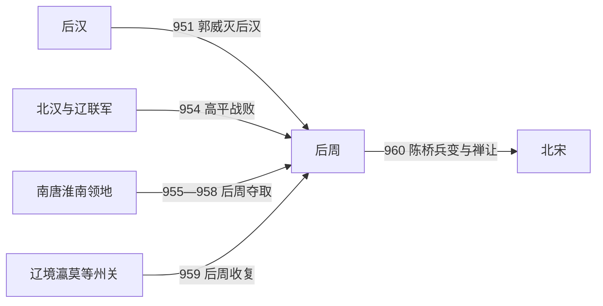

# 后周

## 时间

951年-960年

## 别称

- 周
- 郭周

## 概括

后周由郭威取代后汉建立，是五代最后一个中原王朝。郭威、柴荣相继推行整顿，削弱军政积弊，增强中央控制，并对南唐、北汉和辽展开军事行动。959年柴荣病逝，960年赵匡胤陈桥兵变，建立北宋。

## 兴起、发展与政权转移

- **建立背景**：后汉隐帝刘承祐诛杀辅政功臣并企图除掉在邺都统军的郭威，郭威于950年起兵。后汉军政体系迅速倒向郭威，951年他称帝建周，以后汉旧官僚、禁军和中原州县为基础重组朝廷。
- **整顿机制**：郭威减轻部分苛税与杂役，整顿吏治，约束军队扰民，并把没收的庄田等重新纳入国家支配。改革并未消除军人政治，却改善了朝廷汲取财赋和维持秩序的能力。
- **扩张与鼎盛**：954年柴荣在高平之战击退北汉、辽联军，随后淘汰临阵退却者、整编禁军，使中央获得更可靠的野战力量。955—958年三征南唐，夺取淮南江北地区；959年北伐又收复瀛、莫等州及关口，统一趋势最为明显。
- **统治结构**：皇帝通过枢密、三司和禁军系统推动战争与财政，地方仍由节度使和州县共同治理。柴荣的改革、征伐与个人威望紧密结合，继承制度本身并未解决武将拥立的问题。
- **转折因素**：后周并非因长期衰败而亡。959年柴荣在北伐途中病逝，七岁的柴宗训即位，主少国疑；禁军高级将领掌握远征部队，而皇室缺少能制衡他们的成年宗室和政治核心。
- **直接政权转移**：960年赵匡胤奉命北上抵御边警，部队在陈桥驿拥立其为帝。赵匡胤回师开封，迫使柴宗训禅位，建立北宋。北宋大体承接后周的官僚、禁军、财政和统一战略，因此这是一次军事政变式王朝更替，而非国家机器全面崩溃。

## 重要事件

| 时间 | 事件 | 过程与影响 |
|---|---|---|
| 951年 | 郭威建周 | 郭威取代后汉，接收中原军政体系。 |
| 954年 | 高平之战 | 柴荣击退北汉、辽联军，并借战后整军强化禁军。 |
| 955年 | 整顿财政与寺院经济 | 朝廷清查寺院、重铸钱币等，以扩大财政与物资来源。 |
| 955—958年 | 三征南唐 | 后周取得淮南江北州县，南唐去帝号、称臣纳贡。 |
| 959年 | 北伐辽境 | 后周短期收复若干州关；柴荣病逝使攻势中止。 |
| 960年 | 陈桥兵变 | 禁军拥立赵匡胤，后周禅位，北宋建立。 |

## 演进流程

## 说明

- 951年，郭威灭后汉，建立后周。
- 郭威出身军人集团，但注意整顿财政、军政和民生。
- 柴荣即位后继续改革，南征南唐、北伐辽与北汉，显示统一趋势。
- 959年，柴荣在北伐燕云十六州过程中病亡。
- 960年，赵匡胤发动陈桥兵变，取代后周建立北宋，五代结束。

## 统治结构

| 角色 | 人物 / 机构 | 说明 |
|---|---|---|
| 君主 | 郭威、柴荣、柴宗训 | 后周皇帝为最高统治者。 |
| 军事核心 | 殿前司、禁军系统 | 赵匡胤等禁军将领在后周后期崛起。 |
| 继承政权 | 北宋 | 北宋承接后周军政基础并继续统一进程。 |

## 追尊先祖

| 姓名 | 庙号 | 谥号 | 说明 |
|---|---|---|---|
| 郭璟 | 周信祖 | 睿和皇帝 | 周太祖追崇。 |
| 郭谌 | 周僖祖 | 明宪皇帝 | 周太祖追崇。 |
| 郭蕴 | 周义祖 | 翼顺皇帝 | 周太祖追崇。 |
| 郭简 | 周庆祖 | 章肃皇帝 | 周太祖追崇。 |

## 君主世系

| 顺序 | 姓名 | 庙号 | 谥号 | 年号 | 在位时间 | 生卒时间 | 与前任关系 | 关键事件 / 备注 |
|---:|---|---|---|---|---|---|---|---|
| 1 | **郭威** | 周太祖 | 圣神恭肃文武孝皇帝 | 广顺、显德 | 951年-954年 | 904年-954年 | 开国君主 | 取代后汉建后周，开启后周整顿。 |
| 2 | **柴荣**（郭荣） | 周世宗 | 睿武孝文皇帝 | 显德 | 954年-959年 | 921年-959年 | 郭威养子，柴氏外甥 | 改革军政，南征北伐，为北宋统一奠基。 |
| 3 | **柴宗训**（郭宗训） | 无 | 恭帝 | 显德 | 959年-960年 | 953年-973年 | 柴荣子 | 幼年即位；960年赵匡胤篡周建宋。 |

## 演变关系

- 前一节点：[后汉](/%E4%BA%BA%E6%96%87%E7%A7%91%E5%AD%A6/%E5%8E%86%E5%8F%B2/%E4%B8%9C%E4%BA%9A/%E4%B8%AD%E5%9B%BD/%E4%BA%94%E4%BB%A3/%E4%BA%94%E4%BB%A3/%E6%B1%89%EF%BC%88%E5%88%98%EF%BC%89.md)。郭威取代后汉建立后周。
- 后一节点：北宋。赵匡胤取代后周，建立宋朝。
- 延续关系：北宋继承后周禁军、官僚和统一战争基础，继续平定十国。
